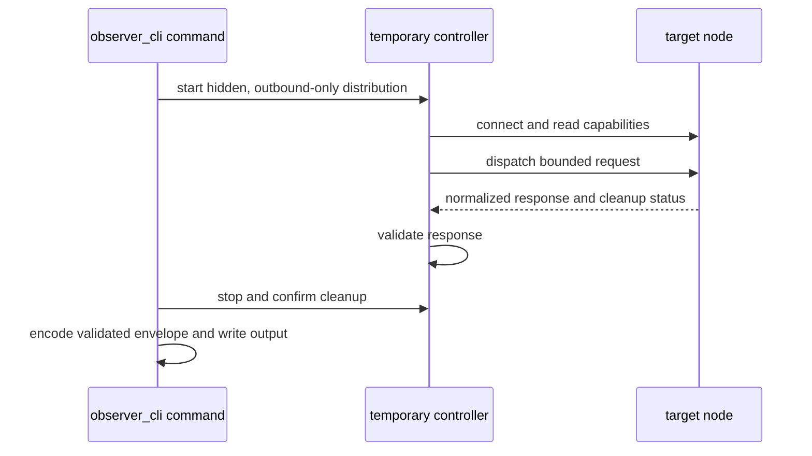
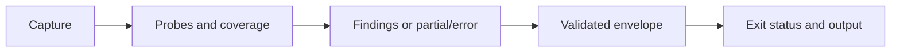

# Core concepts

Observer CLI has two interfaces over Erlang distribution: an ephemeral command
controller for bounded diagnostics and a continuously refreshing TUI for live
exploration. Their trust boundary is the same, but their code delivery,
lifecycle, and output contracts differ.

## Controller, target, and saved context

The **controller** is the machine running the generated `observer_cli` escript.
The **target** is the distributed BEAM node being inspected.

Each remote command starts as a non-distributed escript, then:

1. resolves the target, name mode, and cookie source;
2. starts a hidden distribution controller with no listening distribution port;
3. connects to the target and reads its diagnostics capabilities;
4. dispatches one bounded request to the target;
5. validates the target response;
6. stops the controller and confirms cleanup; and
7. encodes and writes the response.



Commands have no daemon or persistent network connection. The controller must
start from `nonode@nohost`; invoking it from an already distributed Erlang node
is refused because it cannot provide the normal lifecycle guarantees.

### Saved context is a selector

`connect` verifies a target and writes one active selector under the operating
system's user-configuration directory:

```text
<user-config>/observer_cli/context.etf
```

It contains the node text, `short` or `long` name mode, and either an
environment-variable name or an absolute cookie-file path. It never contains
the cookie value.

The directory is mode `0700` and the regular, non-symlink file is mode `0600`.
A new selector is installed atomically only after temporary-controller cleanup
succeeds. A failed connection, probe, or cleanup leaves the preceding selector
unchanged.

`status` rereads the cookie source and performs a fresh probe. `disconnect`
removes the selector; it has no persistent network connection to close.
Stateless commands can pass `--node` and a cookie source on every invocation.

## Code delivery and compatibility

### The CLI uses the target's installed bundle

Before dispatch, the controller calls the target's
`observer_cli_snapshot:capabilities/0`. The capability handshake requires:

```text
bundle_version = 2.0.0
protocol_version = 1
```

The target executes its installed diagnostics bundle. The CLI never injects or
replaces missing target modules. `connect` and `status` can describe a reachable
target whose bundle is missing or incompatible, but diagnostic and inspection
commands reject that target with a capability error.

The public response contract is the JSON Schema 2020-12 document at
[`priv/schema/observer_cli.cli.v1.schema.json`](https://raw.githubusercontent.com/zhongwencool/observer_cli/v2.0.0/priv/schema/observer_cli.cli.v1.schema.json).

Bundle identity describes the deployed implementation. Protocol identity
describes controller-to-target dispatch. Separately, the controller validates
the public response as `observer_cli.cli/v1`. All three identities matter:
matching protocol alone does not make an older response shape compatible. Use
the same 2.0.0 build on controller and target; legacy release-candidate
envelopes are rejected rather than converted.

### The TUI can load code remotely

The explicit `tui` command starts a hidden controller, connects to the target,
and checks for a compatible TUI installation. When core modules are missing or
incompatible, it uses `recon` to load the required `observer_cli` and configured
formatter modules before starting the remote TUI.

Auto-load sends the controller's compiled BEAM files to the target without
recompiling them. Build the controller on the same OTP major as the target when
auto-load is needed; cross-major bytecode loading is outside the supported
compatibility contract. This restriction does not apply when the target already
has a compatible bundle and no code is loaded.

The TUI can therefore load code and application environment into the target. It
runs until the operator quits, scans and refreshes repeatedly, and produces
terminal views rather than a versioned response envelope. Plugin applications
must already be packaged on the target; automatic core-module loading does not
discover them.

Use commands for repeatable runbooks, automation, and agent input. Use the TUI
when an operator needs to explore and drill into changing runtime state.

## Distribution and cookie trust boundary

The Erlang cookie authenticates a distribution peer; it is not a read-only
credential. A connected peer can execute code on the target, and distribution
is not encrypted by default.

Operationally:

- connect only to trusted nodes;
- use a trusted network or separately secured transport;
- prefer `--cookie-env` or a protected `--cookie-file` over command arguments;
- do not publish context files or machine-readable reports; and
- treat a compromised controller host as a compromised trust peer.

The command surface narrows what Observer CLI requests. It does not reduce the
authority Erlang distribution grants to the controller.

## Diagnostic evidence and outcomes

`diagnose` captures evidence before versioned rules interpret it. A failed or
refused probe is not evidence that the node is healthy.



Every structured command response has exactly six top-level fields:

- `schema`: `observer_cli.cli/v1`;
- `command`: the stable command identity, or `null` before recognition;
- `outcome`: `complete`, `partial`, or `error`;
- `data`: command-specific data or `null`;
- `meta`: target and capture metadata; and
- `issues`: non-probe warnings and errors.

### Outcomes, probes, and issues are different

`outcome` is the single execution result:

| Outcome | Meaning |
| --- | --- |
| `complete` | The promised work completed. Diagnose findings do not make it partial. |
| `partial` | Usable data exists, but required coverage or an optional probe that already started did not complete. |
| `error` | Invocation, connection, safety, schema, cleanup, or internal failure prevents success. |

Each capture probe records whether it is required, its status and standardized
reason code, duration, sample count, and coverage. Command `data` may retain
domain-specific status or reason details, but probe failures are not copied into
`issues` or diagnosis `data.skipped`.

`issues` contains non-probe problems such as argument, capability, connection,
safety, cleanup, schema, or internal errors. Machine consumers should handle
known reason codes and retain unknown ones for reporting.

### Findings require coverage

A default diagnosis takes two samples roughly 1.5 seconds apart. It emits a
warning when process, port, atom, or ETS use exceeds 85 percent of its VM limit
and a critical finding at or above 95 percent.

`--observe` takes five planned samples. It enables scheduler wall-time
measurement for the capture and disables it during cleanup; it does not restore
a setting another tool already enabled. Observation tracks stable resource
identities so creation, termination, or replacement is not mistaken for growth.

`--observe ... --deep` takes seven samples and requests a separately admitted
binary-holder ranking. `--observe ... --app` adds application-scoped samples
and child identity context. The two modes are mutually exclusive. Ambiguous or
unsafe child identities remain unavailable rather than being guessed.

Rules produce findings only when their required evidence is complete. With
incomplete required coverage and usable data, the outcome is `partial`,
findings are suppressed, and the command exits `3`. "No findings" means only
that the named rules found nothing within the reported coverage.

### Exit status is derived from the envelope

| Code | Meaning |
| --- | --- |
| `0` | Complete; diagnosis has no findings |
| `1` | Complete diagnosis has findings |
| `2` | Argument, format, or direct capability error |
| `3` | Partial result or safety, connection, scan-budget, or required-probe failure |
| `4` | Schema, cleanup, internal, or unknown failure |

Automation should inspect the status, `outcome`, probes, and issues together.
Non-null data alone does not imply success.

### Redaction preserves within-response correlation

Diagnosis and snapshot commands redact identifiers by default. A target node,
PID, name, application, table, port, socket, or MFA module/function becomes a
typed alias such as `node-1`, `pid-2`, `module-1`, or `function-1`. Repeated
appearances share the alias within that response; numbering resets for the next
invocation.

Use `--include-identifiers` only when the report destination may receive the
original identities. Inspection and trace commands expose identifiers by
default and accept `--redact`. Redaction limits disclosure, but counts, timing,
topology, and findings remain operationally sensitive.

## Bounded work and observer effect

Command probes execute in a monitored target worker. The dispatcher applies a
target-side deadline shorter than the controller deadline, a worker heap limit,
response size and depth limits, scan admission budgets, and response
normalization before data crosses distribution.

Success is reported only after the worker exits normally. Timeout, heap-limit,
invalid-response, or unconfirmed-cleanup conditions remain visible as partial
or error results. These controls bound Observer CLI's request; they do not turn
distribution into a security sandbox or make target-dependent work constant
cost.

### Choose the least invasive operation

**Point-in-time facts.** `snapshot`, `memory`, `distribution`, and similar
commands read bounded runtime facts. Even a shallow snapshot creates a
distribution peer and target worker.

**Inventories and sampling.** `processes`, `applications`, `ets`, `mnesia`,
`ports`, and `sockets` enumerate resources. Duration, observation, and deep
modes repeat work or retain samples. If scan admission refuses the work, narrow
the command instead of repeatedly forcing it.

**State and supervision.** `otp-state` and `supervision-tree` report high risk.
`otp-state` copies process state before reducing it to bounded shapes. Its
five-second `sys:get_state/2` timeout cannot retract a request already delivered
to the process. `supervision-tree` is limited to one application root and
direct children, but its preflight and supervisor calls can still be linear,
blocking, and non-atomic.

**Retained logs.** `logs` is a bounded configured-path file read, not a Logger
event ledger. It neither flushes Logger nor proves that the configured path is
the handler's active file descriptor. The command trusts target code, handler
callbacks, and the target filesystem namespace; regular-file identity checks
are correctness guardrails, not a hostile-filesystem sandbox. Returned text is
sensitive and untrusted, so identifier redaction is deliberately unavailable.

**Tracing.** `trace call` changes node-global static tracing and requires one
exact MFA, one target-local PID, bounded duration and event rate, plus
`--replace-existing-trace`. The rate form is recon's burst breaker rather than
a strict pacer. Setup and cleanup clear legacy process/port trace flags and
tracers, static call patterns (including on-load and call-memory), and fixed-name
recon helpers. OTP dynamic trace sessions are not directly cleared, but
terminating a fixed-name occupant can disable a session that uses it as its
tracer. `trace stop --all` has the same global scope.

### Sampling changes the sample

The controller, worker, distribution peer, scans, and scheduler measurement add
processes, memory, reductions, ports, and activity while facts are captured.
Reports name known effects and use contaminated-count field names where
appropriate. Evidence is from a bounded window, not an atomic snapshot of an
untouched VM.

Cost still depends on the target:

- inventories grow with the resource population;
- process and application attribution read metadata from many processes;
- duration modes take multiple samples and match identities;
- scheduler measurement changes a node-global VM flag; and
- state inspection may copy data before output bounds apply.

Start with defaults. Increase a limit, add a duration, inspect state, or trace
only after the preceding result explains why more invasive evidence is needed.

### Data collection boundaries

Default snapshot and diagnosis collect metadata and bounded metrics, not
arbitrary application payloads. They do not read mailbox contents, process
dictionaries, ETS or Mnesia contents, application environment values, cookies,
trace arguments, trace returns, or arbitrary operator expressions.

The `process` command includes a bounded normalized stacktrace. `otp-state` is
the deliberate high-risk exception: it acquires full state and returns only
bounded behavior-aware shapes.

`logs` is a separate explicit sensitive-content exception. It can return up to
64 KiB retained from one admitted configured file path and is never included in
default `snapshot`, `diagnose`, or TUI collection.

The TUI has explicit process subviews for messages, dictionary, stack, and
state. Opening one reads and renders that selected data. Treat the terminal and
custom formatter as part of the trusted environment.

## Safe operating sequence

For an unfamiliar production incident:

1. run `status` to confirm the target and capabilities;
2. run default `diagnose` or `snapshot`;
3. inspect probe coverage and skipped checks;
4. use one narrow resource command for the observed domain;
5. add sampling only when a point-in-time value is insufficient;
6. inspect state only for a specific target; and
7. trace only after coordinating ownership and accepting global replacement.
