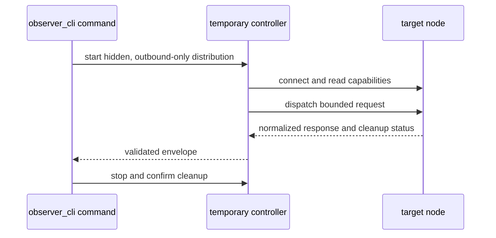

# Execution model

Interactive exploration and repeatable diagnostics need different lifecycles.
Both `observer_cli` interfaces use Erlang distribution, but code delivery,
controller lifetime, and output contracts differ.

## The command interface is ephemeral

Each command starts as a non-distributed escript, then:

1. resolves the target, name mode, and cookie source;
2. starts a hidden distribution controller with no listening distribution port;
3. connects to the target and reads its diagnostics capabilities;
4. invokes `observer_cli_snapshot:dispatch/4` on the target;
5. validates and encodes the response; and
6. stops the controller before returning.



Commands have no daemon or persistent network connection. Each invocation
creates a controller and performs a capability probe.

The command controller must itself start from `nonode@nohost`. Running the
escript from an already distributed Erlang node is refused because the command
cannot provide its normal controller lifecycle guarantees in that state.

## The saved context is a selector

`connect` verifies a target, then writes one active context under the operating
system's user configuration directory:

```text
<user-config>/observer_cli/context.etf
```

The context contains:

- target node text;
- `short` or `long` name mode; and
- either an environment-variable name or an absolute cookie-file path.

The context does not contain the cookie value. The directory is restricted to
mode `0700` and the context file to `0600`. A new context is installed atomically
only after the temporary controller stops successfully. A failed connection,
probe, or cleanup leaves the previous context unchanged.

`status` reads the selector and performs a fresh probe. `disconnect` removes the
selector; it does not close a persistent connection because none exists.

Scripts can avoid shared state entirely:

```sh
observer_cli memory \
  --node app@host \
  --cookie-file "$HOME/.erlang.cookie" \
  --format term
```

## Command targets must provide the diagnostics bundle

Before dispatch, the controller checks the target's
`observer_cli_snapshot:capabilities/0` result against this contract:

```text
bundle_version = 2.0.0
protocol_version = 1
```

`connect` and `status` can still report a reachable target whose diagnostics
bundle is missing or incompatible. Commands that require target probes then fail
with a capability error. The command interface does not inject or replace BEAM
modules to repair that condition; the matching bundle belongs in the target
release.

The target executes its installed bundle; the controller verifies its contract
before requesting data.

## The TUI can load code remotely

The explicit `tui` route starts a hidden controller, connects to the target, and
checks for a compatible `observer_cli` installation. When modules are missing or
incompatible, it uses `recon` to load the required `observer_cli` and configured
formatter modules before starting the remote TUI.

The TUI:

- may load code and application environment into the target;
- runs continuously until the operator quits;
- refreshes and scans repeatedly; and
- renders terminal-oriented views rather than a versioned response envelope.

Use the TUI when an operator needs to explore. Use commands when a script, agent,
or repeatable runbook needs bounded data and explicit exit status.

## Target workers are bounded

Command probes execute in a monitored target worker. The dispatcher applies:

- a target-side deadline shorter than the controller deadline;
- a worker heap limit;
- response size and depth limits;
- scan admission budgets for inventories; and
- response normalization before data crosses distribution.

The dispatcher reports success only after the worker exits normally. It returns
a timeout, heap limit, invalid response, or unconfirmed cleanup as an error or
partial result rather than hiding it behind a successful envelope.

These controls limit the work performed by the tool. They do not turn Erlang
distribution into a security sandbox; a connected distribution peer remains
trusted code. See [Safety and observer effect](safety-and-observer-effect.md).
