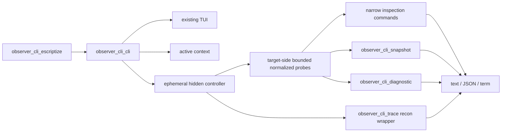

# observer_cli 2.0 AI-native diagnostics CLI design

状态：Design-reviewed（实现与发布矩阵通过；repeatable release runner 待入库）
日期：2026-07-11
目标版本：2.0
实施拆分：`.agents/observer-cli-2-diagnostics-goals/MANIFEST.md`（17 个串行 goal objectives）

## 1. 结论先行

只有 `snapshot` 和 `diagnose` 两个命令确实不够。它们适合作为**聚合入口**，但 AI 和工程师还需要窄而可组合的探针，才能按证据继续追问，而不是每次都重新采一份大快照。

2.0 应形成四组命令：

1. **Context**：选择当前目标节点，但不运行本地 daemon。
2. **Inspection**：按资源域读取当前状态，默认只读、有限输出。
3. **Diagnostics**：组合多次采样，产出 findings、suspects 和 context。
4. **Trace**：显式、短时、强限流的 active instrumentation，独立于普通诊断。

`snapshot` 仍是核心事实包，`diagnose` 仍是自动诊断入口；`processes`、`memory`、`ets`、`ports` 等命令使用同一组窄探针，不是另一套实现。默认 snapshot 不能假装“低成本地遍历所有资源”；全量 Top N 只能显式开启并受 scan budget 约束。

这里的 **AI-native** 指：

- 每个命令都能非交互运行；
- text、JSON、Erlang term 共享同一语义；
- 输出有稳定 schema、单位、resource ID、采样窗口和能力缺口；
- finding 能回指 evidence，suspect 不冒充根因；
- agent 能先跑低成本命令，再按结果选择更窄或更主动的命令。

第一版不内置模型 SDK，不联网，也不让 LLM 决定 VM 的基础故障事实。

## 2. 命令体系

### Context 与现有 TUI

```text
observer_cli connect --node myapp@host --cookie-env ERL_COOKIE
observer_cli status
observer_cli disconnect

observer_cli tui myapp@host
```

### 只读检查

```text
observer_cli snapshot
observer_cli snapshot --deep
observer_cli memory
observer_cli schedulers
observer_cli distribution

observer_cli processes --sort memory --limit 20
observer_cli processes --sort message_queue_len --limit 20
observer_cli process "<0.123.0>" --info

observer_cli applications --sort memory --limit 20
observer_cli ets --sort memory --limit 20
observer_cli mnesia --sort memory --limit 20
observer_cli network --sort oct --duration 1500ms --limit 20
observer_cli ports --sort queue_size --limit 20
observer_cli sockets --sort io --duration 1500ms --limit 20

observer_cli gen-server-state my_registered_server --redact
observer_cli supervision-tree --app my_app
```

### 受控 Trace

```text
observer_cli trace call my_mod:my_fun/2 --pid "<0.123.0>" \
  --duration 30s --limit 200 --replace-existing-trace

observer_cli trace stop --all
```

### 自动诊断

```text
observer_cli diagnose
observer_cli diagnose --json
observer_cli diagnose --observe 30s
observer_cli diagnose --observe 60s --deep
observer_cli diagnose --observe 30s --app my_app
```

上面的 inspection 示例要求目标 release 已安装协议兼容的 observer_cli diagnostics module。新 CLI v1 不复用现有远程 loader；缺少 module 时返回明确 capability error。旧 positional/TUI 路径继续保持现有自动加载行为。

这是一套 2.0 命令面，不是一个 PR 的范围。实现必须分切片交付。

## 3. 与现有 2.0 工作和 Issue #134 的关系

当前 2.0 重构已经建立 collection → render 边界，并规定未来机器输出不能解析 ANSI/TUI 文本。当前源码已有 Home、System、Application、ETS、Mnesia、Network、Ports、Sockets 和 Process detail 的数据面，但“已有页面 collector”不等于“可以安全直接暴露的远程 API”。

现有 [Issue #134](https://github.com/zhongwencool/observer_cli/issues/134) 仍是正确的第一块基础：

```text
#134 = versioned snapshot + JSON/term transport
本方案 = CLI context + narrow probes + snapshot + diagnostics + bounded trace
```

不应把全部命令继续塞进 #134。先固定 CLI envelope 和 snapshot schema，再逐域暴露窄命令。

此前 Trace 被判断为不适合加入低开销 TUI 核心；本方案也不把它放进 TUI 或默认 `diagnose`。用户现在明确需要 Trace，因此把它设计成独立、显式、可停止的 active instrumentation 命令族。

## 4. 现有代码基础与真实缺口

| 领域 | 当前可复用边界 | 需要补的 CLI 边界 |
| --- | --- | --- |
| Runtime/System | `observer_cli_system` runtime 与 memory 字段 | 从 public BIF 重建不枚举 process/table/port/socket 的窄 probe；OS/allocator 默认不采 |
| Home/Processes | 当前 Top N 字段和 TUI 语义 | 新扫描器；机器诊断不能直接复用 `recon:proc_window/3` |
| Process detail | 当前字段映射可参考 | 新的 explicit-key `process_info/2` probe；不能直接调用 `collect_process_info/1` |
| Application | `observer_cli_application` 的 group-leader attribution 语义 | 用 public OTP API 重建有限 attribution；不复用 private `application:info/0` |
| ETS/Mnesia | 页面本地 `collect_*_info` | metadata-only schema；表生命周期处理 |
| Network | 当前 IO/inet 字段和 recon API 语义 | total/delta、counter reset、legacy inet scope |
| Ports | 当前非 inet 分类 heuristic 和字段映射 | 不把 missing 字段变成 0；不读取无界 monitor lists |
| Sockets | 当前 socket API capability 与 counters | 不吞 enumeration error；稳定-ID delta |
| Plugin/Formatter | 现有 2.0 callback/format 边界 | 不作为第一版诊断规则扩展机制 |

当前 collection map 仍不等于公开协议：

- 部分值包含显示字符串、颜色、列宽或分页状态；
- 部分列表使用便于排序的 tuple/proplist；
- PID、Port、Ref、MFA、atom、tuple、`undefined` 不能原样进入 JSON；
- 大多数 collectors 仍是生产私有函数，只在 `TEST` 下导出；
- Top N 限制输出大小，但不自动限制全进程/全表扫描成本；
- `observer_cli_process:collect_process_info/1` 经 `recon:info/1` 会读取 dictionary、current stacktrace 和 binary refs，不能用于默认安全 probe；
- `recon:proc_window/3` 会把新生/死亡 PID 的累计值混入窗口结果，不能作为稳定 PID delta；
- 当前 distribution queue 读取依赖内部 `sys_dist` tuple 和未公开的 `erlang:dist_get_stat/1`；
- 当前没有 supervisor restart 历史，也没有 scoped trace session 管理。

因此，2.0 需要一个小的 CLI/协议层和少量真正窄的 target-side probes，但不需要新的通用采集框架。所谓“复用”是复用字段语义和已验证的小 helper，不是把现有 TUI collector 原样改成 public RPC。

## 5. `connect` 的准确语义

### 5.1 不运行 daemon

`observer_cli connect` 不能声称保持一条长期网络连接，因为命令进程执行完就会退出。它的语义是：

1. 校验 node name、cookie source、name mode 和 reachability；
2. 探测目标 OTP、observer_cli diagnostics module 和可用能力；
3. reachability 和认证成功后保存一个 active context；
4. 后续每个命令临时启动 hidden controller node，连接、调用 target-side bounded worker、确认清理、断开并退出。

成功提示必须明确：

```text
Selected myapp@host; probe succeeded.
No persistent connection is kept.
```

`disconnect` 只删除 active context；它不是网络断连操作。`status` 读取 context，并执行一次新的 reachability/capability probe。

目标可达但缺少 diagnostics module 时，`connect` 仍成功选择 context，同时输出 `diagnostics_module=missing` 警告。后续 inspection 命令返回 `capability_unavailable`，直到目标正式安装兼容 module。`connect` 不能把 DNS、端口、cookie 或节点未启动造成的失败可靠地区分开；对外统一返回 `connection_failed`，只提供排查提示，不声称已经证明是认证错误。

legacy TUI 保持当前 `resolve_target_name/1` 规则。新命令默认在 host 含 `.` 或 `:`（IPv6 literal）时推断 longnames，否则推断 shortnames；`--name-mode short|long` 可以显式覆盖，IPv6 还要求现有 inet6 构建 profile。node 文本必须恰好包含零个或一个 `@`，并拒绝空组件、控制字符和超长输入。

新命令不继续生成本地 controller 名称。OTP 26+ 使用 public `net_kernel:start(undefined, #{name_domain => Mode, dist_listen => false, hidden => true})` 启动 dynamic hidden controller；启动后立即取 24-byte `crypto:strong_rand_bytes/1`、hex encode 成 cookie-safe atom且绝不回显，并以 public `erlang:set_cookie/1` 替换 default cookie，再为 explicit target 设置 per-node cookie，最后才调用 `net_kernel:connect_node/1`。随机源不可用就必须在连接前失败，不能降级成时间/`rand`。一参数 API 在 dynamic name 尚未分配、`node()=nonode@nohost` 时也能设置 default；不能错误地调用此时会失败的 `set_cookie(node(), Cookie)`。动态名称由目标在 handshake 时唯一分配，因此并行 agent 不会争用当前 `random_local_node_name/0` 的秒级名称，也不在 controller 上开放 distribution listener。旧 positional/TUI 路径继续保持当前命名方式，不把这项新协议改动倒灌进去。

新非交互 escript 要求启动时 `node() =:= nonode@nohost`；若 controller runtime 已经 distributed，就返回 `controller_already_distributed`，不复用一个可能有 listener、旧 cookie 或错误 name mode 的节点。legacy TUI/library path 保持现行为。

### 5.2 Context 文件

使用 OTP stdlib：

```erlang
filename:join(filename:basedir(user_config, "observer_cli"), "context.etf")
```

文件要求：

- 使用未压缩 `term_to_binary/1` 写入，读取前限制 8 KiB，再调用 `binary_to_term(Bin, [safe])`；拒绝 compressed ETF；
- 只保存 version、node、name mode、cookie source 类型和环境变量名/绝对文件路径，值使用 binary；
- 绝不保存 cookie 值；
- 配置目录 mode `0700`，context/temp file mode `0600`；
- 拒绝 symlink 和非普通文件；使用唯一 temp file，close 后在同一目录 atomic rename；
- decode 后做完整 allowlist/类型/长度校验，再解析 node；不使用 `file:consult/1`；
- 并发 `connect` 采用 last-successful-rename-wins；`disconnect` 遇到不存在文件仍成功。

第一版只支持一个 active context，不做 profiles、credential store 或 daemon。

### 5.3 Cookie source

```text
--cookie-env ERL_COOKIE
--cookie-file ~/.erlang.cookie
```

后续命令执行时才读取 cookie source。cookie file 在 `connect` 时转成绝对路径；读取时处理单个 trailing LF/CRLF，拒绝空值、超大值和控制字符。缺失环境变量、不可读文件和无效 cookie 返回参数或 connection error；stderr 不回显 secret。新命令不提供明文 `--cookie VALUE`，也不把默认 `.erlang.cookie` 当作 target credential。dynamic net kernel 启动时 runtime 仍可能短暂初始化自身 default cookie，但任何连接前先用 `set_cookie/1` 随机化，再设置 explicit per-node target cookie；旧 default 不参与 handshake，也没有 inbound listener。

### 5.4 无状态调用

脚本和 agent 不应依赖 context 文件：

```text
observer_cli processes --node myapp@host --cookie-env ERL_COOKIE \
  --sort memory --limit 20 --json
```

v1 只支持 command-first grammar；不接受 global flags 前置。显式 `--node` 不修改 context，并且必须同时给出 cookie source，绝不继承另一个 context 的凭据。

## 6. 旧 TUI 兼容与保留字

现有入口继续保留：

```text
observer_cli TARGETNODE [TARGETCOOKIE REFRESHMS]
observer_cli:start/0,1,2
```

但 `memory`、`diagnose`、`connect` 等单词今天也可能被解释为短节点名。不能根据“本机是否已有 context”动态解释，否则同一条脚本在不同机器行为不同。

2.0 使用确定性规则，并且只检查首 token：

- 首 token 是已知 command word 时始终按新命令解析，不受参数个数影响；
- 只有首 token 非保留字时，单 positional 或三 positional 才走旧 TUI 路径；
- 未被占用的单 positional 参数仍走旧 TUI 路径；
- 三 positional 参数旧路径继续保留；
- 新增显式 `tui` escape，访问与命令同名的节点：

```text
observer_cli tui memory
observer_cli tui diagnose COOKIE 1500
```

这是一个小范围、明确记录的 2.0 语法变化；页面、导航、刷新、远程加载和退出行为仍保持兼容。

当前 `observer_cli_escriptize:run/4` 先假定第一次远程 `start` 必须得到 `{badrpc,_}`，目标已预装 observer_cli 时会在 TUI 退出后 badmatch。Slice A 必须先改成“probe module → 缺失才 legacy-load → TUI 只启动一次”，并为预装/缺失两条路径保留行为测试。

## 7. 通用选项与输出契约

所有非交互命令共享：

```text
--node NODE
--cookie-env NAME | --cookie-file PATH
--name-mode short|long
--format text|json|term
--json
--timeout DURATION
--redact
--include-identifiers
```

- `--json` 是 `--format json` 的便捷别名。
- options 只出现在 command 之后；unknown、duplicate 或互斥 flags 返回 2。
- `--json` 与显式非 JSON `--format` 互斥；`--redact` 与 `--include-identifiers` 互斥。
- text 默认；只有 TTY text 可以使用 ANSI，JSON/term 永不包含 ANSI。
- text 模式成功结果写 stdout、错误写 stderr；JSON/term 在 parser 和 encoder 可用后，无论成功失败都输出同一 envelope。bootstrap/encoder 不可用错误使用稳定纯文本 stderr。
- byte、count、ratio、millisecond 保留数值，单位写入字段名。
- 列表稳定排序；值相同时使用规范化 resource identifier 打破平局。
- `--timeout` 是整个命令 deadline：不含采样窗口的普通命令默认 10 s、硬上限 120 s。任何 duration-bearing command（schedulers/network/sockets、reductions window、observe、trace）的默认 timeout 为 `max(10 s, duration + 5 s)`；显式 timeout 小于 `duration + 5 s` 时直接拒绝。当前所有 duration 硬上限不超过 60 s，因此不会撞到 120 s command cap。
- target deadline 比 controller deadline 至少早 1 s；所有 probes 共用 remaining budget，不能每个 optional probe 各消耗一份完整 timeout。
- target-side normalized response 结构上限为 1 MiB；controller 编码后再次检查 1 MiB。超过时截断有界列表并设置 `truncated=true`，不返回任意大 term。
- 不增加 `--output`；使用 shell redirect。

### Identifier 默认策略

- 窄 inspection 命令默认输出真实 identifier，用于同一报告内关联；只有已经存在对应 consumer 的 identifier（v1 主要是 process PID/name）才承诺下一条命令可以 drill-down。ports/sockets/ETS v1 没有 detail command，不作该承诺。
- `snapshot` 和 `diagnose` 默认脱敏，使用单次报告内稳定 ID；`--include-identifiers` 显式放开 node/PID/name/MFA。
- `--redact` 可强制窄命令脱敏。
- identifier 可见不代表 messages、dictionary、state 或 trace payload 会被自动读取。
- report-scoped ID 在整个多点采样期间由同一 raw-resource dictionary 分配，不能按每个样本重新编号，也不能跨命令继续 drill-down。

### List 默认限制

- `--limit` 默认 20；硬上限 200。
- 超过 hard cap 直接拒绝，不静默扩大。
- Top N 只限制输出；可能扫描大量对象的 probe 仍要有 target-side deadline。

## 8. 只读检查命令

| Command | 默认事实 | 关键选项 | 安全/成本边界 |
| --- | --- | --- | --- |
| `snapshot` | scan-free runtime、limits、memory、IO/GC、run-queue/peer context | `--deep`、`--json` | 默认不枚举 process/table/port/socket；scheduler/peer list 仍随 topology 增长 |
| `memory` | `erlang:memory()`、persistent term summary、basic runtime | — | 单点 BEAM memory，不等于整机 RSS；默认不执行 `ps`/allocator scan |
| `schedulers` | normal/dirty CPU utilization、run queue lengths | `--duration` | 临时 wall-time measurement，有 observer effect |
| `distribution` | public connected visible/hidden peer 集合、controller queue/limit capability | `--limit` | controller peer 排除；不承诺 per-peer state 或 in/out |
| `processes` | process Top N + safe metadata | `--sort`、`--limit`、`--duration` | 不读取 messages/dictionary/state |
| `process` | 单进程 explicit-key metadata、GC summary | `--info` | 不读取 links/monitors/dictionary/stack/binary；对象消失返回 `not_found` |
| `applications` | group-leader attribution 的 count/memory/reductions/msgq | `--sort`、`--limit` | 近似归因，不是严格 ownership |
| `ets` | table metadata、size、memory、owner | `--sort`、`--limit` | 不读 table content |
| `mnesia` | table metadata、storage、size、memory | `--sort`、`--limit` | 未运行是 `not_running`，不是故障 |
| `network` | VM port-driver IO 与 legacy inet TCP/UDP/SCTP counters | `--sort`、`--duration`、`--limit` | 不是主机全部网络流量 |
| `ports` | best-effort 非 inet Erlang Port queue/memory/connected PID | `--sort`、`--limit` | 分类只靠 documented port name heuristic；不是 TCP/UDP port number |
| `sockets` | OTP socket registry-known overview/counters | `--sort`、`--duration`、`--limit` | 不可见 registry-disabled sockets；enumeration error 不得伪装成 empty |

`schedulers --duration` 使用两个 wall-time 样本，默认 1500 ms，最短 250 ms、最长 10 s；`network`/`sockets` 和 `processes --sort reductions --duration` 使用同一 250 ms–10 s 范围。它们只输出 measurement/context，不单独产生诊断 finding。`diagnose --observe` 范围 5–60 s；Trace 范围见第 11 节。`memory` v1 只采单点；增长判断统一由 `diagnose --observe` 完成。

`network`/`sockets` 无 duration 时输出 lifetime total 并标记 `sort_semantics=total`；有 duration 时只对两个样本中 generation 稳定的资源计算 delta 并标记 `sort_semantics=delta`。新生资源是 `baseline_missing`，counter 下降是 `counter_reset`，不能像当前 socket collector 一样 clamp 为 0。

### 8.1 排序契约

v1 `--sort` 是固定 allowlist；unknown key 退出 2。CLI key 保持简短，response 字段必须带单位后缀：

| Command | Default | Accepted keys | Unit / semantics |
| --- | --- | --- | --- |
| `processes` | `memory` | `memory`、`message_queue_len`、`reductions`、`binary_memory`、`total_heap_size` | bytes/count；只有 reductions 可按 duration 变成 delta/rate |
| `applications` | `memory` | `memory`、`process_count`、`reductions`、`message_queue_len` | bytes/count；current/lifetime aggregate |
| `ets` | `memory` | `memory`、`size` | bytes/rows；current gauge |
| `mnesia` | `memory` | `memory`、`size` | local in-memory bytes/rows；disc_only/external storage 不 eligible for memory sort |
| `network` | `oct` | `oct`、`recv_oct`、`send_oct` | bytes；lifetime total 或 duration delta |
| `ports` | `queue_size` | `queue_size`、`memory`、`input`、`output`、`io` | bytes；queue/memory gauge，input/output/io lifetime counter |
| `sockets` | `io` | `io`、`read_bytes`、`write_bytes`、`packets`、`waits`、`fails` | bytes 或 count；lifetime total 或 duration delta |

`oct = recv_oct + send_oct`、Port `io = input + output`。Socket composites 固定为：

```text
read_bytes  = read_byte
write_bytes = write_byte + optional(sendfile_byte)
io          = read_bytes + write_bytes
packets     = read_pkg + write_pkg + optional(sendfile_pkg)
waits       = acc_waits + read_waits + write_waits + optional(sendfile_waits)
fails       = acc_fails + read_fails + write_fails + optional(sendfile_fails)
```

每个公式的 non-optional core key 缺失时 metric unavailable；`sendfile_*` 在普通 socket/部分 OTP counter shape 中常不存在，缺失时只对该 optional contribution 取 0，并在 coverage 记录 `optional_sendfile_counter_absent`，不能泛化成“所有 missing 都是 0”。duration delta 中任一已存在组成 counter 下降都使整个 composite `counter_reset`/invalid；counter shape 在两点间变化也要记录。`snapshot --deep` 分别固定使用 processes/applications/ETS/Mnesia `memory`、network `oct`、ports `queue_size`、sockets `io`，全部按无 duration 的 current/lifetime semantics。所有命令 metric 相等时仍按 target-side canonical raw identifier 升序打破平局。

状态和退出语义分开处理：

- capability 存在但 Mnesia 未启动或资源为空：返回 `not_running|empty`，direct command 成功退出 0；
- capability/API 不存在：聚合 probe 使用 `status=unavailable`、`reason_code=capability_unavailable` 并进入 `skipped`；direct command 返回同一 reason code 并退出 2；
- probe timeout/error：按 required/optional 规则进入 partial report，不能伪装成空数据；v1 不承诺 timeout 后还能返回 partial ranking。

`scan_budget_exceeded` 是进入昂贵 per-resource stage 前的安全拒绝，不等于 timeout：direct list command 将该 probe 标为 `unavailable`、返回 `reason_code=scan_budget_exceeded`、`capture.status=complete` 并退出 3；complete 表示 admission decision 正常完成，不表示 full scan 已运行。Mnesia/Application 的 admission 必须先物化 ID/app list，因此另记 `admission_stage=post_enumeration`。`snapshot --deep`/`diagnose` 的 optional scan 进入 `skipped`，不把聚合报告改成 partial。scan 已开始后超时使用 `status=timeout`；max-heap boundary 杀死 worker 使用 `status=error, reason_code=worker_heap_limit_exceeded`，两者都会让 direct/aggregate capture 成为 partial 并退出 3。

### Scan budget

当前 `recon:proc_count/2`、`recon:proc_window/3` 和页面 ETS/port/socket list comprehension 都会先物化全量资源。新 CLI 不直接调用这些全成或全败路径：

- 所有 OTP 先检查 process count；超过经 benchmark 固定的 release scan budget 时返回 `scan_budget_exceeded`；
- OTP 28+ 再 capability-check `processes_iterator/0` 与 `processes_next/1`；single-point ranking 可以流式扫描并只保留 bounded Top N，但 iterator 只避免 `processes/0` 的巨型 PID list，不会让 delta/trend working set 变成常量；不能按 release number猜 API；
- iterator/list 都不是原子 process-table snapshot；`exact` 只表示对本次 observed stable scanned set 做无 candidate bias 的选择，`complete=true` 只表示 iterator 到 `none`/list 扫完。每次 inventory 记录 scan start/finish，不能声称所有 PID 来自同一时刻；
- OTP 26/27 admission 通过后才调用 `erlang:processes/0`；
- ETS/port/socket 同样先用可用 cheap count 做 admission，并在 target worker 设置 deadline 与 max-heap kill boundary；
- Mnesia 没有 public O(1) local-table count：在 worker deadline/max-heap 内先调用 `mnesia:system_info(local_tables)` 得到当前节点有本地 replica 的完整 ID list，再按 length 做 staged admission；超预算时不调用逐表 `table_info`，返回 `scan_budget_exceeded, admission_stage=post_enumeration`。这只能限制第二阶段，不能把第一阶段 list allocation 描述成 scan-free/pre-allocation admission；不用 `tables` 把 remote-only table 混进“当前 VM”报告；
- Applications 同样没有独立 cheap count：`application:loaded_applications/0` 在 worker 中从 application controller table select/materialize loaded list；`which_applications(RemainingTimeout)` 则让 `application_controller` server 在自身 heap 构造完整 running list后同步回复，timeout 只限制等待，不能取消 server 已开始的工作/reply allocation。取得两份 list 后才做 staged app-count admission；超预算就不做 per-app `get_supervisor/1`、process attribution/Top N。process count 只能间接约束 running apps，不能冒充限制 loaded list 或 application-controller work；
- process ranking 与 application attribution 共用同一次 explicit-key process inventory；
- timeout 返回 probe `status=timeout` 且不附 ranking，除非未来真正实现 checkpointed accumulator；
- 每个 list 输出 `scanned_count`、`eligible_count`、`returned_count`、`dropped_count` 和 `complete`。

single-point Top N 的 selection heap 是 O(limit)，但 exact delta/trend 必须保留第一个采样点所有 admitted stable-resource baseline，否则会漏掉“首点不热、窗口内突然变热”的真实 Top N。v1 因此明确：

- process/mailbox/memory/reductions trend、socket/network delta 和 ETS/port trend 的 working set 是 `O(admitted resources × tracked fields × retained samples)`；sample 上限固定为 7；
- admission 依据 resource count、模式、字段数和经 benchmark 固定的每-resource state estimate，而不只看输出 `--limit`；
- state 留在有 max-heap boundary 的 target worker heap，不用 target ETS/persistent process 把内存成本藏起来；
- response 记录 `baseline_count`、`tracked_field_count`、`retained_sample_count`、`working_set_estimated_bytes` 和实际 coverage；
- v1 只输出 admission 通过后的 exact stable-resource ranking/trend summary；若以后做 candidate-only approximation，必须换 schema/字段名并明确 selection bias，不能冒充完整 Top N。

scan budget 的具体数值必须通过第 21 节的大节点 benchmark 固定；在数值未验证前，相应能力不能标记 release-ready。

### 8.2 `processes`

v1 sort fields：

```text
memory
message_queue_len
reductions
binary_memory
total_heap_size
```

`reductions` 无 duration 时表示累计值；指定 `--duration` 时表示窗口 delta/rate。v1 只有 `--sort reductions` 接受 duration。两个样本按 PID 求交集，只对 stable PID 计算 delta；born/died PID 单列 lifecycle context，不能使用 `recon:proc_window/3` 的结果。输出必须记录实际 monotonic interval 和 `sort_semantics=total|delta`。

`binary_memory` 需要读取每进程 binary refs，成本高于普通 process_info；它必须显式执行、使用更低 scan budget。timeout 返回无 ranking 的 `status=timeout`，不能伪装成完整或 partial Top N。

Top N 在 target 侧使用 `{metric, canonical_raw_id}` 作为选择 key，再按 metric 降序、ID 升序输出。当前页面/recon heap 的 equal-metric tie 不稳定，不能等截断后再补排序。

### 8.3 `process`

`--info` 是默认模式，可保留为显式可读别名。v1 使用明确的 `process_info/2` key list，不调用当前 `observer_cli_process:collect_process_info/1` 或 `recon:info/1`。默认不请求 messages、dictionary、current stacktrace、binary refs、links、monitors、suspending 或 arbitrary state。

`process --info` allowlist 固定为 `registered_name|status|current_function|initial_call|memory|message_queue_len|reductions|heap_size|total_heap_size|stack_size|group_leader|garbage_collection_info`；GC info 再做 fixed numeric/boolean field allowlist。process inventory 只请求当前 sort/输出需要的上述子集和 application attribution 的 `group_leader`；只有显式 `--sort binary_memory` 才额外读取 binary refs，并只在 target 求和后立即丢弃 ref 列表。

目标解析在目标 VM 内完成：

- `"<0.123.0>"` 经过严格 PID 文本校验后，在目标节点解析；
- registered name 先做 UTF-8/长度校验，再在目标用 `binary_to_existing_atom(Name, utf8)`（catch `badarg`）和 `whereis/1` 解析，要求结果是仍存活的 local PID；不调用会物化全部名称的 `registered/0`；
- atom 不存在、atom 已存在但未注册、name/PID 对象刚好消失都对外归一化为 `not_found`；不对任意 CLI 文本调用 `list_to_atom/1`，也不泄漏 atom 是否已经 intern。

### 8.4 资源字段语义

- Process `memory_bytes` 是该 process 的 runtime memory；heap/stack 从 words 乘 target word size 后输出 bytes。
- `erlang:statistics(garbage_collection)` 的 reclaimed 值是 words：schema 输出 `collections_total`、`reclaimed_words_total`，若同时给 bytes 则明确 `reclaimed_bytes_total = words * target wordsize`；不得用无单位字段或误标 bytes。`erlang:statistics(io)` 的 input/output 按 bytes 输出。
- Application `attribution=group_leader_application`；memory 是被归因 process memory 的和，不包含 ETS、ports 或共享 binary 的全局真实占用。
- Application inventory 只用 public `application:loaded_applications/0`、`application:which_applications(RemainingTimeout)` 和 staged-admission 后的 `application:get_supervisor/1`；只有返回 `{ok, Root}` 且 `Root` 是 local live PID 才读取 `process_info(Root, group_leader)` 建立映射，`undefined` 表示没有 callback/root、是有效 state，不能把 `{ok,Pid}` tuple 误传给 process/supervisor API。`get_supervisor/1` 没有 per-call timeout，worker deadline 仍不能撤销已送达 application controller 的 call。再与 shared process inventory 的 explicit `group_leader` 字段关联；无法映射的 process 单列 `unattributed` coverage，不递归追 group leader，也不静默丢弃。当前 collector 使用的 `application:info/0` 是 `-doc false`，新 CLI 不调用；v1 只区分 `loaded|running`，不承诺 private Loading/Starting 状态。
- ETS `memory_bytes = ets:info(Table, memory) * wordsize`，generation 使用 `ets:info(Table, id)`，不能使用可复用的 named-table atom。
- Mnesia 使用 `mnesia:system_info(is_running)` 和 `local_tables`；每表 race 单独记录，并先读 documented `storage_type` 再解释 `table_info(Table, memory)`：`ram_copies|disc_copies` 的值是本节点 allocated words，输出 `memory_bytes = Value * target wordsize`、`disk_bytes=null`；`disc_only_copies` 的同一 API 值是 on-disk bytes，输出 `memory_bytes=null, disk_bytes=Value`，绝不乘 wordsize；external/unknown storage 两者都为 null 并标 `storage_semantics_unavailable`。memory sort 只纳入有 `memory_bytes` 的 local table，size sort 可纳入其它 local storage。
- 只有 local `ram_copies|disc_copies` Mnesia main table 能通过 public `ets:whereis(Table)` + exact raw `ets:info(Tid,id)` 与本次 ETS inventory 唯一匹配时，才标记 `managed_by=mnesia_main_table`。Mnesia internal/index ETS 没有 public arbitrary Tid→table mapping，统一 `management_unknown`，不能按 owner/name 猜测。v1 growth 只输出 context，本就不生成重复 suspect/finding；future 去重只允许使用上述 exact evidence。
- Ports 只逐项调用 documented `port_info(Port, name|connected|queue_size|memory|id|input|output)`；不调用会连同 `monitors`/`monitored_by` 一次物化的 `port_info(Port)`。v1 只以 name 是否为已知 `tcp_inet|udp_inet|sctp_inet` 做 best-effort 分类，不读取当前 collector 的 `controls` fallback；`input`/`output` 只是 driver 支持时的 Erlang Port byte counters。缺失/死亡字段输出 `null` 和 field error，不默认成 0，`connected_pid` 不能错误命名为 owner。
- Cross-sample correlation 在 target side 使用完整 raw identity：process 用 PID；ETS 用 `ets:info(Table,id)`；legacy inet/network 和 port 用完整 raw `Port` term；socket 用完整 opaque raw Socket term/ref。绝不使用可复用的 port slot/`port_info(id)`、socket fd、name 或展示字符串作为 generation。完成 stable intersection/born/dead 分类后才映射 report ID；同 fd/slot 重用不能拼接成一条 delta。
- `socket:number_of/0` 与 `socket:which_sockets/0` 只覆盖 socket registry 已知对象。probe 固定输出 `coverage=registry_known_sockets` 和 `socket:info().use_registry`；即使全局为 true，per-open override 仍让 completeness 不可证明。admission count 也是 registry-known count；空结果只能写 `no_registry_known_sockets`，绝不能写“no sockets”或据此判断 healthy。
- v1 network/socket probes 只输出 counters、raw-ID 映射和 domain/type/protocol 等非 endpoint metadata；不调用 `inet:peername|sockname` 或 `socket:peername|sockname`，因此不采 IP:port 或 Unix socket path。未来若加入 endpoint，必须纳入 identifier/redaction policy，不能沿用当前 TUI renderer 直接输出。

## 9. 高风险只读命令

### 9.1 `gen-server-state`

这个命令可以存在，但不能把“任意业务 state 已安全脱敏”当作承诺。

```text
observer_cli gen-server-state SERVER --redact
```

实现边界：

- SERVER resolver 复用第 8.3 节的严格 local PID 文本或 UTF-8/长度校验后的 `binary_to_existing_atom` + `whereis`；只把已存活 local PID 传给 `sys:get_state/2`，不接受 `{global,...}`、`{via,...}` 或任意 Erlang term，不创建 atom，所有不存在情况统一 `not_found`；
- 使用 `sys:get_state(Server, Timeout)`，默认 timeout 1000 ms；
- 该调用会执行目标 special process 的 `system_get_state/1`，因此不是零成本 metadata read；
- v1 只允许 target-side strict shape：类型、容器规模、有限前缀和截断标记；不输出 map keys、tuple tags、atom/binary/string 内容；
- 不调用完整 `length/1`、`term_to_binary/1` 或 `external_size/1` 深遍历任意业务 term；
- 默认最大深度 6、最大访问节点数 10,000、normalized output 上限 64 KiB；
- 64 KiB 只限制归一化输出，不能限制 `sys:get_state` 先复制完整 state 的成本；timeout 也不能撤销已经发给目标 process 的 system request；
- 当前 TUI 的 `collect_process_state/1` 会直接返回完整 state，只能保留给显式旧 TUI，不能提升为新 CLI probe；
- callback exception 在目标侧归一化成稳定 reason code，不返回或记录 arbitrary reason/stack；
- v1 删除 `--include-values`；如果无法接受完整 state copy 的固有风险，就不发布该命令；
- 永不自动加入 `snapshot` 或 `diagnose`。

### 9.2 `supervision-tree`

```text
observer_cli supervision-tree --app my_app
```

v1 的命令名保留 `tree`，但安全范围固定为 **application root + direct children 一层**；不假装已经安全实现任意递归树。实现使用 OTP 现有能力：

- application 名称从已加载 applications 中匹配 existing atom，并调用 OTP 26+ public `application:get_supervisor/1`；只有 `{ok, Root}` 且 Root 是 local live PID 才继续，`undefined` 是 no callback/not supervised 的有效 state，error/exit 按 probe error 处理；不直接调用两个内部 application modules；
- v1 不接受任意 `--supervisor` name/PID，也不调用 `proc_lib:translate_initial_call/1`；对任意 gen_server 调用 supervisor API 可能让目标 callback 崩溃，child spec 的 `Type=supervisor` 也不是可安全调用的运行时证明；
- 只对解包后的 local live `Root` 调用一次 `supervisor:count_children/1`；`max(active,specs)` 超过 scan budget 时不调用 `which_children/1`；该 preflight 自身会在 root supervisor process 中 O(children) fold，只避免第二次巨型 reply，不是硬 admission 或零成本保护；
- admission 通过后只对同一个 root 调用一次 `which_children/1`；child 的 `Type`、local/remote PID 和存活状态只作为 leaf metadata，绝不继续调用 child；
- 两次 OTP call 都在 max-heap/deadline worker 中执行，因为 `count_children/1` 和 `which_children/1` 内部都使用 infinity call；worker boundary 不能限制 supervisor process 已开始的 fold/reply allocation；
- direct child 输出上限 500 只是 output soft cap，不是 `which_children/1` 单次 reply 的硬内存边界；
- child ID 可以是任意 term：safe scalar 才按 identifier policy 输出真实值/report ID；复杂 term 只输出无值 shape、截断和控制字符清理，不把 arbitrary payload 带进 report；
- `which_children/1` reply 的 Modules 字段已经随本地 OTP reply 被 acquisition/copy，无法在 mapper 阶段撤销；v1 不再归一化它，也不跨 distribution 暴露，但不能把这描述成降低原始 call 成本；
- 多样本 correlation 的 safe-scalar child ID 仅允许 atom、integer 或 binary，且其 canonical encoded value 对三种类型都不得超过 128 bytes；integer 先用固定 1024-bit magnitude bound 拒绝超限 bignum，再编码，不能为检查上限先分配任意大 decimal/binary。其它 tuple/list/map/PID/Port/Ref 即使可显示也不作为 stable key；
- `restarting`、`undefined`/duplicate child ID、dynamic child、remote child 和中途消失都要显式表示；`Type=supervisor` 只作为 leaf metadata。

OTP 官方明确警告巨型 supervisor 的 `which_children/1` 可能导致内存问题。即使有 preflight，count 与 children 之间也存在竞态；这一层 snapshot 不是原子结果。它只展示采样期间观察到的 application root/direct children，不提供历史 restart count，也不能单独证明异常重启。任意 root 与深层递归另立明确 unsafe 的 future design，不在 v1 偷做。

这两个命令都是 High risk，应在核心 inspection 稳定后单独交付和评审。

## 10. `snapshot` 的职责

`snapshot` 是同一批窄 probes 的组合，不应复制采集逻辑。

默认包含：

- target/OTP/runtime identity；
- process/port/atom/ETS count 与 limit；
- BEAM memory、IO/GC counters、persistent term summary；
- scheduler topology 和 run queue context，但不主动开启 scheduler wall-time；
- public connected visible/hidden peer 集合；
- 每个 probe 的 `ok|unavailable|timeout|error` 状态和 observer effects。

只有 `snapshot --deep` 才尝试 process、application、ETS、Mnesia、network、ports、sockets 的 Top N。每项先做 capability/scan-budget admission；任一 scan 被拒绝或 timeout 都必须显式记录，不能把空列表当健康。

默认不包含：

- process messages、dictionary、state；
- ETS/Mnesia 内容；
- full supervision tree；
- trace event；
- arbitrary user payload。

required core 明确定义为：target/OTP/runtime identity、process/port/atom/ETS count 与 limit、`erlang:memory()`。其它 scheduler、distribution 和 `--deep` 资源 Top N 都是 optional probes。

一个 optional probe 的 `status=unavailable, reason_code=capability_unavailable` 不能丢掉整份 snapshot，也不单独改变退出码；它进入 probe status/warnings。required core 或已开始执行的 optional probe 出现 timeout/error 时，都保留已采数据并标记 `partial`，退出码为 3。

snapshot 是一个带 `started_at`/`finished_at` 的时间范围，不是 VM 的原子一致性快照。target diagnostics module、worker 和 controller distribution connection 都会污染观测值。已知本次 observer PID/Port/controller peer 必须在 entity scan 的 eligibility 阶段排除：它们不进入 ranking、delta/trend baseline、reductions share 分母或 application aggregate；`scanned_count` 仍包含、`eligible_count` 排除，并记录 exclusion IDs/reasons，不能等最终 Top N 才过滤。无法准确扣除的全局 process/port/atom count、memory、IO 与 GC collections/reclaimed words 保留 raw 值并标记 `observer_contaminated=true`；deep scan 尤其可能触发 diagnostics worker GC。首次 module load 还会增加 code/total memory，response 记录 `module_loaded_before_sample`。dynamic controller name 会在 target intern atom；串行连接可能复用 dynamic slot/name，但并发峰值仍可能增加 atom count，不能假装可逆。

## 11. 受控 Trace

Trace 是主动观测，不是普通 read-only probe。v1 不自建 OTP trace setup，也不直接用 `erlang:trace/3` 创建 session；控制面只调用公开 `recon_trace:calls/3` 和 `recon_trace:clear/0`。结构化 event capture 只使用 `calls/3` 已公开的 `{formatter, Fun}` 与 `{io_server, Pid}` options，不调用 recon 的 internal exports。observer_cli 只补 CLI 参数校验、duration、bounded capture 和 cleanup 验证。

### 11.1 采用 `recon_trace` 后的真实边界

当前仓库 `rebar.lock` 固定 recon 2.5.6。v1 target capability 必须报告 `recon` application version 和 `recon_trace` module identity；第一版只接受经过第 21 节矩阵验证的 2.5.6，版本或行为 profile 不匹配就返回 `capability_unavailable`，不能猜测兼容。升级 recon 必须重新跑 trace proof gates。

observer_cli 允许使用的 recon public control surface 只有 `calls/3` 和 `clear/0`。在已锁定的 2.5.6 实现中：

- 只支持 function call tracing，不支持 send/receive message trace；
- `calls/3` 支持 `{pid, Pid}`、`{args, arity}`、global/local scope、absolute count 或 rate limit；
- 每次 setup 都先调用 `clear/0`；`clear/0` 会关闭 node-static process tracing 并清除 global/local/meta patterns；
- 2.5.6 的 `clear/0` 包含 `erlang:trace(all, false, [all])` 和 wildcard pattern clear，setup/cleanup 成本会随节点 process/trace state 增长；event limit/rate 完全不限制这段成本，调用开始后也不能靠 controller timeout 撤销；
- tracer/formatter 使用固定 registered names，所以同一节点只能有一个 recon trace；
- `clear/0` 会直接 kill 当时占用 `recon_trace_tracer` / `recon_trace_formatter` 名称的进程，无法证明这些进程一定由 recon 创建；
- `Max` 只能是 total count 或 `{count,window_ms}` rate，不能同时满足 `--limit` 和 `--rate`；
- broad/hot trace 的事件仍会先进入 tracer mailbox，limit/rate 是 reactive safeguard，不是峰值内存硬边界。

fixed names、link topology 和 clear 顺序是本仓库锁定 recon 版本的已核查行为，不冒充长期 public contract；capability gate 和测试锁住它们。真正的 trace setup/stop 仍只通过 public `calls/3` / `clear/0` 完成。

因此 v1 明确收缩：

- 只发布 `trace call MFA --pid PID`；
- `--limit N` 与 `--rate N/s` 互斥，默认 `--limit 100`；limit 范围 1–1000，rate 范围 1–200/s，后者准确映射 recon 的 `{N,1000}` 并在超阈值时停止 session；
- duration 默认 10 s、范围 100 ms–60 s；
- 不发布 `trace list`、`trace stop TRACE_ID` 或 `trace pid --messages`；
- `trace stop --all` 是 owner-aware stop，最终仍调用 `recon_trace:clear/0`；它会停止节点上其它 static tracing，并可能 kill 固定名称碰撞进程，不声称只清理 observer_cli；
- 启动 `trace call` 必须显式传 `--replace-existing-trace`，确认接受 setup 的 global clear 和 fixed-name kill 风险；
- OTP 26–29 都走同一 recon node-static tracing 路径，不增加 OTP 27+ 分支。

### 11.2 `trace call` 薄封装

v1 只接受准确的已加载 exported `Module:Function/Arity`：

- 不接受 wildcard、`on_load`、shell fun、return trace、任意 match spec 或 local scope；
- 固定 `scope=global`，所以只捕获通过 `Module:Function(...)` 发生的 external calls；module 内部不带 module qualifier 的 local/self-recursive call 不会出现，response 必须写明该 coverage；
- module/function 在目标节点用 existing atom 解析，并以 `code:is_loaded/1` 和 `erlang:function_exported/3` 验证；不自动加载用户 module；
- PID 必须是一个已存活的本地 PID；
- MFA/PID/version validation 全部先完成，再原子注册一个编译期固定 owner name 做单会话 admission；并发第二个 observer_cli trace 返回 `trace_busy`，validation/admission/helper-setup 失败路径绝不能调用 `clear/0`；
- owner 在调用 `calls/3` 前设置 `trap_exit=true`，监控 controller、target dispatcher 和 tracee，并启动 bounded event collector 与一个正确实现 Erlang IO protocol 的 silent IO server；owner 及 recon formatter 的 group leader 都指向该 silent server；owner 把自身、collector、silent IO 的 PID manifest 和随机 session ref 交给 target dispatcher；
- 固定调用 `recon_trace:calls({M,F,A}, Max, [{pid,Pid},{args,arity},{timestamp,trace},{scope,global},{formatter,Formatter},{io_server,SilentIO}])`；
- target-side `Formatter` 只把 tracee、MFA、session-relative offset 归一化成 bounded map，带 per-event ref 发给 collector，并等待 collector ACK 后才返回 `[]`；ACK timeout 或 collector `DOWN` 让 formatter 异常退出并触发 forced clear/4。因此 recon 的 `io:format/3` 不会输出 args、return、exception、stack 或任意目标字符串；普通 PID 不能冒充 IO server；
- helper 准备完成后，只有在即将调用 `calls/3` 的位置才进入唯一的 `try ... after recon_trace:clear/0 end` cleanup ownership scope；`calls/3` 返回 `Matches=0` 时在该 scope 内返回 `mfa_not_traceable`，由同一个 `after` clear 一次，不能 double-clear；
- success 后 owner 与 dispatcher 都监控锁定版本的 recon tracer/formatter、collector 和 silent IO。owner receive loop 处理 stop、deadline、controller/dispatcher `DOWN`、tracee `DOWN`、recon tracer exit、formatter/collector/silent-IO `DOWN`；任一 helper 异常退出都 forced clear，并返回 `capture_internal_error`/退出 4，不能静默丢事件后标记 complete；count/rate tracer 自然结束时先等 formatter `DOWN`，此时每个 event 已由 per-event ACK 形成 collector drain barrier，再向 collector 请求 final result/ACK，最后 clear pattern；其它路径属于 forced clear；
- collector 达到 response cap 后仍立即消费 event，但不再保存，并设置 `truncated=true`，避免 rate 模式在长 duration 内累积无界结果；
- `recon_trace` 没有 duration，`--duration` 由 owner 提供。duration、explicit stop、controller disconnect 或 tracee exit 都必须 forced clear；
- module MD5 在开始/结束都记录；中途 code reload 时结果标记 `partial`。

一旦进入 cleanup ownership scope，其后的 success/error/exception 分支都由同一个 `after` 调用 public `recon_trace:clear/0`；scope 之前的 validation/admission/helper failure 明确不调用。`clear/0` 无条件返回 `ok`，这本身不是 cleanup 证明；锁定版本的 wrapper 随后必须确认 fixed tracer/formatter names 已消失、目标 PID 的 `call` trace flag 已关闭、exact MFA global pattern 已关闭，再以 stop+monitor 协议关闭 collector/silent IO。确认失败或检测到并发外部 tracing interference 时返回 `cleanup_unconfirmed`、退出 4。target dispatcher 独立监控 owner 和 manifest 中的 helper PIDs；owner 异常 `DOWN` 时停止/必要时 kill 这些已由 dispatcher spawn/handshake ref 证明属于本 session 的 helper，执行 fallback `clear/0` 和 target-specific verification，再返回 4。controller 只有在 dispatcher 收到 owner result、owner `DOWN`、helper 全部 `DOWN` 后才返回。

count/rate tracer 自然结束且 formatter 已 drain 时，capture 可以标记 `trace_complete=true`；达到 response cap 时 events 仍是 `truncated=true`。duration/stop/disconnect/tracee-exit 等 forced clear 会 kill tracer/formatter，已排队 event 数无法得知，因此必须返回 `trace_complete=false, truncated=true, dropped_count=null`，不能把已处理 event 数冒充完整 capture。

这些检查只能证明 cleanup check 那一刻的状态，不能消除另一个 tracing 工具紧接着启动的竞态；observer_cli 不承诺与其它 tracing 工具并发安全。

`trace stop --all` 不能把 registered name 或自报 session ref 当作所有权证明，也没有持久 trusted registry 可以授权 kill。它先向 name owner 发送带随机 ref 的 graceful-stop request；合法 owner 回复 armed 后保持 registered，stop caller 随即直接调用 public global `clear/0`，owner 从 tracer exit 进入自身 cleanup/verification。stop caller 永不 kill 该 registered PID 或它自报的 helper，必须等 cleanup ACK 和 owner `DOWN` 才成功；owner 保持 name 直到结束，避免 stop 期间新 trace 插入。无 armed/ACK、owner 不退出或 name collision 时，stop caller仍执行已经明确告警的 global clear、不碰该 PID，并返回 `cleanup_unconfirmed`/4。

owner 不存在时，stop caller没有 exact PID/MFA metadata，无法执行本 session 的 target-specific cleanup proof；它调用 `clear/0`、只做 fixed recon names 的 reduced verification，并保守返回 `cleanup_unconfirmed`/4。也就是说，无 active observer_cli owner 的 `trace stop --all` 是 emergency best-effort global clear，不冒充已证明的 scoped success。所有路径都保留“清除全部 node-static tracing并可能 kill recon fixed-name collision process”的明确 warning。

### 11.3 延后能力

以下需求无法由 recon public API 满足，移出 2.0 v1：

- 多 session、`trace list`、按 ID stop、只清理 observer_cli-owned tracing；
- message send/receive tracing；
- 同时执行 total limit 与 rate limit；
- args、return、exception、stack 或任意 match-spec payload tracing。

只有将来确认 node-global interference 不可接受时，才重新评估 OTP 27+ isolated `trace` sessions；不是现在先建一套 coordinator。

## 12. `diagnose` 的运行模式

v1 只有四种互斥 mode：无 mode flag 的 Quick、`--observe D`、`--observe D --deep`、`--observe D --app APP`。`--deep`/`--app` 都必须同时有 `--observe`，两者互斥；`diagnose --deep`、`diagnose --app APP` 和 `--deep --app` 等非法组合退出 2，避免把 binary deep scan 与 High-risk supervisor observation 隐式叠加。

### Quick：默认

```text
observer_cli diagnose
```

- 两个采样点，默认间隔 1500 ms；count/limit 是轻量路径，可选 inventory 不是；
- 运行 count/limit 高置信 rules；distribution 只输出 capability/context；
- 只有通过 scan-budget admission 才输出当前 mailbox/ETS/port context；
- 只有通过 admission 才在每个采样点各做一次 shared process inventory，共两次；同一采样点的 mailbox/application/reductions 字段共用该次扫描，再按两个 inventory 的 stable PID 交集计算 reductions delta Top N；
- scheduler wall-time 已启用时只输出一个窗口的 pressure context，否则明确 skipped；quick 不主动开启该 node-global flag，也不生成 scheduler suspect/finding；
- 不把两个点的增长称为 leak。

### Observation

```text
observer_cli diagnose --observe 30s
```

- 默认 5 个等间隔采样点；
- 运行 mailbox、process memory、ETS 和 port 多点 trend；未经故障样本校准前只进入 `context.trends`，不生成 suspect；
- 需要 scheduler pressure finding 时，显式临时开启 wall-time；每次重 sample 完成后才取 scheduler baseline，并在下一次重 sample 开始前取 end sample，使两者之间形成低成本窗口。只有至少两个连续、`heavy_probe_overlap=false` 的窗口可作为 finding evidence；scan 过长时该窗口记 gap/invalid。controller/worker/wall-time 开关本身仍记录为 observer effect，不声称零污染；
- 每个昂贵 scan 先做 admission，并受同一个 command deadline/worker max heap 约束；
- 每个 sample 记录 target monotonic start/finish，rate 使用 sample midpoint 的实际间隔；scan 错过下个计划点时记录 gap，不补跑或压缩间隔。

### Deep observation

```text
observer_cli diagnose --observe 60s --deep
```

- 默认 7 个采样点；
- 采 7 点全局 binary memory；用户已显式选择 `--deep`，因此在最终 sample 后固定尝试一次有独立 admission/scan budget 的 current binary-holder ranking，作为 context，不再用未定义的“持续增长”决定是否执行；
- 不调用 `recon:bin_leak/1`，因为它会对所有进程强制 GC；
- 单次 holder ranking 不能证明 retention；`binary_retention_suspects` 在两次有限候选 ref-summary 和校准 predicate 完成前记为 `skipped: ruleset_not_calibrated`。

### App observation

```text
observer_cli diagnose --observe 30s --app my_app
```

- 只对指定 application root 的 direct children 做多点观察，不递归 full tree；每个样本仍会执行 O(children) `count_children` 和可能的 `which_children`，继承第 9.2 节 High-risk/infinity/late-execution 边界；
- 只有 non-`undefined`、每个样本内唯一且通过 bounded safe-scalar policy 的 child ID 才做 target-side ID/PID correlation；PID 变化进入 context，可能是 restart、deploy 或 manual change；
- `undefined`、duplicate、oversized/complex child ID 标记 `identity_unavailable`，只报告 aggregate born/died context，绝不进入 restart suspect；duplicate/topology 状态变化使对应 trend invalid；
- 没有结构化 event 证据时不声称 abnormal restart。

Logger/system event observation 会修改全局 observer state，必须在后续独立切片设计；不自动混入默认 `diagnose`。

### Mode required coverage

- 所有 diagnose mode 都把 target identity 和计划中的每个 process/port/atom/ETS count+limit lightweight sample 设为 required；
- Quick 要求 2 个 core samples；Observation 与 App observation 要求 5 个 core + 全局 `erlang:memory()` samples；Deep 要求 7 个 core + 全局 memory/binary samples；
- process inventory、per-table/per-port/per-socket trend、distribution 和 scheduler 都是 optional；admission refusal 进入 `skipped`，已启动后 timeout/error 则按总则使报告 partial；
- 显式 `--app` 的 application root/direct-child sample 是 requested-required：app 合法但未运行是有效 state；scan safety refusal 退出 3，已启动 call timeout/error 使报告 partial；
- 前一 probe overrun 导致计划点未采标记 `sampling_gap`；required point 缺失或已开始的 optional sampling plan 未完成都使报告 partial/退出 3。coordinator 应优先保住下一次 required lightweight sample，而不是让 optional scan 无限拖延；
- versioned finding 只在该 mode required coverage 完整时运行。required 不完整时，已经观察到的 threshold crossing 只能保留在 context，exit code 由 partial 3 决定，不能再用 finding 1 覆盖。

## 13. 诊断结果分层

报告必须分成：

```text
findings  = versioned policy 条件已经满足的告警；不是 root cause 证明
suspects  = 完整且已校准 predicate 满足、但仍有正常解释的候选
context   = Top N、原始趋势和能力信息
skipped   = 因 capability、成本或证据缺失未运行的检查
```

只有 warning/critical findings 影响 `diagnose` 的退出码 1。suspects 和 context 默认不让 CI 失败。

### 13.1 高置信基础规则

| Rule ID | v1 条件 |
| --- | --- |
| `vm.process_limit_pressure` | `100*observed_count_including_observer > 85*limit`；`100*observed_count_including_observer >= 95*limit` critical |
| `vm.port_limit_pressure` | `100*observed_count_including_observer > 85*limit`；`100*observed_count_including_observer >= 95*limit` critical |
| `vm.atom_limit_pressure` | `100*observed_count_including_observer > 85*limit`；`100*observed_count_including_observer >= 95*limit` critical |
| `vm.ets_limit_pressure` | `100*count > 85*limit`；`100*count >= 95*limit` critical；这是新增策略 |
| `vm.scheduler_pressure` | observation 的低成本 scan-gap windows 中，至少两个连续且 `heavy_probe_overlap=false` 的窗口满足同一 scheduler pool aggregate utilization `>= 80%`，且该 pool 的 `observed_runnable_count_including_observer` 在各窗口末都非零；normal 与 dirty CPU 独立计算；只产生 warning，不称为 queue backlog |

Process/port/atom 的 85% strict boundary 和 scheduler 80% 数值参考当前 TUI；95%、ETS 规则、scheduler pool 聚合与多点组合都是新的 versioned policy，必须随 finding 输出。比例边界使用整数交叉乘法，不使用浮点比较。process/port/atom finding 只陈述“controller 已连接、diagnostics module/worker 已运行时观察到的 count”；不推断连接前基线，也不使用无法证明的 adjusted count。第一次 module load/RPC 会 intern atoms，target-assigned dynamic controller name 也会占用 target atom；evidence 固定带 `observer_contaminated=true`、`module_loaded_before_sample` 和 controller/已知 observer resource 信息。

`diagnose` 的 limit rules 对每个 scheduled lightweight count/limit sample 独立做整数比较，并以窗口内最高 ratio 决定 severity；evidence 指向实际 sample index、target monotonic midpoint、该点 count/limit。summary 必须写“reached during capture”，不能把较早峰值写成“currently”。capabilities 必须先证明四组 count/limit API；任一 planned sample/domain missing、limit `<=0` 或 shape invalid 都让 required coverage 不完整并禁止全部 findings（target probe error 为 partial/3，controller schema violation 为 4），不能 field-level 跳过。只有整个 required window 完整时，其中一个 sample 越线就足以产生 finding；若窗口内 limit 改变，每点使用自己的 limit，不跨点拼 count/limit。

distribution 不进入 v1 findings。实现分别调用 public `erlang:nodes(connected)`、`erlang:nodes(visible)` 和 `erlang:nodes(hidden)`，用后两者给 connected peer 分类；这些结果只证明采样时已连接，不提供 pending/down state 或 per-peer in/out。queue 只在 documented `erlang:system_info(dist_ctrl)` 返回 port controller、`port_info(Port, queue_size)` 和 `dist_buf_busy_limit` 都可用时输出；alternative carrier 或任何错误都 skipped。在跨 OTP 语义验证前，它也只作为 context。`net_kernel:nodes_info/0` 是 `-doc false` API，v1 不调用。

### 13.2 用户提出的诊断目录

| Diagnostic ID | 所需证据 | 输出层级 | 默认模式 |
| --- | --- | --- | --- |
| `mailbox_backlog_suspects` | 5 点 stable PID queue trend；predicate 待故障样本校准 | v1 context；校准后 suspect | `--observe` |
| `memory_growth_suspects` | 全局 memory domain + stable PID memory trend；predicate 待校准 | v1 context；校准后 suspect | `--observe` |
| `binary_retention_suspects` | 两次有限候选 ref summary + 全局 binary trend；尚未具备 | skipped/context | `--deep` |
| `ets_growth_suspects` | 同一 `ets:info(Table,id)` generation trend；predicate 待校准 | v1 context；校准后 suspect | `--observe` |
| `scheduler_pressure` | normal/dirty CPU 分开的 wall-time delta + 对应 run queues | quick 只输出 context；observe 的低成本 scan-gap windows 满足连续窗口规则才是 finding | quick capability-dependent；finding 需 `--observe` |
| `hot_processes_by_reductions` | stable PID reduction delta/rate/`share_of_stable_scanned_reductions` | v1 固定为 context；scheduler finding 可在 evidence/recommendation 引用，但不升级层级 | quick |
| `port_queue_backlog_suspects` | all-port staged scan：queue trend + IO 无进展；predicate 待校准 | v1 context；校准后 suspect | `--observe` |
| `supervisor_restart_suspects` | 指定 app direct child 的 unique bounded ID/PID 变化；undefined/duplicate ID 不可关联；event evidence 以后补 | context/skipped | `--app` |

名称故意使用 `retention`、`backlog_suspects`、`restart_suspects`，因为短窗口不能证明 leak、blocked 或 abnormal root cause。

### 13.3 关键公式和误报边界

- Mailbox：`net_growth = q_last - q_first`；同时输出 `positive_step_ratio`。消息条数不是字节，批处理和短时突发可以正常。
- Process memory：输出 delta、rate、`pid_delta / processes_used_delta`。分母 `<= 0` 时 contribution 为 `null`，大于 1 也只作为 context。VM warm-up、cache、heap 扩容和 GC 锯齿都可能正常。
- Binary：`process_info(Pid,binary)` 是高成本/不稳定证据，同一 refc binary 会被多个进程引用，逐进程 bytes 会重复计数；不汇总成“全局泄漏字节”，不输出 opaque binary ID。
- ETS：generation 使用 `ets:info(Table,id)`；正常导入、cache 和 Mnesia 增长不是 leak。
- Scheduler：normal 与 dirty CPU 分开；dirty IO busy 不等于 CPU pressure。wall time 还包含等待 runtime 资源，不等于纯 OS CPU。
- Reductions：不是 CPU time；NIF、driver 和 GC 可能被低估。`share_of_stable_scanned_reductions = pid_delta / sum(all stable scanned positive deltas)`；born/dead PID、counter reset 和 non-positive delta 不进分母，分母 `<= 0` 时 share 为 `null`。它不是 Top-N share，也不是 node-global reductions share。单纯 Top 1 不生成 warning。
- Ports：诊断扫描 all ports，不复用页面的非-inet filter；IO progress 只在同一 raw Port generation 的 documented `input`/`output` counters 都可用时判断，unsupported/missing 就 skipped。`queue_size > 0` 常是瞬时背压，不能等同 blocked；没有 event 也不能证明健康。
- Supervision：`which_children/1` 的 PID 变化不能区分 crash、deploy 或人工 restart；公共 API 没有历史 restart counter。

Delta 类型必须区分：

| Kind | Metrics | 下降语义 |
| --- | --- | --- |
| Gauge | mailbox len、process/global memory、heap、VM process/port/ETS counts、ETS size/memory、port queue/memory、run queue | 保留 signed delta；下降通常是 drain/GC/shrink，不是 reset |
| Monotonic-ish counter | process reductions、VM IO、legacy inet octets/packets、Port input/output、socket counters、scheduler active/total wall time | 同 generation 下降标记 `counter_reset` 并使对应 delta/window invalid；绝不 clamp 为 0 |

generation/identity 改变时两类 metric 都禁止跨对象拼接，改记 born/dead/replaced；拓扑变化、缺样或 scan gap 会让相关 predicate 无效。

在真实故障/正常高负载样本校准前，growth 类只输出 `context.trends`，并把对应 diagnostic ID 标记 `ruleset_not_calibrated`；不能凭空选 threshold 后称为 suspect。Slice F 的 release gate 是提交完整 predicate、fixtures、边界测试和 `ruleset_version`。

## 14. 采样与 observer effect

### Scheduler wall time

`scheduler_wall_time` 是 node-global 状态，但每个调用进程有逻辑引用计数。需要主动测量时：

1. 同一个 target-side worker 调用一次 `erlang:system_flag(scheduler_wall_time, true)`；
2. 获取两个或多个样本；
3. 在 `after` 中由同一个 worker 调用一次 `false`；
4. 不尝试“恢复旧 boolean”；true/false 必须成对；
5. worker 退出也会移除它自己的引用计数。

这是一项短暂 observer effect，必须记录。并发诊断通过各自引用计数共存。

采样同时读取 configured `schedulers`/`dirty_cpu_schedulers`、online `schedulers_online`/`dirty_cpu_schedulers_online` 和 `run_queue_lengths`。设 configured normal 数为 `S`、online normal 为 `SO`、online dirty CPU 为 `DO`：normal pool 只纳入 wall-time IDs `1..SO`；dirty CPU pool 只纳入 IDs `S+1..S+DO`，起点不能错误地用 `SO`。normal run queue 只汇总 list 前 `SO` 项，dirty CPU 使用 list 最后一项的 aggregate queue；offline scheduler 不进分母。pool utilization 为这些 online IDs 的 `sum(active_delta)/sum(total_delta)`；窗口两端 online/configured topology 改变、ID 缺失/重复、counter shape 不符或 denominator `<= 0` 时窗口无效。dirty IO 不并入 CPU pressure。

wall-time Active/Total 的 runtime unit 未定义，可能随 OTP/OS 改变；public schema 只把它们用于同窗口 utilization ratio。若保留 raw delta，字段必须标 `unit=opaque_same_window`/`runtime_time_units`，绝不能命名 ns/us/ms；独立的 target monotonic interval 才转换成 `interval_ms`。

OTP 明确 `statistics(run_queue_lengths)` 的各 queue 不是原子同时采集；process 在读取期间迁移会让 endpoint aggregate 出现瞬时偏差。scheduler evidence 固定写 `run_queue_snapshot_atomic=false`；连续两个窗口只降低误报，不把 queue endpoint 冒充精确原子值。

该 API 计入 ready **或 currently running** 的 process/port，并非纯等待队列；采样 worker 自己也可能让数值瞬时非零。因此字段命名为 `observed_runnable_count_including_observer`，只证明采样时存在 runnable/running work，不证明 backlog，observer effect 必须随 evidence 输出。

### Scan 成本

- Quick 模式做两个采样点；process inventory 被 admission 接受时会执行两次完整扫描，并完整计入 deadline、coverage 和 observer effects。
- Observation/Deep 明确展示 duration、sample count、实际 monotonic interval。
- scheduler finding 的低成本 window 以“上一轮重 sample 完成后 baseline、下一轮重 sample 开始前 end”夹住，不能与重 scan 重叠；任何包含 process/ETS/port/socket scan、GC 或其它本次命令重工作的 wall-time 窗口都标记 `heavy_probe_overlap=true`，只能进入 context。即使为 false，measurement 仍有 controller/worker/wall-time observer effect。
- 全进程、全 ETS、全 port 扫描在 target-side monitored worker 中执行。
- exact delta/trend baseline map 随 admitted resource 数线性增长；它与 scan list、selection heap 一起计入 worker max heap/deadline，不能因最终只返回 Top N 就忽略。socket/network 也遵守同一规则。
- worker 使用 deadline 和 max-heap kill boundary；controller PID 断开、global deadline 或 caller 退出时 target coordinator kill worker 并等待 `DOWN`。
- `erpc` timeout 只会放弃等待，不能证明 remote function 已停止；因此 target deadline 必须更早。即使 worker 被 kill，已经发给 `sys`/supervisor 的 request 仍可能执行。
- 单 probe timeout 后记录 gap 且不返回 ranking；不能把异常吞成健康空列表。
- Top N 只限制 report size，不把 `O(resources × samples)` 假装成常量成本。
- 动态对象消失只影响对应 entity generation。

## 15. 最小架构



建议新增的职责模块：

| Module | Responsibility |
| --- | --- |
| `observer_cli_cli` | pure arg parsing、reserved verbs、context、dispatch、encoding、exit code |
| `observer_cli_snapshot` | target dispatcher、窄 probes、target-side normalization/caps、versioned snapshot |
| `observer_cli_diagnostic` | sampling plan、pure rules、findings/suspects/context |
| `observer_cli_trace` | `recon_trace:calls/3` thin wrapper、duration、capture、global cleanup warning |

`supervision-tree` 的 one-level bounded logic 可放在现有 `observer_cli_application`；其它窄命令只有在不触发额外敏感/无界读取时才复用页面 helper。默认 process probe、窗口 delta 和 distribution queue 必须走新安全路径。不要为每条命令新建 module，也不要引入 collector behavior、rule DSL 或 provider abstraction。

稳定 remote handshake 是 `capabilities/0` 加 protocol version；稳定 public API 是 CLI schema，不是页面内部 tuple/proplist。controller 把用户选择的 identifier policy 作为请求参数；目标负责 raw identifier 到真实值或 report-scoped ID 的一致映射、脱敏、归一化和结构上限，controller 只验证 policy 已执行、schema/size 合法并编码。

## 16. 统一 response schema

所有非交互命令使用同一个 envelope：

```erlang
#{
    <<"schema">> => <<"observer_cli.cli/v1">>,
    <<"command">> => <<"processes">>,
    <<"target">> => #{
        <<"node">> => <<"myapp@host">>,
        <<"otp_release">> => <<"29">>
    },
    <<"capture">> => #{
        <<"status">> => <<"complete">>,
        <<"started_at">> => <<"2026-07-10T10:00:00Z">>,
        <<"finished_at">> => <<"2026-07-10T10:00:01.512Z">>,
        <<"duration_ms">> => 1512,
        <<"probes">> => [],
        <<"observer_effects">> => []
    },
    <<"data">> => #{},
    <<"warnings">> => [],
    <<"errors">> => []
}.
```

示例是默认可 drill-down 的窄 `processes` 命令，所以 node 使用真实 identifier；若命令带 `--redact`，或使用默认脱敏的 `snapshot`/`diagnose`，target-side mapper 才输出 `node-1` 一类 report-scoped ID。

`diagnose` 的 `data` 固定包含：

```text
ruleset
ruleset_version
sampling_plan
findings
suspects
context
skipped
summary
```

`context.snapshot` 保存本次规则实际使用的脱敏事实子集，finding 的 evidence pointer 必须指向这里或同一 response 的其它已存在字段。

Finding 最小结构：

```json
{
  "id": "vm.process_limit_pressure",
  "severity": "warning",
  "entity": {"type": "node", "id": "node-1"},
  "summary": "Process table reached 87.1% during capture.",
  "evidence": [
    {
      "path": "/data/context/snapshot/runtime_samples/1/process_usage_ratio",
      "sample_index": 1,
      "monotonic_midpoint_ms": 1510,
      "observed": 0.871,
      "operator": ">",
      "threshold": 0.85
    }
  ],
  "recommendations": [
    "Inspect process memory and message-queue rankings before changing the limit."
  ]
}
```

字段规则：

- public report 只含 map、list、binary、number、boolean、`null`；
- target-side capture 已开始时，`capture.status` 固定为 `complete|partial`；parser、context、connection 或 direct capability 等 pre-capture fatal error 使用 `capture=null`、`data=null` 和非空 `errors`，target 尚未解析/连接时也允许 `target=null`；
- 每个 probe 固定输出 `id`、`required`、`status`、`reason_code`、`duration_ms`、`samples`、`coverage`；
- PID/Port/Ref 规范化为字符串或报告内 stable ID；
- MFA 使用 `{module,function,arity}` map；
- bytes、ratios、durations 保持数值；JSON integer 按任意精度十进制整数输出，consumer 不能假设 IEEE-754 safe integer；
- UTC RFC 3339 时间；
- target monotonic time 只用于计算 delta/relative offset，不直接当 wall-clock 或跨节点时间；
- probe 错误只输出稳定 error class/reason code，不输出 stacktrace 或 arbitrary exception term；
- probe `status` 固定为 `ok|unavailable|timeout|error`；`capability_unavailable` 是 `unavailable` 的 `reason_code`，不是第五种 status；
- runtime state 如 `empty|not_running|running` 放在 probe data，不扩展 probe status；
- resource-list wrapper 统一包含 `items|scanned_count|eligible_count|returned_count|dropped_count|complete|truncated`；delta/trend wrapper 另含 `baseline_count|tracked_field_count|retained_sample_count|working_set_estimated_bytes`。findings、evidence、warnings 等普通数组不适用这组扫描字段；
- `diagnose.data` 固定输出 `ruleset`、`ruleset_version` 和实际 `sampling_plan`；
- 所有动态字符串在进入 text stdout/stderr 前统一 escape C0/ESC/OSC，包括 argv/unknown flag、本地 path/context/error 和目标返回数据；无效 UTF-8 binary 使用 tagged base64，只有 renderer 自己可以生成 ANSI；
- JSON 交给 stdlib encoder 做 string escaping；term encoder 只用可回读的 quoted Erlang syntax，禁止用 `~s` 原样拼动态 binary；
- JSON Pointer 必须指向同一份 response 内的 evidence。
- target/controller 为 1 MiB cap 截断时先裁 optional context/list items，绝不能裁掉 finding 正在引用的 evidence；截断后重新验证全部 JSON Pointer。required evidence 仍无法容纳时返回 schema/size error 4，不交付悬空 finding。

### JSON 与 OTP 26

支持声明必须拆成 source/build OTP、controller runtime OTP、target OTP 和 module installation 四层。当前仓库 CI 只证明各版本自建自测，不证明任意 controller-target 交叉组合。stdlib `json` 从 OTP 27 起可用：

- text/term 支持 OTP 26+；
- controller OTP 27+ 使用 stdlib `json`；
- OTP 26 controller 请求 JSON 返回明确 capability error，除非单独批准小型 JSON dependency；
- OTP 26 build 中通过 `code:ensure_loaded(json)` + dynamic `erlang:apply/3` 避免 xref undefined call；
- 不手写 JSON encoder。

发布前必须真实验证 26→27、27→29、29→26 等 controller-target probes，只承诺测试通过的组合。因为 v1 不注入 BEAM，target 需要安装由其 OTP major 构建的兼容 diagnostics module。

Erlang term 输出以 `.` 结尾，可由 `file:consult/1` 或 `erl_scan`/`erl_parse` 回读；不输出 ETF binary。

## 17. 远程执行、module 部署与污染

每个命令：

1. 解析显式 target 或 active context；
2. 以 `Name=undefined, dist_listen=false, hidden=true` 临时启动 dynamic controller；
3. 立即以 `erlang:set_cookie/1` 设置随机 default cookie，再为 explicit target 设置 per-node cookie；只有两者完成后才以 `net_kernel:connect_node/1` 连接；
4. 通过 `capabilities/0` 检查 protocol/API；
5. `erpc` 调用 target dispatcher，dispatcher 运行有 deadline/max-heap/controller-monitor 的 worker；
6. target 先归一化、脱敏、限制结构；controller 再验证 schema/size 并编码；
7. 确认 target worker cleanup，断开并退出。

v1 要求目标已安装协议兼容的 diagnostics module，不提供新命令 `--load`。这不是功能遗漏，而是对当前代码的事实修正：

- 当前 `observer_cli_escriptize:remote_load/1` 会遍历并加载 observer_cli、recon、formatter 的完整 module 集合；
- 它复制 application env，内部 RPC 没有整体 deadline，并忽略逐 module load 结果；
- `recon:remote_load` 最终可能覆盖/purge 目标已有 code、执行 `on_load`，操作不可事务回滚；
- controller 本地 filename/debug info 也可能被带到目标；
- 实测新 OTP major 编译的 BEAM 注入旧 major 会失败。

旧 positional/TUI 路径为兼容性继续使用现 loader；新 AI-native commands 不复用它。如果以后必须支持临时注入，应单独设计 per-OTP artifact、missing-only whitelist、hash/protocol check、拒绝覆盖和逐项结果，但不放进 v1。

即使不注入，controller connection、dynamic node-name atom、首次 module/RPC lazy load 和 target worker 仍会影响 process/port/atom/distribution count、memory、IO 与 GC counters。response 必须记录 observer effects；采集结果是连接后的状态，不能宣称完全无污染。

## 18. 安全与隐私边界

### Snapshot、diagnose 与默认 inspection 绝不采集

- process messages、dictionary、arbitrary state；
- ETS/Mnesia table contents；
- application env、cookie、argv secret；
- trace call args、return values、exceptions、stack；
- arbitrary user payload。

`gen-server-state` 是用户显式选择的 High-risk 例外：`sys:get_state/2` 必然先在目标 VM 取得完整 state，但只能在 target-side 输出第 9.1 节的无值 shape，raw state 不跨 distribution。不能接受这一 acquisition 风险时就不发布该命令。

### 默认绝不执行

- kill、suspend、manual GC、restart；
- 修改 VM limits、socket/port options；
- 自动修复；
- 向外部 AI/provider 上传数据；
- 新 CLI module 注入或覆盖目标 code。

例外：用户显式执行 `trace call ... --replace-existing-trace` 或 `trace stop --all` 时，会按 recon public API 调用 node-global `recon_trace:clear/0`。在锁定的 recon 2.5.6 中，这还会 kill 占用 `recon_trace_tracer` / `recon_trace_formatter` 固定名称的任意进程。这是 High-risk 已确认行为，不得描述为 scoped cleanup。

### 风险等级

| Level | Commands | Boundary |
| --- | --- | --- |
| Low | `memory`、单个 `process` metadata、`snapshot` required core probe（组件，不是整个 aggregate command） | no full process/table/port/socket scan + deadlines |
| Medium | default/deep `snapshot` aggregate、`distribution`、`processes`、`applications`、`ets`、`mnesia`、`network`、`ports`、`sockets`、`schedulers`、`diagnose`/`--observe`/`--deep` | optional topology/controller list、admitted resource scan or temporary/repeated measurement |
| High | `gen-server-state`、`supervision-tree`、`diagnose --app`、`trace call`、`trace stop --all`、future event observation | unbounded system reply/repeated supervisor call or node-global tracing/clear semantics |

### Erlang distribution 信任边界

当前 escript 使用普通 hidden Erlang distribution。`-hidden` 只影响节点发现，不是 sandbox；拥有 cookie 的目标节点可以反向在 controller 上执行 Erlang RPC。默认 inet distribution 也不提供 transport confidentiality。

因此 v1 只允许连接可信目标和可信网络。dynamic controller 使用 `dist_listen=false`，在首次 outbound connect 前先用一参数 `set_cookie/1` 随机化 default cookie、再设置 target-specific cookie，并建议在低权限、最小环境进程中运行；它没有 inbound listener，但既有 distribution connection 仍是双向能力，目标仍可沿该连接在 controller 上执行 RPC。这些措施不能把目标变成 untrusted sandbox。TLS distribution 或真正单向 transport 另立范围。

默认 state shape、probe summary 和错误归一化必须在 target 边界完成，raw state/arbitrary exception 不得跨 distribution。未经脱敏的中间值不得写文件、stdout 或 provider。

## 19. Exit code

| Code | Meaning |
| ---: | --- |
| 0 | 命令完成；`diagnose` 无 warning/critical finding |
| 1 | `diagnose` 完整运行并发现 warning/critical finding |
| 2 | 参数、format 或 capability 不支持 |
| 3 | safety refusal/`scan_budget_exceeded`、controller/distribution setup 失败、节点不可达、required probe 失败或报告 partial |
| 4 | 内部错误、cleanup 未确认或 schema 违规 |

这里的 capability exit code 只适用于用户直接请求一个不可用的 command。`snapshot`/`diagnose` 中 optional capability 不存在时记入 `skipped`，不单独返回 2；Mnesia 未启动等有效运行状态返回 0。required 或已执行的 optional probe timeout/error 使聚合报告成为 `partial` 并返回 3。

具体边界：无 active context 且未给 `--node`、unsupported recon/MFA capability 返回 2；read-only `process`/`gen-server-state` 观察到 `not_found` 是有效运行状态并返回 0；Trace 的 required PID 消失、`trace_busy` 或 safety refusal 返回 3。缺少 `--replace-existing-trace`、互斥 limit/rate 等仍是参数错误 2。

退出码由错误类别决定，不从 `capture.status` 反推；优先级为 cleanup/schema/internal 4 > safety refusal/connection/required probe/partial 3 > argument/format/direct capability 2 > complete diagnose finding 1 > success 0。pre-capture error 的 `capture=null` 和 complete admission refusal 因而都能保留自己的正确 code。

Trace 因 count/rate 自然停止时仍是成功 capture，response 标记 `limit_reached` 或 `rate_exceeded`；duration 或合法 active owner 收到 explicit stop 也是预期停止、退出 0，但按第 11 节保守标记 `trace_complete=false, truncated=true, dropped_count=null`。owner absent/name collision/timeout 的 emergency `trace stop --all` 以及任何 node-global cleanup 未确认都返回 4。

新子命令写完 stdout/stderr 后显式 `erlang:halt(Code)`；旧 TUI 路径保持当前 `main/1` 返回行为。第一版不承诺额外 SIGINT/130 处理。

## 20. 实现切片

### Slice A：CLI contract

- stateless `--node`、cookie source、统一 envelope；
- reserved verbs、`tui` escape、legacy parser tests；
- text/term/JSON capability；
- 先不做 context file。

### Slice B：Snapshot foundation（#134）

- scan-free runtime、limits、memory、IO/GC、run queues、distribution context；
- versioned snapshot、probe status、partial report；
- 本地/远程真实节点验证；
- 现有 TUI 不变。

### Slice C：Context convenience

- `connect/status/disconnect`；
- 单一 active context；
- atomic file、permissions、secret absence tests。

### Slice D：Core inspection

- `memory`、`schedulers`、`distribution`；
- `processes/process`、`applications`；
- `ets/mnesia`、`network/ports/sockets`；
- 每个命令独立提交；只复用不触发敏感/无界读取的现有 helper。

### Slice E：Advanced inspection

- `gen-server-state` target-side shape、明确完整 state copy 风险；
- `supervision-tree --app` public root + direct children、preflight、soft output cap；
- 独立安全与大节点评审。

### Slice F：Diagnostics

- 先交付 limit findings 和 distribution context；
- 再交付 quick reductions/scheduler/context；
- observation 先只交付 trends；
- growth predicate 经故障/正常样本校准后才升级 suspects；
- binary retention 和 supervisor restart event evidence 最后加入。

### Slice G：Active instrumentation

- 单 PID `recon_trace:calls/3` thin wrapper；
- recon 2.5.6 capability gate、`--replace-existing-trace`、duration、count-or-rate、silent formatter/capture、global cleanup warning 同一切片；
- `trace stop --all` 的 owner ACK/DOWN 与 fallback global `recon_trace:clear/0`；
- 不实现 session list、ID stop 或 message trace。

## 21. 验证与验收

### Parser 与 context

- command-first grammar、全部 reserved words、legacy positional、`tui` escape；
- global option 前置被拒绝；unknown/duplicate/互斥 flags 返回 2；
- diagnose 四种 mode matrix；bare `--deep`/`--app`、deep+app 等非法组合返回 2；
- 所有 duration-bearing command 的 min/max、默认 `max(10s,duration+5s)`、显式 timeout 小于 `duration+5s` 被拒绝；
- explicit node 必须同时提供 cookie source，不能继承其它 context 凭据；
- malformed/multi-`@` node、name-mode override、short/long/IPv4/inet6 peer；
- cookie env/file 的 missing、empty、CRLF、oversized、permission 和 secret absence；
- context oversized/compressed/corrupt ETF、symlink、非普通文件、目录 `0700`、file `0600`、并发 atomic replace；
- 两个并发 dynamic controller 都由目标分配唯一名称；`dist_listen=false`、dynamic-name 前以 `crypto:strong_rand_bytes/1` + `set_cookie/1` 设置不回显的随机 default、per-node target cookie、`net_kernel:connect_node/1` 的严格顺序有真实节点测试；随机源失败时不得连接；
- 预先 distributed 的 controller 被新命令拒绝，legacy TUI/library path 不回归；
- legacy TUI 在 target 预装/缺少 observer_cli 时都只启动一次；
- pure dispatcher 测试外，真实 escript subprocess 分别断言 exit 0–4。

### Inspection 与 schema

- 每个 command 的固定 sort allowlist/default/unit/total-vs-delta、unknown sort exit 2、stable tie；snapshot deep metrics 固定；
- GC reclaimed words/optional bytes 与 IO bytes 的 target-wordsize/unit assertion；
- global GC counters 在 deep scan 下标 observer-contaminated；scheduler wall raw units 只能 opaque_same_window，不能出现 ns/us/ms 后缀；
- equal-metric tie 在 hard-limit 边界仍确定；
- JSON-safe recursive assertion；
- term round trip；OTP 27+ JSON success/error envelope；OTP 26 JSON bootstrap capability error；
- 默认 redacted snapshot/diagnose 不含真实 node/PID/name/MFA；control sequence 不进入 text terminal；
- target-side response cap、单字段 cap、invalid UTF-8 tagged base64；
- response truncation 保留所有 finding evidence target 并重验 JSON Pointer；无法容纳 required evidence 时退出 4；
- 默认 process probe 没有 dictionary/stack/binary/links/monitors 请求；
- process info/inventory exact key allowlist；binary refs 只在 explicit binary_memory worker 内求和并不跨 target boundary；
- process registered-name lookup 不调用 `registered/0`/不创建 atom；超长、non-existing atom、existing-but-unregistered atom 都归一化且不泄漏区别；
- application attribution 不调用 `application:info/0`，只输出 public API 可证明的 loaded/running 与 group-leader approximation；
- 动态 process/port/socket/table 消失；
- born/dead PID 不进入 delta；new socket、baseline missing、counter reset 不当作 0；
- port slot/id 与 socket fd 重用 fixture：只有完整 raw Port/Socket identity stable 才计算 delta，展示 ID/name 不作为 generation；
- named ETS delete/recreate generation；Mnesia table 扫描中途消失；只有 `ets:whereis`+raw id exact main-table match 标 managed，internal/index ETS 保持 management_unknown、不伪造去重；
- Mnesia ram_copies/disc_copies words→bytes、disc_only bytes-on-disk 不乘 wordsize、external/unknown null；remote-only table 不进 `local_tables` report；
- socket enumeration error 不伪装成 empty；Mnesia/socket unavailable 不等于健康或故障；
- `socket:use_registry(false)`/per-open override 的 live socket 不可枚举 fixture；coverage 固定为 registry-known，empty 只表示 `no_registry_known_sockets`；
- network/socket probe 不调用 peername/sockname；fixture IP:port/Unix path 不进入任何 v1 format；
- OTP 26–29 socket counter-shape fixtures：core key missing 使 metric unavailable；sendfile optional absent 贡献 0 且进入 coverage；composite 任一已有 counter reset 使 delta invalid；
- ports probe 不调用 `port_info/1`，不会隐式读取 monitors/monitored_by；name heuristic 误分类用 fixture 固定为 best-effort；
- 10 万级 disposable process/table/port 的 scan admission、peak worker heap、timeout 与 controller-disconnect cleanup；
- delta/trend admission 按 resource×field×sample working-set estimate 拒绝超预算节点；首点冷、后续突然变热的 PID/socket/table 仍进入 exact Top N；baseline state 不落 target ETS；
- Mnesia table list 与 loaded/running application list 的 `post_enumeration` staged admission、peak heap 和“拒绝后不做 per-table/process attribution”；
- known worker/coordinator/controller PID/Port/peer 在 eligibility 阶段排除，不进入 Top N、trend state、reductions share denominator 或 app aggregate；scanned/eligible/exclusion reason 可审计，raw global counters 仍 contaminated；
- process/port/atom limit finding 的 evidence 使用 `observed_count_including_observer`，不伪造 pre-connect/adjusted baseline；first module/RPC load 与 dynamic controller name 的 atom effect 可见；
- repeated sequential dynamic controllers 不应让 target atom count 随命令数无界线性增长；并发 controller 峰值造成的 name atoms 作为 observer effect 压测并记录；
- OTP 26/27 list path 与 OTP 28/29 iterator path 的 coverage/scan-budget contract；
- 26→27、27→29、29→26 等真实 controller-target probes；
- 与现有 TUI 在同一采样窗口内按容差对比。
- 恶意 argv、unknown flag、cookie path、context 和 target string 的 C0/ESC/OSC 都不能注入 text stdout/stderr。

### Advanced inspection

- `sys:get_state` timeout 后 late execution、完整 state copy、worker max heap、64 KiB/depth/node truncation、output 不含 fixture secret；
- gen-server SERVER 的 unknown/existing-unregistered/oversized name 都不增长 atom count，不接受 global/via/arbitrary term；
- callback arbitrary exception/stack 不进入 report/log；
- OTP 26–29 `application:get_supervisor/1` 的 exact `{ok,Root}|undefined` shape、local-live check、error、restarting、remote child、dynamic child、soft direct-child cap；
- giant dynamic supervisor 和 atom/integer/binary/complex secret/huge child ID；三种 safe scalar 都执行 128-byte canonical cap；
- parser 拒绝 `--supervisor`/`--depth`；misdeclared `Type=supervisor` child 不被调用；
- simple_one_for_one/dynamic 多 child 的 `Id=undefined`、duplicate ID、复杂 ID 都是 `identity_unavailable`，只形成 aggregate churn context；
- infinity OTP calls 被 target-side worker deadline 包住，同时验证已发送 request 仍可能晚执行的标记。

### Diagnostics

- 85%/95% 边界和 evidence path；
- findings/suspects/context/skipped 分层；
- Quick/Observation/Deep/`--app` required sets、optional admission skip、required/started-optional sampling gap 的 complete/partial 与 exit precedence；required coverage 不完整时不运行 finding；
- stable PID/table generation；
- quick 两个采样点各执行一次 admitted process inventory；同点字段共用、跨点只取 stable PID；
- mailbox/memory/ETS/port gauge 保留 signed delta；reductions/IO/socket/scheduler counter reset invalid；gap、negative denominator；
- `share_of_stable_scanned_reductions` 使用所有 stable scanned positive deltas 作分母；born/dead/reset/non-positive 排除且零分母为 null；
- 未校准 growth rule 只能进入 context/skipped；每个 future predicate 的全部边界必须有 fixture；
- `+S 4:2 +SDcpu 3:1` 等真实 VM 下，只用 online normal IDs `1..SO`、dirty IDs `S+1..S+DO`；offline ID 不进 utilization/run queue，online topology change/missing ID/zero denominator 使窗口 invalid；
- idle VM fixture 证明 sampling worker 可令 `run_queue_lengths` 瞬时非零；字段/summary 只能称 runnable/running observation，不称 backlog，并标 non-atomic/observer effect；
- scheduler wall-time true/false 在同一 worker 成对，异常后无引用泄漏；
- distribution private API 不再影响 finding，peer pending/disappear 只形成 context；
- growth trends 不影响 exit 1。

### Trace

- OTP 26/27/28/29 + recon 2.5.6 的 exact exported MFA + PID + arity `recon_trace:calls/3` smoke；其它 recon version/profile 明确拒绝；
- global-scope fixture 证明 external `M:F/A` 被捕获、module 内 unqualified local/self-recursive call 不被捕获，coverage 字段可见；
- 没有 `--replace-existing-trace` 时拒绝启动；有 flag 时确认 setup 会 global clear，并验证 fixed-name collision process 的 kill warning；
- `--limit`/`--rate` 互斥，count/rate/duration 边界和 reactive overflow；
- 同一节点第二个 observer_cli trace 返回 `trace_busy`，不清掉第一个；
- unrelated process 占用 observer_cli owner name 时，start 不调用 `calls/3`；`stop --all` handshake 失败时不 kill 该进程并返回 4；
- `Matches=0` 不残留 tracer/formatter/trace flag/pattern；
- count/rate natural drain、deadline、controller disconnect、tracee exit、owner exception 和 dispatcher fallback 后分别断言 owner/collector/silent IO/recon registered names、PID call flag、exact MFA pattern；
- collector 或 silent IO 单独 crash 必须 forced clear、退出 4，不能返回 `trace_complete=true`；
- natural count/rate 的最后一条 formatter→collector event 与 owner stop 竞态；只有全部 per-event ACK 和 final drain ACK 后才允许 `trace_complete=true`；
- forced clear 标记 `trace_complete=false, truncated=true, dropped_count=null`；response cap 后 collector 继续 drain 且 heap 有界；
- custom formatter 只生成 bounded map 并返回 `[]`；silent group leader/IO server 完整应答 IO protocol，stdout/stderr 无 recon 固定文本、args、return、exception 或目标控制字符；
- `trace stop --all` 的合法 owner 路径等待 cleanup ACK+DOWN；name collision/timeout/owner absent 的 emergency clear 只做 reduced verification 并返回 4，且绝不 kill owner-name PID；它确实会清除 non-observer static tracing，并在文档/CLI warning 中可见；
- disposable named node 上做 hot-MFA smoke，不在生产节点压测。
- disposable 10 万 process 节点测 `calls/3` 隐式 clear 与 final clear 的 latency/observer effect；limit/rate 不得被描述成覆盖 setup/cleanup cost。

建议验证命令：

```sh
rebar3 fmt
rebar3 as test eunit --module=observer_cli_cli_test,observer_cli_snapshot_test,observer_cli_diagnostic_test,observer_cli_trace_test,observer_cli_escriptize_test
rebar3 eunit
rebar3 compile
rebar3 as ci compile
rebar3 xref
rebar3 dialyzer
rebar3 check
git diff --check
```

## 22. MVP 非目标与建议决策

### 非目标

- 不做本地 daemon、profiles 或 credential store。
- 不做 arbitrary remote `eval`。
- 不做自动修复、kill、restart 或强制 GC。
- 不做 ETS/Mnesia 内容浏览。
- 不做 crashdump viewer 或长期历史数据库。
- 不做 cluster fan-out。
- 不做 arbitrary supervisor root 或递归 supervision traversal；v1 `supervision-tree --app` 只展示 root/direct children。
- 不做新 CLI remote module injection/`--load`。
- 不做 trace sessions、list、按 ID stop、message trace 或 scoped cleanup；v1 只薄封装 recon public call trace。
- 不做 TLS distribution 或 untrusted-node sandbox。
- 不从短窗口宣称 memory/binary/ETS leak 已确认。
- 不在 calibration corpus 完成前生成 mailbox/memory/binary/ETS/port growth suspects。
- 不内置 OpenAI、Anthropic 或 provider abstraction。

### 建议决策

1. **接受“两个聚合命令 + 多个窄命令”的 2.0 命令面。**
2. **`connect` 只保存 active context，不运行 daemon。**
3. **保留 stateless `--node`，让脚本和 agent 不依赖本地状态。**
4. **Inspection 默认保留真实 identifier 供关联；有 consumer 的 process 可继续 drill-down，snapshot/diagnose 默认脱敏。**
5. **Growth/leak/blocked/restart 在校准前只输出 trends/context，不冒充 suspect 或 root cause。**
6. **Trace v1 直接复用 `recon_trace` public API，并接受单会话、call-only、global clear 的真实边界。**
7. **新 CLI v1 不复用当前 remote loader；target 必须正式安装 compatible diagnostics module。**
8. **`gen-server-state` 和 `supervision-tree` 属于后续 High-risk inspection，不阻塞 snapshot/diagnose foundation。**

这个范围比两个命令大，但仍有清晰边界：窄命令只复用安全字段/helper，聚合命令只组合 bounded facts，Trace 是 recon 的显式薄封装，不把 observer_cli 变成通用远程 shell 或常驻监控平台。

## 23. 事实核查、迭代与置信度

### 23.1 第一轮：当前代码反证

| 原方案假设 | 代码事实 | 本稿修复 |
| --- | --- | --- |
| global flags 可前置且 parser 看首 token | `observer_cli_escriptize:parse_args/1` 目前只有 1/3 positional | v1 command-first |
| 新 CLI 应继续生成本地 controller name | 当前秒级名称会并发碰撞；OTP 26+ 支持 target-assigned dynamic name 和 `dist_listen=false` | 新命令使用 dynamic outbound-only controller；legacy TUI 不变 |
| 当前 `remote_load/1` 可直接复用 | 它加载完整 app/recon/formatter、复制 env、忽略逐项结果且无整体 deadline | 新 CLI v1 删除 `--load` |
| `erpc` timeout 会停止目标工作 | OTP `erpc` 明确说 timeout/noconnection 后函数可能仍执行 | target dispatcher/worker、较早 target deadline、controller monitor |
| 当前 process collector 是安全 metadata | `collect_process_info/1` 经 `recon:info/1` 读取 dictionary、stack、binary refs 和无界 relationships | 新 explicit-key `process_info/2` probe |
| `--limit` 限制扫描成本 | recon/page collectors 先物化全进程/表/port/socket list | 默认 scan-free snapshot、scan admission、worker heap/deadline |
| iterator + Top N 让 delta/trend memory 也变成 O(limit) | exact stable-resource delta 必须保存所有 admitted baseline，当前 socket collector 也保留全 socket counter map | single-point heap O(limit)；delta/trend working set O(admitted resources × fields × samples) 并纳入 admission |
| `recon:proc_window/3` 是 stable PID delta | `recon_lib:sliding_window/2` 保留 born/dead PID 累计值 | stable PID 交集，自行计算 delta |
| distribution queue 是稳定 public evidence | 当前读取内部 `sys_dist` 和 `-doc false` 的 `dist_get_stat/1` | public dist controller/port queue capability，context only |
| socket 首样本是 delta | 当前 empty baseline 让首样本等于 lifetime total，并把负 delta clamp 为 0 | total/delta 明示，baseline/reset 单独状态 |
| Mnesia `memory` 总是 words | 当前 collector 无条件乘 wordsize；OTP 对 disc_only 返回 disk bytes | 按 storage_type 分 memory_bytes/disk_bytes，只枚举 local_tables |
| `sys:get_state` timeout/64 KiB 限制 acquisition | full state 会先复制，timeout 不撤销已发送 system request | target-side shape；删 values；明确 High risk |
| 500 child nodes 是 hard cap | root `which_children/1` 一次可返回巨型 list，child ID 是 arbitrary term | v1 只查 public app root 一层、preflight、worker heap、soft cap |
| Trace 需要新 session manager | 当前 recon 已有 public call trace、PID/arity/count/rate | v1 收缩成 single-session recon thin wrapper |
| recon cleanup 是 scoped | `recon_trace:calls/3` setup 先 global `clear/0`，且固定 tracer names | 强制 `--replace-existing-trace`，显式 global interference |

### 23.2 第二轮：OTP 26–29 实测

本机对 OTP 26.2、27.3、28.5、29.0 做了小型只读 probes，结论是：

- stdlib `json`：OTP 26 无，OTP 27+ 有；
- `filename:basedir/2`、`sys:get_state/2`、`application:get_supervisor/1`：OTP 26–29 可用；
- `processes_iterator/0` 与 `processes_next/1`：OTP 26/27 无，OTP 28/29 有，必须成对 capability-check；
- `ets:info(Table,id)`：OTP 26–29 对 named table 都给唯一 ref，可作为 generation；
- scheduler wall-time、normal/dirty CPU samples 和 `run_queue_lengths`：OTP 26–29 可用；
- `net_kernel:start(undefined, dist_listen=false)` + pre-connect `set_cookie/1` random default + per-node cookie + `connect_node/1`：实测 `set_cookie/1` 在 OTP 26–29 的 `nonode@nohost` dynamic state 可用，且 26→26、26→29、27→29、29→26、29→29 都取得 target-assigned dynamic name；
- `recon_trace:calls/3` 使用 legacy node-static tracing，可在 OTP 26–29 走同一条路径；
- 新 major 编译的 BEAM 注入旧 major并不可靠，不能作为 v1 部署机制。

第二轮也撤回了两项不必要设计：不再自建 isolated trace session manager，不再提供新 CLI code injection。两者都由缩小 v1 范围解决，而不是增加兼容层。

### 23.3 第三至最终轮：对抗式复核

后续按 CLI/runtime、inspection/diagnostics、Trace/high-risk 三条线反复用源码和 OTP probe 反证，并在每轮修订后重新审阅。最终轮三条线均为 **design-level PASS**，关键闭环包括：

- dynamic outbound-only controller、pre-connect random/default + per-node cookie 顺序、legacy parser/context/exit schema；
- exact delta/trend 的 O(admitted resources) baseline、staged Application/Mnesia admission、Mnesia storage unit、Port/Socket raw generation 与 registry coverage；
- online scheduler ID/run-queue 非原子与 observer 语义、required sampling coverage、fixed sort/formula/unit/evidence contract；
- supervision 收缩为 public application root/direct children 一层，不对任意 gen_server 或 child 递归调用 supervisor API；
- Trace 只用 recon 2.5.6 public `calls/3`/`clear/0` 控制面，并补齐 owner/helper、IO、drain barrier、forced-loss、global cleanup verification；
- 所有 private/unbounded/sensitive acquisition、observer contamination 和无法证明的 suspect 都被删除、降级或标成明确 High-risk/proof gate。

这个 PASS 只表示文档自洽。2026-07-11 的后续对抗审查修复了 Trace helper、diagnostics trend、controller deadline/schema/privacy 和 response envelope 缺口，并补齐对应 tracked fixtures；修复后的 OTP 26–29 focused suites、16 组交叉节点矩阵和 disposable resource/Trace proofs 均已重跑通过。当前状态仍为 **design-reviewed**，直到这些一次性 proof commands 进入 tracked repeatable runner；证据和未关闭项见 `docs/observer-cli-2.0-diagnostics-validation.md`。

### 23.4 当前验证证据

Goal 17 曾运行 focused/full EUnit、compile、CI compile、xref、Dialyzer、OTP 26–29 和跨节点矩阵，并记录 disposable resource/Trace measurements。本轮修复后，OTP 29 本地 full EUnit、compile、CI compile、xref、Dialyzer、lint、format 和文档检查重新通过，两条独立最终审查线均未发现可复现 P1/P2。

当前实现矩阵已通过；在 release proof commands 进入可复现 runner 前仍不标记 `release-ready`。当前精确覆盖和开放项记录在 validation 文档中。

### 23.5 不能伪造的“100%”

当前对“实现事实上 100% 正确”的信心不能是 100%。即使实现和 proof matrix 都完成，以下物理边界也只能被限制和验证，不能被文档消除：

1. 全资源 scan 在极端节点上的 CPU/内存成本；
2. `sys:get_state` 的完整 state copy 和 timeout 后 late execution；
3. application root supervisor infinity call、巨型 reply 和非一致性 direct-child snapshot；
4. recon node-global trace interference 与 reactive rate/count safeguard；
5. Erlang distribution 对可信节点的双向完全信任及非 TLS 明文传输；
6. observer worker/connection 对被测 VM 的污染。

本项目可使用的发布标准不是口头“100%”，而是：第 21 节所有 proof gates 通过、OTP 26–29/交叉节点矩阵有真实证据、10 万级资源与故障注入没有残留 worker/trace/scheduler flag、schema/隐私/exit code 都由 subprocess 验证。这些边界已纳入发布验证和操作文档；任何后续改动若缺失第 21 节要求的当前证据，状态必须退回 `design-reviewed`。
