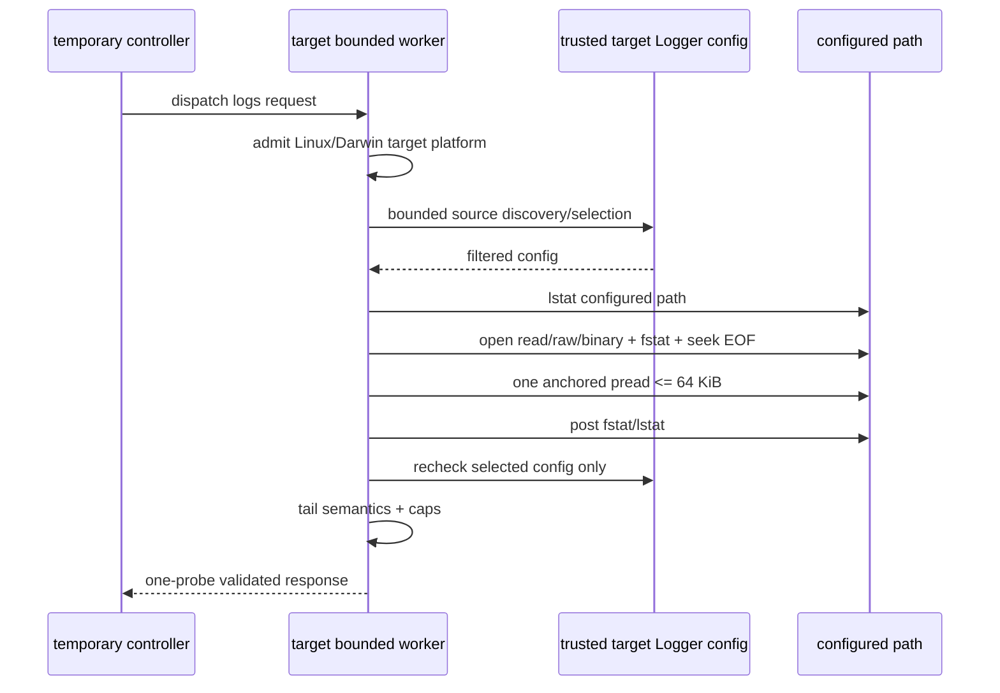

# observer_cli 历史日志访问方案（对抗性审查修订稿）

状态：Proposal v3，待同事确认信任边界后实现
日期：2026-07-13
目标版本：2.0.0（尚未发布，不因本功能升级版本）
范围：命令 CLI；不改 TUI，不改默认 `snapshot` / `diagnose`

## 1. 结论先行

新增一个独立命令：

```text
observer_cli logs [--handler HANDLER_ID] [--tail LINES]
```

V1 在 Linux/macOS 目标上只读取 `logger_std_h` 配置路径在打开时对独立 reader
可见的普通文件内容：

```erlang
#{
    module := logger_std_h,
    config := #{type := file, file := File, modes := Modes}
}.
```

这个定义刻意不使用“handler 当前打开的文件”或“最新日志”：OTP public
Logger API 不公开 handler 当前 FD，配置路径与活动 FD 在外部 rotation 期间可能
不同。

目标 worker 执行：

1. 通过 public OTP Logger API 发现并选择一个受支持的配置；
2. 不接受用户提供的文件路径；
3. **不调用 `logger_std_h:filesync/1`**；
4. 只接受 plain、regular、seekable、读取期间 identity 稳定的文件；
5. 从一次捕获的 EOF 向前最多读取 64 KiB；
6. 通过现有 `observer_cli.cli/v1` envelope 返回 text、term 或 JSON；
7. 不安装 handler，不创建目标常驻进程、ETS 或其它持久状态。

V1 明确不做：

- 不把目标节点、已加载 handler callback 或目标文件系统当作恶意沙箱；
- 不承诺包含 Logger 尚未写出的缓冲内容；
- 不承诺文件包含所有曾经产生的 Logger event；
- 不读取轮转归档、gzip、`logger_disk_log_h`、stdout/stderr 或自定义 sink；
- 不开放 `--file PATH`；
- 不默认加入 `snapshot`、`diagnose` 或 TUI；
- 不声称能可靠脱敏任意日志正文。

### 1.1 必须先确认的发布门

`logger:get_handler_config/1` 返回的是 handler 自己 `filter_config/1` 处理后的
结果。OTP 不会恢复或验证 callback 返回的 `module`、`id` 和 `config`。

因此本方案的硬前提是：

> 目标节点、目标节点已加载的 handler module、其 `filter_config/1` 返回值，
> 以及目标文件系统 namespace 都属于可信目标环境。

如果评审要求抵抗恶意 target、恶意 custom handler 或恶意并发文件系统替换，
本方案必须 **NO-GO**。只用 public Logger API 无法证明 filtered config 对应真实
handler module，也无法把配置路径绑定到 handler 的内部 FD。不能改用 private
OTP state 假装获得稳定安全边界。

即使 filesystem namespace 本身可信，`lstat(path) -> open(path)` 也不是原子操作。
OTP stdlib 没有 portable 的 `O_NOFOLLOW | O_NONBLOCK` open surface；leaf 在该窗口
被换成 FIFO 时，open 可能阻塞，甚至唤醒同一路径上的 writer。V1 只能保证后续
`fstat` 不通过时不返回任何 bytes，不能保证这类 race 绝不扰动目标。若评审要求
这种并发下也绝对 non-interference，同样必须 **NO-GO**。

## 2. 第一性原理

### 2.1 日志历史只能来自已经存在的保留者

日志是事件历史，不是 VM 当前状态。已经发生的日志只有在以下位置之一仍被保留
时才能读取：

1. 节点内常驻内存缓冲；
2. 目标节点本地文件；
3. stdout/stderr 的外部接收者，例如 systemd、Docker 或 Kubernetes；
4. syslog、Loki、OpenTelemetry 等远端日志系统。

事件发生时如果没有任何保留者，之后不能通过 RPC、CLI 或 MCP 重建它。

observer_cli 是临时 controller，不拥有目标应用的启动生命周期。第一版应复用
目标已经存在的日志文件，而不是偷偷安装 handler 或再造日志存储层。

### 2.2 本命令提供的是 retained evidence，不是 event ledger

即使文件读取完全成功，以下事件仍可能不存在于文件中：

- Logger overload 时被 drop 或 flush 的事件；
- handler filter 丢弃的事件；
- formatter 或 I/O 失败的事件；
- 尚在 Logger/file delayed-write buffer 中的事件；
- 已经被 rotation 移入 archive 的事件。

所以输出只能表述为“配置路径中保留的文件证据”，不能表述为“命令前全部日志”。

## 3. 已核实的事实与多轮审查结论

### 3.1 Tidewave 的 `get_logs` 不是文件读取

核查基线：`tidewave-ai/tidewave_phoenix` commit
`beaa0073ec285b9f3f77009b0d102e60a44379e6`，package version `0.6.1`。

Tidewave 在应用启动时注册 Logger handler，把格式化事件发送给常驻 GenServer，
并在 1024 条环形缓冲中保留。`get_logs` 查询的是该缓冲。它能读取 MCP 调用前
的日志，是因为缓冲从 Tidewave 启动时就存在，不是因为 MCP 能恢复历史。

相关源码：

- [`Tidewave.MCP` 注册 handler 并启动 Logger 进程](https://github.com/tidewave-ai/tidewave_phoenix/blob/beaa0073ec285b9f3f77009b0d102e60a44379e6/lib/tidewave/mcp.ex#L14-L27)
- [`Tidewave.MCP.Logger` 的 handler 与环形缓冲](https://github.com/tidewave-ai/tidewave_phoenix/blob/beaa0073ec285b9f3f77009b0d102e60a44379e6/lib/tidewave/mcp/logger.ex#L8-L72)
- [`get_logs` MCP 包装](https://github.com/tidewave-ai/tidewave_phoenix/blob/beaa0073ec285b9f3f77009b0d102e60a44379e6/lib/tidewave/mcp/tools/logs.ex#L4-L50)

本方案只复用“让 agent 获得日志证据”的产品思路，不复制 Tidewave 的常驻
生命周期。

### 3.2 filtered config 不是安全身份证明

OTP 的实现等价于：

```erlang
get_handler_config(HandlerId) ->
    {ok, Config} = logger_config:get(..., HandlerId),
    {ok, Module:filter_config(Config)}.
```

callback 异常会被捕获，但成功返回的 map 不会被 OTP 再校验。首轮红队已经在
OTP 26.2.5.2、27.3.4.2、28.5、29.0.3 复现：custom handler 可以把返回值
伪造成：

```erlang
#{
    id => spoof,
    module => logger_std_h,
    config => #{type => file, file => "/etc/passwd"}
}.
```

四个版本的 `logger:get_handler_config/1` 都原样返回伪造值。

修订结论：

- config 仍需做严格 shape/size allowlist，以防错误数据进入 reader；
- 但 allowlist 不是对恶意 target callback 的认证；
- 安全承诺从“证明真实 handler”收窄为“读取可信目标报告的配置路径”；
- 如果这个信任前提不可接受，则不实现。

OTP reference：[`logger:get_handler_config/1`](https://www.erlang.org/doc/apps/kernel/logger.html#get_handler_config/1)。

### 3.3 V1 删除 `logger_std_h:filesync/1`

原稿把 filesync 描述成低风险 flush。源码和 OTP 26–29 实测否定了这个假设：

- 同步 filesync 会执行 `ensure_file/1`；
- path inode 变化时会关闭旧 FD，并重新创建或打开配置路径；
- reopen 失败可能让 file controller 退出并导致 handler 被移除；
- worker timeout 不能撤回已经送进 Logger mailbox 的 sync；
- file controller 即使内部 `file:datasync/1` 失败，也可能对 public caller 回复
  `ok`，所以 `freshness=synced` 不可证明。

首轮实测中，filesync 在 rename 后重新创建了原路径；在不可恢复的 reopen 错误
下，OTP 26–29 都出现了 `removed_failing_handler`。

因此 V1 完全删除：

- `logger_std_h:filesync/1` 调用；
- `log_filesync` probe；
- `log_filesync_failed`；
- `freshness=synced`；
- sync 失败后继续读取的降级路径。

未来如果有真实需求，sync 只能作为独立、显式、危险 opt-in 方案重新评审。

### 3.4 `type=file` 不保证是普通文本文件

OTP 26–29 都接受 `logger_std_h` 使用：

```erlang
#{file => File, modes => [write, compressed]}.
```

这种 current file 是 gzip stream。活动期间外部 reader 可能看到空或不完整压缩
流。OTP 也接受 `/dev/null` 这类 device 作为 `type=file` 路径。

修订结论：支持条件必须同时检查：

- plain-mode allowlist；
- leaf 不是 symlink；
- path 和打开后的 FD 都是 regular file；
- FD 可 seek；
- 读取期间 path/FD identity 稳定。

### 3.5 config path 不等于 handler 活动 FD

`filename:absname/1` 只产生绝对配置字符串，不解析 symlink，也不消除所有
filesystem identity 歧义。外部 logrotate rename 后，handler 可能继续写旧 inode，
而配置仍指向原字符串。

响应必须使用：

```text
scope=configured_path
active_handler_fd_match=unknown
visibility=reader_visible
consistency=non_atomic
```

不得使用 `scope=current_file` 或 `freshness=synced`。

### 3.6 handler ID 枚举不是完全有界

`logger:get_handler_ids/0` 会先复制并排序完整 ID 列表。64 的预算只能限制后续
`get_handler_config/1` lookup 数和 callback upper bound，不能限制 OTP API 内部 ID
枚举。

修订结论：

- 显式 `--handler` 不枚举 ID；
- 自动模式才调用 `get_handler_ids/0`；
- ID 枚举只受现有 target worker heap 和 deadline 保护；
- 超过 64 个 ID 时，在调用任何 handler-config lookup 前拒绝自动发现。

### 3.7 现有 text / JSON encoder 不能直接承担日志输出

当前 `observer_cli_cli:escape_text/1` 按 UTF-8 编码后的 byte 转义
`0x80..0x9F`。正常中文或 emoji 的 continuation byte 可能落入该范围，产生非法
UTF-8。已用 `<<16#C2,16#9B>>` 和普通 Unicode 实测确认。

修订结论：实现 logs 前先在共享 helper 根因处改成 codepoint-aware escaping；
ASCII 行为保持不变，普通 Unicode 保留，C0/C1 和 bidi 控制符转义，非法 UTF-8
继续 base64。

OTP 29 的 `json:encode/1` 还会把 U+009B、U+2028/U+2029 和 bidi codepoint 作为
raw UTF-8 写进 JSON string。decoded JSON 语义合法，但直接输出到 terminal 仍可能
触发 C1 或视觉换行。JSON body 因此也需要 post-encode hardening；只改变 escape
表示，不改变 JSON decode 后的值。framing newline 在 hardening 后单独追加。

### 3.8 首轮阻断项关闭方式

| 首轮发现 | 修订 |
| --- | --- |
| filtered config 可伪造 module/path | 明确信任目标 callback；不再宣称安全认证；不接受该边界则 NO-GO |
| filesync 会重绑、创建路径或移除 handler | V1 删除 filesync |
| config 字符串无法绑定 handler FD | 能力改为 configured path；regular/identity 检查；保留 residual risk |
| `compressed` / device 被误判为文本 | strict mode allowlist + regular + seekable |
| 三 probe 与现有 validator 不兼容 | 缩成一个 required `log_file_tail` probe |
| 256 KiB 可在 encoder 膨胀后超过 1 MiB | raw read cap 降到 64 KiB，并加入完整最大 envelope 的真实 encoder gate |
| byte-cap leading fragment 被冒充完整行 | 显式 truncated line index 和 partial outcome |
| text escape 破坏 Unicode | 修复共享 codepoint escape，并给每行加不可信内容前缀 |
| JSON encoder raw 输出 C1/bidi/line separator | post-encode 转成 JSON `\uXXXX`，保持 decoded value |

### 3.9 第二轮交叉审查关闭方式

首轮修订后，又分别从 OTP/file I/O、现有 capture/validator 架构和安全/资源边界
做了交叉复审。新增问题及关闭方式：

| 第二轮发现 | 修订 |
| --- | --- |
| `lstat -> open` 仍有 FIFO leaf race | 明确 residual、test barrier 和绝对 non-interference 时 NO-GO |
| retry 可让 lookup/callback upper bound 到 67/4 | missing/malformed 不 retry；有效 changed config 复用为 baseline |
| 128 KiB data 几乎吃满 JSON cap | 降为 64 KiB；删除 YAGNI rotation summary；给 ID/effect/int 精确上限；测完整 envelope |
| 值型 extra-effects 参数无法记录实际次数 | 由同一次 OutcomeFun 返回扩展 outcome/coverage/effects tuple |
| generic effect validator 只检查 map | logs effect exact keys/range/数量，拒绝 unknown/duplicate |
| reason/data/request 只有原则没有矩阵 | 增加 mode/cardinality/nullability 的唯一合法矩阵 |
| JSON Schema 被要求证明跨字段关系 | Schema 只验 local shape；handwritten validator 负责全部关系与 request binding |
| 不可寻址 source 被忽略会错误自动选择 | 所有 supported source 参与 cardinality，addressability 只约束 selector |
| byte-cap fragment 也可能切断 UTF-8 | byte/line cap 统一跳过 leading continuation bytes |
| `has_more` 不可执行 | 定义为因 tail/cap 未完整返回的逻辑内容，并列出关系 |
| 默认 rotation `infinity` 与 validator 冲突 | public rotation metadata 整体删除，而不是增加无关兼容逻辑 |
| 空文件 `pread(Fd,0,0)=eof` | EOF=0 不调用 pread，直接使用空 binary |

### 3.10 第三轮架构与输出复审关闭方式

第二轮后继续用现有 helper/validator 源码和真实 encoder 反推可执行性：

| 后续发现 | 修订 |
| --- | --- |
| auto success 可伪造第二个 supported source | selected 的 auto 行强制 supported count=1，并加 malformed fixture |
| `logger_buffer_included=false` 暗示伪 freshness | 改成只声明 `command_filesync_requested=false`，自然 flush 保持 unknown |
| public API 看不到 callback entry | effect 改为可观测的 handler-config lookup count；callback 只作 upper bound |
| prefix 无法阻止 terminal auto-wrap 视觉伪装 | 承诺收窄到逻辑 newline/control 隔离；auto-wrap 进入 residual |
| auto source set 不是原子 snapshot | 唯一性限定为本次 bounded observations；不接受则要求显式 handler |
| JSON encoder 会 raw 输出 C1/bidi/line separator | post-encode hardening，且要求 decode value 不变 |
| JSON Schema 无法证明 byte/cross-field 上限 | handwritten validator 独立承担，并逐关系 fail-closed 测试 |
| tail 字段各自有界但可伪造零行/多空行/cap | 增加 EOF/line-byte conservation、cap/offset/index 和 base64 parity 关系 |
| supported summary 可声称 custom kind/relative path | supported/selected 绑定 `logger_std_h_file`，selected Unix path 必须 absolute |
| Windows error path 与 Unix validator 冲突 | platform gate 前置到零 enumeration/lookup/read，并返回独立 capability reason |

## 4. 信任模型与安全承诺

### 4.1 可信边界

本命令信任：

- 已通过现有 bundle compatibility 检查的目标节点；
- 目标节点上已加载的 BEAM code；
- Logger handler callback，包括 `filter_config/1`；
- 目标 OS 用户和文件系统 namespace；
- 目标 OS 对 regular file、device 和 inode identity 的报告。

原因不是这些组件“天然安全”，而是 Erlang distribution cookie 已经给 peer 高权限，
同一 VM 内的 handler code 也没有隔离。恶意 target 可以直接伪造整个 dispatch
response，controller validator 不能把它变成沙箱。

### 4.2 不可信内容

以下内容即使来自可信 target，也作为不可信数据处理：

- 日志正文；
- handler ID、handler kind 和 path 的显示文本；
- formatter 输出；
- 日志中的 URL、命令、prompt 或操作建议。

controller validator 是 correctness/fail-closed 防线，不是 hostile-peer isolation。

### 4.3 本命令可以承诺什么

在上述可信边界成立时：

1. CLI 用户不能传入任意文件路径；
2. handler 文本不会创建新 handler ID atom；
3. reader 只使用被选择 config 中的原始 filename term；
4. V1 不调用 Logger mutation API；
5. leaf symlink、non-regular、non-seekable 和读取中 identity 变化会 fail closed；
6. 所有返回内容和 handler-config lookup 数都有明确的 V1 上限；
7. text/term/JSON body 不会透传终端控制字符。

### 4.4 本命令不能承诺什么

本命令不能防御：

- 恶意 target 或恶意 `filter_config/1` 伪造配置；
- parent-directory symlink、hardlink、bind mount、inode reuse 或其它 namespace
  技巧；
- regular file 在 pre-check 前已经被可信环境替换；
- leaf 在 lstat/open 窗口被换成 special file 时 open 可能阻塞或影响 writer；
- NFS/overlayfs/Windows 等不同 filesystem 对 identity 和 cancellation 的差异；
- worker 被 kill 后内核或 async I/O 已经绝对停止；
- 日志正文中的业务秘密或 prompt injection 被消费者错误使用。

这些不是通过增加几次 stat 就能消除的风险。如果评审要求消除，应否决 V1。

## 5. 目标和非目标

### 5.1 目标

1. 读取 observer_cli 调用前已经对独立 reader 可见的配置路径历史。
2. 不要求目标主机开放 shell、SSH 或额外 HTTP 服务。
3. 不修改 Logger 配置，不安装 handler，不创建持久目标资源。
4. 用户空间读取预算、handler-config lookup、返回字段和编码后输出都有上限；kernel I/O
   cancellation 不作虚假承诺。
5. 多 source、无 source、rotation race 和读取失败返回稳定、可操作结果。
6. text、term 和 JSON 共享同一个 public data 语义。
7. 复用当前 target worker、normalizer、envelope、cleanup 和 exit-code 模型。

### 5.2 非目标

1. 替代 journald、Docker logs、Kubernetes logs、Loki 或日志平台。
2. 读取任意路径或充当远程文件浏览器。
3. 证明配置路径等于 handler 活动 FD。
4. 刷出 Logger 当前缓冲或保证最新事件可见。
5. 解析自定义 formatter 并重建结构化 Logger event。
6. 按 level、module、PID、grep 或时间范围查询。
7. follow/tail -f。
8. 合并多个 handler 的时间线。
9. 读取 rotation archive、gzip、disk log 或 custom sink。
10. 对日志正文做通用脱敏。

## 6. CLI 设计

### 6.1 调用与默认值

```sh
observer_cli logs
observer_cli logs --handler app_file --tail 500
```

默认值和硬上限：

```text
handler = 自动选择唯一受支持 source
tail = 200 physical lines
max tail = 2000 physical lines
raw read cap = 64 KiB
per returned line cap = 32 KiB
configured path display cap = 4 KiB
discovery handler-config lookups <= 64
total handler-config lookups <= 66 automatic / <= 3 explicit
scope = configured path only
```

| Option | Default | Validation |
| --- | --- | --- |
| `--handler HANDLER_ID` | 自动选择 | 可寻址 ID 规则见下节 |
| `--tail LINES` | 200 | 整数，1..2000 |

target、cookie、format 和 timeout 选项沿用现有 CLI。

### 6.2 可寻址 handler ID

V1 可寻址 ID 必须：

- 是有效 Unicode；
- 长度为 1..255 Unicode codepoints；
- UTF-8 编码后不超过 1024 bytes；
- 不包含 C0、C1 或 bidi 控制字符；
- 不以 `--` 开头，因为当前 parser 会把它解释为下一个 option；
- 使用精确 codepoint comparison，不做 Unicode normalization。

不满足的 discovered ID 标记为 `unaddressable_handler_id`，但只要其 config 满足
第 7.3 节，它仍是一个受支持 source，并参与自动选择的 cardinality：

- 唯一受支持 source 即使不可显式寻址，也可由自动模式读取；
- 多个受支持 source 中只要有一个不可寻址，也仍返回 `log_handler_required`，
  不能静默忽略它再选择另一个；
- 错误摘要显示 `addressable=false`，用户需在目标侧移除或重命名该 handler 后再
  显式选择。

addressability 只约束 CLI selector，不改变 source 是否真实存在、是否受支持。

显式 ID 在 controller 先转成 binary，target 再通过：

```erlang
binary_to_existing_atom(HandlerText, utf8).
```

解析失败就是 `log_handler_not_found`。这里不会创建 atom，也不需要枚举所有
handler。禁止 `binary_to_atom/2`、`list_to_atom/1`。

含空格或引号的可寻址 ID 需要正常 shell quoting：

```sh
observer_cli logs --handler 'app file'
```

### 6.3 source 选择

- 恰好一个受支持 source：自动选择，不要求该 ID 可显式寻址；
- 多个受支持 source：返回 `log_handler_required`，只列安全摘要；
- 零个受支持 source：返回 `log_source_unavailable`；
- 显式 ID 不存在：`log_handler_not_found`；
- 显式 ID 存在但不受支持：`unsupported_log_handler` 或更具体 reason。

多 source 错误不返回所有绝对路径。只有 selected source 可以包含 configured
path。

### 6.4 identifier policy

`logs` 拒绝 `--redact` 和 `--include-identifiers`，返回
`unsupported_command_option`。

任意日志正文都可能包含 node、PID、路径、请求参数、token 或 PII。只 redaction
source path 却原样返回正文会制造错误安全感。

`logs` 必须使用专用 help clause；不能复用当前会无条件宣传两个 identifier
选项的通用 `remote_help/4`。

### 6.5 不增加目标侧 grep

过滤交给现有 shell 工具：

```sh
observer_cli logs --tail 500 | rg -i 'timeout|database|exception'
```

V1 不增加 `--grep`，避免在 target 实现第二套 regex、timeout 和兼容语义。

## 7. source discovery 和配置准入

### 7.1 显式模式

1. 验证 handler 文本；
2. `binary_to_existing_atom/2`；
3. 调用一次 `logger:get_handler_config/1`；
4. 严格检查返回 `id` 等于查询 atom；
5. 分类并选择；
6. 读取完成后只复查这个 ID；
7. 若发生允许 retry 的 race，最多再复查一次。

显式模式最多调用 3 次 `get_handler_config/1`，因此 `filter_config/1` callback 也最多
3 次；不调用 `get_handler_ids/0`。

### 7.2 自动模式

1. 调用 `logger:get_handler_ids/0`；
2. 只检查列表前 65 个元素判断是否超过预算；
3. 超过 64 时，在调用任何 `get_handler_config/1` 前返回
   `scan_budget_exceeded`；
4. 不超过 64 时，每个 ID 最多读取一次 config；
5. 分类并要求唯一受支持 source；
6. 后续只复查 selected ID，不重新扫描全部 handler；
7. race retry 后再复查 selected ID 一次。

自动模式 handler-config lookup 总上限是 66，而不是原稿中的 64；每个 lookup 最多
触发一个 `filter_config/1`，所以 callback upper bound 也是 66。ID list 自身已经由
OTP 完整复制和排序，只受 worker heap/deadline 保护。

“唯一 source”只针对这一次初始 ID list 和随后逐项 config observation；Logger
没有跨 handler 的配置事务。为保持 callback/枚举边界，读取后不再次枚举全局 ID。
并发新增的另一个 handler 可能不在本次 `sources` 中；selected ID 自身仍必须通过
post-read recheck。capture 的 `consistency=non_atomic` 覆盖这一点，不能把自动选择
表述成返回时全局仍唯一。

为使 66/3 是所有分支上的真实上限，retry 必须遵守：

- post-read config lookup 返回 missing、exception、malformed 或不受支持 config 时，
  立即丢弃 bytes 并返回 `log_source_changed`，不 retry；
- post-read lookup 返回一个 shape 有效但关键字段变化的新 config 时，直接把这次
  返回值复用为 retry baseline，不再额外 lookup；
- 在尚未执行 post-read lookup 的 file race 上，retry 前 lookup 一次作为 baseline，
  retry 结束后再 lookup 一次；
- 第二个 attempt 发生任何 race/失败时立即结束；除该 attempt 已计划的唯一
  post-read recheck 外，不再增加 lookup。

每个 retry 入口都必须用 lookup counter 证明自动模式不超过 66、显式模式不超过
3；mock callback 另外证明实际 callback 不超过 lookup。不同 attempt 或不同 config
generation 的 bytes 绝不混合。

每次 `get_handler_config/1` 都可能执行 target custom callback。observer effect
必须如实记录这一点；“无持久副作用”只对遵守 callback contract 的可信 target
成立。

### 7.3 受支持配置

候选必须同时满足：

1. 返回值是 map；
2. `id` 精确等于被查询的 atom；
3. `module =:= logger_std_h`；
4. `config` 是 map；
5. `config.type =:= file`；
6. `config.file` 是 proper flat filename list；
7. 原始 filename 是 absolute path；display path 可无损转换为 UTF-8，且不超过
   4 KiB；
8. 原始 filename term 与 display path 分开保存，I/O 永远使用原始 term；
9. `modes` 是长度不超过 32 的 proper list，并通过 plain-mode allowlist；
10. source ID display 是有效 UTF-8，且同时满足 255 codepoints / 1024 bytes 上限。

plain-mode allowlist：

```text
read
write
append
exclusive
raw
binary
sync
delayed_write
{delayed_write, Size, Delay}  # Size/Delay 为 0..2^31-1
read_ahead
{read_ahead, Size}            # Size 为 1..2^31-1
```

`compressed`、`ram`、`directory`、`{encoding, _}` 和任何未知或未来转换 mode
全部拒绝为 `unsupported_file_modes`。这是保守的 V1 capability 边界，不尝试
猜测 mode 是否“可能也能工作”。

OTP 26–29 实测 `read_ahead` 两种公开形式都由 `logger_std_h` 接受并保留，且不转换
current file bytes。OTP 28/29 的 `{zstd, _}` 等新转换 mode 仍因不在 allowlist 而
fail closed。

多个问题同时存在时，summary reason priority 固定为：结构/数值/path-shape
`invalid_log_handler_config`，再到 module/type `unsupported_log_handler`，再到
mode `unsupported_file_modes`，最后是 display conversion
`log_path_unrepresentable`。addressability 独立计算，不改变该 priority。

### 7.4 source summary

未选择 source 只返回：

```erlang
#{
    id => <<"app_file">>,
    addressable => true,
    handler_kind => <<"logger_std_h_file">>,
    supported => true,
    reason_code => null
}.
```

`handler_kind` 是固定枚举 `logger_std_h_file | other`，不返回任意 module 名。
summary 也不返回 path、formatter、filters、modes、rotation 或私有 config。最多
64 个 summary；每个 ID 不超过 1024 UTF-8 bytes，全部 ID 聚合不超过 64 KiB。

summary 关系固定为：`addressable` 必须等于第 6.2 节 predicate 的重算结果；
`supported=true` 必须 `handler_kind=logger_std_h_file`；supported 且 addressable 时
`reason_code=null`；supported 但不可寻址时
`reason_code=unaddressable_handler_id`；`handler_kind=other` 必须 unsupported；
unsupported 时 reason 必须是 config-admission allowlist 中对应的稳定 code。不能
返回 callback/OS 原始 reason。

selected source 才增加：

```erlang
#{
    configured_path => <<"/var/log/my_app/app.log">>,
    active_handler_fd_match => unknown
}.
```

V1 删除 public rotation summary。rotation config 不是读取 current configured path
所必需，公开它只会引入 `infinity`、任意大整数和额外编码预算，违反 YAGNI。

## 8. 目标侧文件读取流程

### 8.1 总流程



流程中没有 filesync。

platform admission 在任何 handler enumeration/config lookup 前执行。`os:type()` 不是
`{unix, linux}` 或 `{unix, darwin}` 时，直接返回 `unsupported_target_platform`，
`sources=[]`，且不访问 Logger 或文件系统。

### 8.2 一次 read attempt

1. 使用 selected config 的原始 filename term。
2. `file:read_link_info(Path, [raw])`：leaf 必须是 `regular`，symlink/device/
   directory/other 直接拒绝。
3. `file:open(Path, [read, binary, raw])`。
4. `file:read_file_info(Fd, [raw])`：FD 必须是 `regular`。
5. path info 与 FD info 的 `{major_device, inode}` 必须相同；两者必须是整数，
   `major_device >= 0`、`inode > 0`。不满足时返回
   `log_file_identity_unavailable`。
6. `file:position(Fd, eof)` 捕获 `CapturedEof`；失败即 non-seekable，且 EOF 必须是
   `0..2^63-1`。
7. 计算 `Start = max(0, CapturedEof - 64 KiB)`。
8. `CapturedEof=0` 时直接使用 `<<>>`，不调用 pread；OTP 26–29 的
   `file:pread(Fd, 0, 0)` 返回 `eof`，不能把它当错误或空 binary。
9. 正长度时，对同一个 FD 执行一次
   `file:pread(Fd, Start, CapturedEof - Start)`，并要求 binary 长度精确相等。
10. short read、unexpected EOF 或 I/O error 不使用部分结果。
11. 再次 fstat FD；identity 必须不变，size 不得小于 `CapturedEof`。
12. 再次 lstat path；仍须是 regular，且 identity 与 FD 相同。
13. 重读 selected config；`id/module/type/original path/modes` 必须不变。
14. 关闭 FD；只有全部检查通过才解析并返回读取的 bytes。

所有公开 path 都从单独的 display conversion 生成；绝不能把 display binary 再
转换回 filename 用于 I/O。

### 8.3 retry

以下普通 race 允许丢弃**整个** attempt 并重试一次：

- pre-lstat 已成功、但 path 在 open 前消失；初始 lstat 就是 `enoent` 不 retry；
- path/FD identity 改变；
- config 的关键字段改变；
- FD size 在读取后小于 captured EOF；
- anchored pread 返回 short data。

retry 只复查 selected ID，不重新扫描所有 handler。第二次仍变化则返回
`log_source_changed`。不同 attempt 的 bytes 绝不拼接。

以下情况不 retry：

- leaf symlink；
- non-regular 或 non-seekable；
- unsupported mode；
- path display 无法安全表示；
- 权限拒绝。

config lookup 的 retry/count 规则以第 7.2 节为准；missing、exception、malformed
或不受支持的新 config 不 retry。所有失败分支都必须关闭已经成功打开的 FD。

### 8.4 一致性边界

单次 pread 比多 chunk backward scan 更少暴露于 copytruncate 代际混合，但它仍
不是原子 snapshot：

- 文件可以在 captured EOF 后继续 append；这些新 bytes 不包含在结果中；
- 同 inode copytruncate 后快速重写仍可能逃过有限 stat 观察；
- path identity 只能证明 reader FD 与读取期间的 configured path 相同；
- 无法证明它等于 handler 内部 FD。

响应始终声明 `consistency=non_atomic`。

### 8.5 leaf type TOCTOU

pre-open lstat 只能拒绝检查时已经是 non-regular 的 leaf，不能原子绑定随后的
open。若 regular leaf 在窗口内被换成 FIFO/device/symlink：

- open 可能阻塞；target worker/controller deadline 不证明内核 open 已撤销；
- open 若返回，post-open fstat/path identity 必须拒绝，且不得返回任何 bytes；
- observer reader 仍可能与该 special file 的 writer 发生交互。

这是 public OTP stdlib 下未关闭的 residual，不伪装成“无副作用”。test-only barrier
必须在 lstat 后替换 regular 为 FIFO，验证无 bytes 泄漏、controller 按 deadline
返回，并记录现有 handler 是否受到影响。若发布门要求这种 race 下绝对不扰动，
V1 NO-GO。

### 8.6 timeout 和 atime

worker deadline 限制 observer_cli 等待时间，不保证已经进入内核、NFS 或 async
thread 的 I/O 被撤销。读取还可能按 mount policy 更新 atime。

因此“只读”在本文中的准确含义是：

> 不修改 Logger 配置、不安装 handler、不调用 filesync、不主动写日志文件、
> 不创建 observer_cli 持久目标资源。

它不表示 filesystem 绝对零写入。

## 9. tail 语义和资源上限

### 9.1 物理行定义

- LF (`0x0A`) 是 delimiter；
- CRLF 视为一个 delimiter，返回内容删除 LF 前的单个 CR；
- 文件末尾 delimiter 的 split sentinel 不额外产生空行；
- 连续 delimiter 之间的空 segment 是空物理行；
- EOF 的非空 fragment 是一行；
- 返回顺序是窗口内从旧到新。

实现从 buffer 尾部向前扫描，找到至多 `requested_lines + 1` 个所需边界后停止；
不得用 `binary:split(Buffer, <<"\n">>, [global])` 或先物化全部 segment。这样
64 KiB 全 LF 也只保留 O(requested_lines) 个索引/行。

例子：

| Bytes | Lines |
| --- | --- |
| `<<>>` | `[]` |
| `<<"a">>` | `["a"]` |
| `<<"a\n">>` | `["a"]` |
| `<<"\n">>` | `[""]` |
| `<<"a\n\n">>` | `["a", ""]` |
| `<<"a\r\n">>` | `["a"]` |

### 9.2 左边界未知 fragment

当 `Start > 0` 时，buffer 的第一个 fragment 可能从一条长行中间开始。

- 如果后面的完整行已经足够返回最后 N 行，丢弃该 fragment；结果仍可
  `complete`，并设置 `has_more=true`；
- 如果为了满足 N 行必须返回该 fragment，则保留它，但把对应 line index 放进
  `truncated_line_indexes`，加入 `byte_cap`，并返回 `partial`；
- 如果整个 64 KiB 没有 LF，则返回最后一个 capped fragment，并明确同时标记
  `byte_cap`，不能把它冒充完整行。

任何因左侧丢失 bytes 而保留的 fragment 都统一执行 UTF-8 边界调整：最多跳过
3 个 leading `10xxxxxx` continuation bytes。该规则同时适用于 `byte_cap` 和
`line_cap`，不是只在 32 KiB 单行截断时执行；跳过的 bytes 仍属于已披露的
truncation。

### 9.3 单行 cap

每个返回行最多 32 KiB bytes。超出时只保留该行的 tail bytes，并：

- 把 index 放进 `truncated_line_indexes`；
- 加入 `line_cap`；
- 返回 `partial`。

物理行先按第 9.1 节移除 CRLF 中的 CR，再应用 32-KiB cap。cap 单位是 bytes；
第 9.2 节的统一 UTF-8 边界调整在此同样执行。调整后仍非法的
UTF-8 交给现有 normalizer 转成 base64 object。

### 9.4 `has_more` 与 `content_truncated`

`has_more` 的唯一语义是：截至 `CapturedEof`，至少有一段逻辑日志内容因 tail
行数、64 KiB 左边界、`byte_cap` 或 `line_cap` 没有完整出现在 `lines` 中。LF/CRLF
delimiter 本身和 `CapturedEof` 之后的 append 不计入。

因此：

- 空文件一定是 `has_more=false`；
- `Start > 0`、tail limit 丢行或任何 content truncation 都是 `has_more=true`；
- `content_truncated=true` 蕴含 `has_more=true`；
- 只因正常 tail limit 少返回更早的完整行不叫 content truncation。

正常 tail limit 示例：

```text
has_more=true
content_truncated=false
outcome=complete
```

只有 byte/line cap 破坏了返回行内容时：

```text
content_truncated=true
truncation_reasons=[byte_cap | line_cap]
outcome=partial
```

### 9.5 上限

| 资源 | 上限 |
| --- | --- |
| 默认请求行数 | 200 |
| 最大请求行数 | 2000 |
| 自动 handler-config lookup / callback upper bound | 64 + selected recheck/retry 2 = 66 |
| 显式 handler-config lookup / callback upper bound | 3 |
| 单次 anchored pread / lines aggregate raw bytes | 64 KiB |
| 单物理行返回 | 32 KiB |
| configured path display | 4 KiB |
| source ID | 255 codepoints 且 1024 UTF-8 bytes |
| source ID aggregate | 64 KiB |
| modes count | 32 |
| read attempt | 2 |
| captured EOF/public file offset | `0..2^63-1` |
| logs-specific effects | exact keys；lookup `0..66`，attempt `0..2` |
| public target response | 现有 1 MiB external term cap |
| controller encoded output | 现有 1 MiB cap |
| target worker heap | 现有上限 |
| command deadline | 现有 `--timeout` |

64 KiB 是完整 envelope 编码预算的一部分，不只是 I/O 预算。JSON 对 NUL 等控制
字符可能膨胀约 6 倍，text escape 也会膨胀。实现必须用真实三种 encoder 编码
**完整最大 envelope**：64 KiB worst-case lines、64 个 summary / 64 KiB 聚合 ID、
4 KiB path、最大合法 target/probe 字段和 exact effects；每种最终输出都必须严格
小于 1 MiB。只测 tail 或 data map 不算通过。

## 10. public response contract

### 10.1 envelope 和单 probe 模型

顶层 envelope 保持：

```text
schema  = observer_cli.cli/v1
command = logs
outcome = complete | partial | error
data    = logs map or null
meta    = target + capture
issues  = controller/local issues only
```

`logs` 只使用一个 required probe：

```text
id=log_file_tail
required=true
```

source discovery、config filtering、regular-file validation 和 tail read 都属于这个
probe 的 coverage/effects。不要新增三段 probe 状态机。

继续复用现有 `capture_scan_inspection/5`，但不能增加一个调用前传入的值型
`ExtraEffects` 参数：lookup/read-attempt 实际计数只有 `OutcomeFun()` 执行后才
知道，预计算会让 duration/module-loaded observation 不覆盖真实工作。

最小改动是让同一次 `OutcomeFun()` 可返回带 coverage/effects 的扩展 tuple；现有
3-tuple callers 和语义保持不变：

复用 `capture_scan_inspection/5` 的现有语义：

| Internal outcome | Public outcome | Probe status |
| --- | --- | --- |
| `{ok, Data, Coverage}` | `complete` | `ok` |
| `{error, Reason, Data}` | `partial` | `error` |
| `{unavailable, Reason, Data}` | `error` | `unavailable` |
| `{ok, Data, Coverage, ExtraEffects}` | `complete` | `ok` |
| `{error, Reason, Data, Coverage, ExtraEffects}` | `partial` | `error` |
| `{unavailable, Reason, Data, Coverage, ExtraEffects}` | `error` | `unavailable` |

target-specific reason 只放 probe，不在 issues 重复，满足当前
`unique_probe_facts/3`。

`logs` 必须使用扩展 tuple，让 success、partial 和 unavailable 都返回实际 coverage，
不能沿用 helper 对 generic unavailable/error 的硬编码 coverage。coverage 只能是以下
有序、唯一 stage 的前缀：

```text
source_classification_complete
source_selected
path_prechecked
fd_identity_verified
bytes_captured
post_read_verified
```

capture 在现有 base effects 后恰好追加一个 exact-shape effect：

```erlang
#{
    id => configured_log_read,
    handler_ids_enumerated => boolean(),
    handler_config_lookups => 0..66,
    read_attempts => 0..2,
    raw_read_cap_bytes => 65536,
    atime_may_change => true,
    consistency => non_atomic,
    command_filesync_attempted => false
}.
```

logs-specific validator 要求 effects list 只包含现有 exact-shape
`diagnostics_worker`、`module_load`、可选 `distribution_controller` 和上述恰好一个
`configured_log_read`；拒绝 unknown/duplicate effect ID。它还按 request mode
检查显式 lookup `<=3`、自动 lookup `<=66`。generic `is_map` 检查不够。

`handler_config_lookups` 精确计数本命令发起的 `logger:get_handler_config/1` 调用。
public API 不暴露 callback entry，因此不能伪称精确知道实际进入
`filter_config/1` 的次数；只能承诺它不超过 lookup count。`read_attempts` 在每次
pre-open lstat 前递增；未选择 source 时必须为 0。计数不能由最终 outcome 反推或
写成固定成功值。

### 10.2 `data` shape

```erlang
#{
    <<"sources">> => [SourceSummary],
    <<"selected_source">> => SelectedSource | null,
    <<"tail">> => Tail | null
}.
```

error 可以携带 bounded logs data，便于返回安全 source ID；对应 validator 必须
显式允许该 logs-specific shape。pre-command/local argument error 仍然
`data=null, capture=null`。

`sources` 在自动模式包含本次已分类的全部 handler summary，在显式模式只包含被
查询 handler 的零或一个 summary。`SelectedSource` 是对应 supported summary 加上
`configured_path` 和 `active_handler_fd_match`；不是另一套可独立漂移的描述。

### 10.3 `tail` shape

```erlang
#{
    <<"scope">> => <<"configured_path">>,
    <<"active_handler_fd_match">> => <<"unknown">>,
    <<"visibility">> => <<"reader_visible">>,
    <<"command_filesync_requested">> => false,
    <<"consistency">> => <<"non_atomic">>,
    <<"content_trust">> => <<"untrusted">>,
    <<"requested_lines">> => 200,
    <<"returned_lines">> => 187,
    <<"captured_eof_bytes">> => 1048576,
    <<"bytes_read">> => 32768,
    <<"has_more">> => true,
    <<"content_truncated">> => false,
    <<"truncation_reasons">> => [],
    <<"truncated_line_indexes">> => [],
    <<"lines">> => [
        <<"2026-07-13T11:59:55+08:00 error: request failed">>,
        <<"stack frame 1">>
    ]
}.
```

合法 UTF-8 行是 string。非法 binary 沿用现有 normalization contract：

```json
{"encoding":"base64","data":"..."}
```

`command_filesync_requested=false` 只声明 observer_cli 没有请求 flush；它不声称
trusted callback 内部绝无副作用。Logger/delayed-write buffer 可能在 capture 前或
期间自然 flush；public API 无法判定某个返回 byte 是否曾在 buffer 中，因此不提供
`logger_buffer_included` 这类伪 freshness 字段。

### 10.4 JSON Schema 能检查的范围

draft-2020-12 JSON Schema 只负责：

- logs map、summary、selected source、tail 和 logs effect 的 exact keys；
- primitive type、固定常量、enum、单字段 numeric/string/array 上限；
- line 的 UTF-8 string 或 exact base64 object shape；
- command discriminator 和局部 required/nullability shape。

它没有 controller request 上下文，也没有标准 `$data` 跨字段 equality，不能证明
selected 引用、`returned_lines=length(lines)`、排序/唯一、probe/outcome 关系或
request binding。不得把这些不可表达的门禁写成“Schema 已验证”。

JSON Schema `maxLength` 计 Unicode codepoints，不等于 UTF-8 bytes；1024-byte ID、
4-KiB path 和 64-KiB aggregate 上限也必须由 handwritten validator 检查。

### 10.5 handwritten semantic validator

通用 envelope validation 通过后，logs-specific handwritten validator 再检查：

- `sources` 长度不超过 64，ID 唯一；每个 ID 同时满足 255 codepoints / 1024 bytes，
  ID aggregate 不超过 64 KiB；
- selected source ID 必须在 sources 中，summary projection 逐字段相同；
- summary 的 supported/addressable/reason_code 和 handler_kind 必须满足第 7.4 节
  关系；任意 selected 必须 `supported=true, handler_kind=logger_std_h_file`；
- path 只允许 selected source 出现，UTF-8、以 `/` 开头且不超过 4 KiB；
- `requested_lines` 是 1..2000，且等于 controller 原始 request 的 `tail`；
- 任意非 null selected source，包括 error/partial，都必须在显式模式下与 request
  handler 精确相等；显式模式的非空 summary ID 也必须等于 request handler；
- `returned_lines = length(lines) <= requested_lines`，且
  `returned_lines=0` 当且仅当 `captured_eof_bytes=0`；
- `bytes_read = min(captured_eof_bytes, 65536)`，EOF 是 `0..2^63-1`；
- 每行 decoded binary 不超过 32 KiB，全部 decoded line bytes 不超过
  `bytes_read <= 64 KiB`；base64 必须 canonical 且 exact shape；
- 令 `R=returned_lines`、`B=sum(decoded line byte sizes)`，必须
  `max(R, B + max(0, R-1)) <= bytes_read`；base64 object 的 decoded binary 必须是
  invalid/incomplete UTF-8，否则 producer 本应返回普通 string；
- truncation reasons 只能按 canonical order `[byte_cap, line_cap]` 取非空子集；
- truncated indexes 严格递增、唯一且在 lines 范围内；
- `content_truncated` iff reasons 非空 iff indexes 非空；只有 `[byte_cap]` 时 indexes
  必须恰为 `[0]`；只有 `[line_cap]` 时每个 indexed line 的 decoded length 都是
  `32765..32768`；两者都有时必须含 0、所有非 0 index 都满足该 length range，且
  至少一个（可为 index 0）满足 range；任何 truncation 蕴含 `has_more=true`；
- partial primary reason 在含 `byte_cap` 时必须是 `log_byte_cap_reached`，否则必须
  是 `log_line_cap_reached`；
- `byte_cap` 蕴含 `captured_eof_bytes > 65536`、`bytes_read=65536`；`line_cap`
  蕴含 `bytes_read > 32768`；
- `captured_eof_bytes > bytes_read` 蕴含 `has_more=true`；空文件必须
  `returned_lines=0, has_more=false, content_truncated=false`；
- 当 `captured_eof_bytes=bytes_read`、`returned_lines<requested_lines` 且无 truncation
  时，`has_more` 必须为 false；
- complete 必须 probe ok 且无 truncation；partial 只能是 byte/line cap、probe
  error、tail non-null；error 必须 probe unavailable、tail null；
- capture 必须恰好一个 `id=log_file_tail, required=true` probe；status/reason 必须与
  第 10.6/12.1 节矩阵一致，拒绝 extra probe 和未知 reason；
- coverage 是第 10.1 节的有序唯一前缀，effects 具有 exact shape、数量和 request
  mode 上限；
- 除 `unsupported_target_platform` 外，`handler_ids_enumerated=true` 当且仅当
  request 是 auto；platform-admission error 时它为 false；scan-budget/platform
  error 的 lookup/read-attempt 都为 0；`selected_source=null` 当且仅当
  read-attempt=0，且 `source_selected` stage 当且仅当 selected non-null；
  handler-config lookup 必须至少为 `length(sources)`，selected non-null 时至少为 1；
  complete/partial 的 read-attempt 是 1 或 2；显式 `log_handler_not_found` 的
  lookup 只能是 0（existing-atom conversion 失败）或 1（config missing），其它
  显式 config-admission error 的 lookup 精确为 1；显式 complete/partial 的 lookup
  只能是 2（initial + post）或 3（发生 retry）；coverage 含 `path_prechecked` 或后续
  stage 时 read-attempt 必须至少为 1；
- complete/partial coverage 必须是完整 stage list；`scan_budget_exceeded` 和
  `unsupported_target_platform` 必须为空；
  其它未选择 source 的 error 必须只到 `source_classification_complete`；selected-file
  error 至少包含 `source_classification_complete, source_selected` 且不得包含
  `post_read_verified`；
- logs capture/probe duration 都是 `0..2^63-1` 且相等，samples 精确为 1，
  timestamps 各不超过 64 bytes，target OTP release 不超过 16 bytes，target probe
  response 的 `issues=[]`；
- response external size、depth、public value 和 target identity 继续通过现有检查。

### 10.6 reason/data/request 矩阵

以下矩阵是唯一合法组合；`S` 表示 `sources`，`Selected` 表示 non-null selected
source。未列出的 reason/mode/shape 组合全部 fail closed：

| Outcome / primary reason | Request mode | `S` | selected | tail |
| --- | --- | --- | --- | --- |
| `complete` / null | auto 或 explicit | auto `1..64`；explicit `1` | `Selected` | non-null，无 truncation |
| `partial` / `log_byte_cap_reached` 或 `log_line_cap_reached` | auto 或 explicit | 同 complete | `Selected` | non-null，按 truncation 关系 |
| `error` / `unsupported_target_platform` | auto 或 explicit | `[]` | null | null |
| `error` / `scan_budget_exceeded` | auto only | `[]` | null | null |
| `error` / `log_handler_required` | auto only | `2..64`，至少两个 supported | null | null |
| `error` / `log_source_unavailable` | auto only | `0..64`，supported 数为 0 | null | null |
| `error` / `log_handler_not_found` | explicit only | `[]` | null | null |
| `error` / config-admission reason | explicit only | 恰好一个 unsupported summary | null | null |
| `error` / selected-file reason | auto 或 explicit | auto `1..64`；explicit `1` | `Selected` | null |

任何 auto 行只要 `selected=Selected`，`S` 中 supported summary 数必须精确为 1，
且 selected 就是该 summary；任何 explicit complete/partial/selected-file 行的唯一
summary 必须 `supported=true, addressable=true`、ID 等于 request handler，selected
是它的 projection。
explicit config-admission error 的 probe primary reason 必须精确等于唯一 unsupported
summary 的 `reason_code`。

config-admission reasons 是 `unsupported_log_handler`、`unsupported_file_modes`、
`log_path_unrepresentable`、`invalid_log_handler_config`。selected-file reasons 是
`unsupported_log_file_type`、`log_file_identity_unavailable`、`log_source_changed`、
`log_file_unavailable`、`log_file_read_failed`。

`unaddressable_handler_id` 只允许出现在 summary 的 bounded `reason_code` 或作为
controller 的 pre-command option error；它不是 target probe primary reason。
`log_handler_required` 中所有 supported source 都参与计数，不得因
`addressable=false` 被忽略。

probe detail/data 不得包含 raw OS reason、原始 path term、config term、partial
pread bytes、exception 或 stacktrace。唯一公开路径是 selected source 中经过准入
和 4-KiB 限制的 `configured_path` display。target 只返回 reason 表中的稳定 code
和已准入的 summary/selected fields；三种 encoder 的 secret-marker test 必须证明
其它内部 term 不会泄漏。

当前 `validated_response/5` 不接收 request。实现只为 `logs` 增加一个窄 wrapper，
在通用 envelope validation 后执行上述完整矩阵和 request binding；不要为了一个
命令重构所有 validator call sites。每条矩阵至少一个 valid test，每个关系约束至少
一个单点 malformed-response test。

## 11. text / term / JSON 输出

### 11.1 text

```text
observer_cli logs
target=app@host.example otp=29
handler=app_file handler_kind=logger_std_h_file
configured_path=/var/log/my_app/app.log
scope=configured_path active_handler_fd_match=unknown
visibility=reader_visible command_filesync_requested=false consistency=non_atomic
requested_lines=200 returned_lines=2 bytes_read=173 has_more=true
--- UNTRUSTED LOG CONTENT ---
| 2026-07-13T11:59:55+08:00 error: request failed
| stack frame 1
```

每个 LF-split 物理行固定 `| ` 前缀，使正文中的 literal newline/control sequence
不能创建无前缀的**逻辑** CLI record。terminal 对超长行的自动换行仍可能产生无
前缀的视觉 continuation；CLI 在 pipe/non-TTY 下没有可靠 width，V1 不伪称解决
这一社会工程边界。被截断行显示：

```text
| [earlier bytes omitted] <retained tail bytes>
```

shared `escape_text/1` 必须改成 codepoint-aware：

- 保留普通有效 Unicode；
- C0、DEL、C1 使用固定四字节 ASCII `\xHH` escape；
- U+061C、U+200E/U+200F、U+2028/U+2029、U+202A..U+202E、
  U+2066..U+2069 使用 `\u{...}`；
- ESC、OSC、BEL、CR、tab 不直接进入 terminal；
- 非法 UTF-8 行显示为 `base64:<data>`。

该 helper 必须用于 text 输出中的**所有**动态 binary，包括 target、handler ID、
configured path、reason display 和日志行；不能只保护 `lines`。

这只能提供结构隔离和终端安全，不能阻止日志用普通文字进行社会工程或 prompt
injection。消费者仍需把日志当证据而不是授权。

### 11.2 term / JSON

term 和 JSON 保留同一个 data 语义，不添加 text prefix 到真实 line value。
structured output 中的日志仍是敏感、不可信内容。

representation 仍须保证直接写 terminal 时没有 raw control：

- term encoder 必须证明 C0/C1/ESC/bidi 只以数字或 escape 表示；
- JSON 先由现有 encoder 产生 body，再以 codepoint-aware pass 把 DEL、C1、
  U+061C、U+200E/U+200F、U+2028/U+2029、U+202A..U+202E、U+2066..U+2069
  转成标准 JSON `\uXXXX`；C0 必须已经由 JSON encoder escape；
- post-pass 后才追加唯一 framing LF，且 decode 后的 JSON value 必须与 pass 前完全
  相同。

这不是对 structured consumer 的内容净化；consumer decode 后仍必须把字段视为
不可信日志。它只避免 CLI 自己向 terminal 写 raw control codepoint。

text error 输出继续走 stderr；term/JSON error 按现有 CLI contract 走 stdout。

## 12. reason、outcome 和 exit code

### 12.1 target probe reasons

| Reason | Outcome | Exit | 条件 |
| --- | --- | --- | --- |
| `log_source_unavailable` | error | 2 | 没有受支持 source |
| `log_handler_required` | error | 2 | 多个受支持 source，未指定 ID |
| `log_handler_not_found` | error | 2 | 显式 existing atom/config 不存在 |
| `unsupported_log_handler` | error | 2 | module/type 不支持 |
| `unsupported_file_modes` | error | 2 | compressed/unknown mode |
| `unsupported_log_file_type` | error | 2 | symlink/non-regular/non-seekable |
| `log_path_unrepresentable` | error | 2 | display path 非 UTF-8 或超 4 KiB |
| `invalid_log_handler_config` | error | 2 | trusted target config shape 不满足 V1 |
| `unsupported_target_platform` | error | 2 | target 不是已验证的 Linux/macOS |
| `scan_budget_exceeded` | error | 3 | 自动模式超过 64 IDs |
| `log_file_identity_unavailable` | error | 3 | 平台无法验证 FD/path identity |
| `log_source_changed` | error | 3 | 读取期间 config/path 变化，或 retry 仍变化 |
| `log_file_unavailable` | error | 3 | 文件不存在、权限拒绝或无法打开 |
| `log_file_read_failed` | error | 3 | seek/pread/stat 失败 |
| `log_byte_cap_reached` | partial | 3 | 返回依赖未知左边界 fragment |
| `log_line_cap_reached` | partial | 3 | 至少一个返回行截断 |

同时发生 byte/line cap 时，probe primary reason 固定优先
`log_byte_cap_reached`；完整集合在 `truncation_reasons`。

不可寻址的显式 `--handler` 在 controller 参数校验阶段以现有 usage error 退出 2，
不生成 target probe；自动发现的 `unaddressable_handler_id` 只出现在 summary。

在 controller 的 `probe_exit_code/1` 中只给 usage/capability reasons 映射 exit 2；
其它 probe failure 沿用 exit 3。schema/cleanup/encoder failure 仍是 exit 4。

### 12.2 合法空结果

配置路径是空文件时：

```text
outcome=complete
returned_lines=0
```

它不是健康证明，也不说明 Logger 没有产生过事件。

## 13. 与现有 observer_cli 架构的结合

### 13.1 新模块

```text
src/observer_cli_log.erl
```

职责：

- handler config shape/mode 分类；
- source 选择；
- regular/identity-stable configured-path read；
- anchored pread 和 tail byte semantics；
- 返回 capped raw binaries 和内部 outcome。

它不负责 public normalization；继续复用
`observer_cli_snapshot:normalize/2` 的 UTF-8/base64、depth、field 和 identifier
处理。

不增加 source behaviour、registry、supervisor、adapter 或新依赖。

### 13.2 现有实现文件

| 路径 | 最小职责 |
| --- | --- |
| `src/observer_cli_cli.erl` | command/options validation、reason text、codepoint escape、专用 text encoder |
| `src/observer_cli_escriptize.erl` | help、request、dispatch、strict logs validator、probe/exit mapping |
| `src/observer_cli_snapshot.erl` | `probe(logs, ...)`，让现有 capture helper 接受 OutcomeFun 扩展 tuple |
| `priv/schema/observer_cli.cli.v1.schema.json` | logs discriminator 和 exact data defs |
| `test/observer_cli_log_test.erl` | source/mode/file identity/tail unit tests |
| `test/observer_cli_cli_test.erl` | parser、Unicode escape、text/term/JSON contract |
| `test/observer_cli_escriptize_test.erl` | routing、validator、exit、peer flow |
| `test/observer_cli_snapshot_test.erl` | probe/outcome/capture/normalizer contract |
| `test/observer_cli_schema_test.erl` | schema command family 与 CLI command parity |
| `scripts/escript-smoke.sh` | help、stream、exit、真实 command smoke |
| `README.md`、`docs/reference/cli.md` | 安装、命令、敏感输出和边界 |
| `docs/explanation/core-concepts.md` | bundle/protocol/schema 说明 |
| `docs/CHANGELOG.md` | 用户可见变化 |

不得触碰 TUI collector、plugin 或 raw-terminal input 路径。

### 13.3 request shape

controller 只发送：

```erlang
#{handler => binary() | null, tail => 1..2000}.
```

target 必须再次验证 shape。不得把 argv charlist、path 或 module callback 放进
request。

logs-specific controller validator 必须把 response 绑定到这个 request；当前通用
`validated_response/5` 不携带 request，所以只增加窄 wrapper，不修改其它命令行为。

### 13.4 version/protocol/schema

保持现状：

- package / bundle version：继续 `2.0.0`，因为该版本尚未发布；
- target protocol：继续 `1`；
- public schema identity：继续 `observer_cli.cli/v1`，增加 command discriminator；
- controller/target 继续 exact bundle capability handshake。

如果维护者认为 v1 schema 不允许增加 command，必须在实现前统一升级 schema；
不能只改 JSON Schema 而不改 handwritten validator。

## 14. 测试与事实门禁

### 14.1 source/config tests

- unsupported target platform 在 enumeration 前拒绝，ID enumeration/config lookup/
  read attempt 全为 0；
- 一个、零个、多个受支持 source；唯一/多个不可寻址 source 也参与 cardinality；
- 显式 existing atom，不枚举 handlers；
- 不存在 ID 不增加 atom count；
- ID 长度、Unicode、C0/C1、bidi、`--` prefix；
- 返回 config `id` 与查询 ID 不同；
- malformed maps/missing keys/improper list；
- custom `filter_config/1` exception、巨大返回和调用计数；
- 超过 64 IDs 时 handler-config lookup count 必须为 0；
- 初始 enumeration 后并发新增 handler：不纳入本次 sources，不宣称返回时全局唯一；
- `read_ahead` 两种形式、`compressed`、unknown mode、mode count overflow；
- relative path、delayed/read-ahead tuple integer cap；
- 非 UTF-8和超 4 KiB configured path；
- ID 1024-byte 单项和 64-KiB 聚合边界；
- addressable predicate 重算；`supported=true, handler_kind=other` 和 selected custom
  kind 必须 fail closed；
- 每个 retry 入口的 lookup counter，自动最多 66、显式最多 3；mock callback 不得
  超过 lookup count；
- 预热相关 module 后批量检查 atom count，避免 lazy module load 假阳性。

custom callback spoof fixture保留为 trust-boundary evidence：它证明 hostile target
不在可防御范围，不能把它写成 observer_cli 已隔离的攻击者。

### 14.2 file identity/read tests

- regular empty/small/large file；
- leaf symlink；
- directory、FIFO、device；
- non-seekable；
- permission denied；
- path replace before/after open；
- test-only barrier 在 lstat 后把 regular 换成 FIFO：无 bytes 返回、deadline 返回、
  不声称 kernel open 已取消；随后由受控 writer 解除阻塞并验证 FD/worker cleanup，
  同时记录 writer/handler 影响；
- rotation rename；
- FD/path inode mismatch；
- copytruncate 和 short pread；
- retry 成功和第二次失败；
- 每条路径关闭 FD；
- 命令不调用 filesync，不重新创建 renamed path，不改变 handler 集合；
- timeout 只断言 controller 按 deadline 返回，不声称内核 I/O 已取消。

parent symlink、hardlink 和 hostile namespace 测试用于证明 residual boundary，不应
伪装成可完全防御的 acceptance test。

### 14.3 tail semantics tests

- 空文件；小于/等于/大于 N 行；
- 最后有/无 LF；连续 LF；CRLF；
- multiline stacktrace；
- 64 KiB 左边界恰在普通行、UTF-8 codepoint 和 CRLF 中间；
- 超过 64 KiB 且无 LF；
- 单行超过 32 KiB；
- byte cap 与 line cap 分别验证 leading UTF-8 continuation 调整；
- 64 KiB 全 LF 在较小 worker heap 下只物化最后 2000 行和一个边界；
- invalid UTF-8；
- 第 9.4 节每个 `has_more` 关系；正常 tail limit 不等于 content truncation；
- indexes/count/reasons 顺序和一致性。
- nonempty EOF 配 `lines=[]`、1-byte EOF 配多空行、small EOF 配 `byte_cap`、
  `bytes_read<=32KiB` 配 `line_cap`、bogus extra truncated index 都必须 fail closed；

### 14.4 output/validator tests

- 正常中文、emoji、组合字符无损；
- C0/C1、ESC、OSC52、BEL、CR、tab、bidi 不透传 text terminal；
- term/JSON body 同样不含 raw control/bidi/line separator；JSON hardening 前后
  decode value 完全相等，唯一 raw LF 是 framing newline；
- 每个 LF-split 物理行固定不可信前缀；literal newline/control 不能造新逻辑
  heading，但 terminal auto-wrap residual 明确保留；
- 完整最大 envelope：64 KiB NUL/C0/C1/quote/backslash/invalid UTF-8 lines、
  64 summary/64 KiB aggregate IDs、4 KiB path、最大 target/probe 和 exact effects，
  经 text/term/JSON 真实 encoder 后都严格小于 1 MiB；
- Schema exact/local checks 与 handwritten cross-field checks 分层测试；
- 第 10.6 节每行至少一个 valid 和一个单点 invalid fixture；
- auto success/partial/selected-file error 多出第二个 `supported=true` summary 必须
  fail closed；
- explicit config-admission probe reason 与唯一 summary reason 不相等必须拒绝；
- 每个 validator 关系约束一个 malformed response test；
- canonical base64 若 decoded bytes 是 valid UTF-8 必须拒绝；relative
  `configured_path` 必须拒绝；
- raw OS/config/unselected-or-unrepresentable-path/partial-bytes/stacktrace secret marker
  在三种格式均不泄漏；
- target-specific reason 不与 issue 重复；
- text error stderr；term/JSON error stdout；
- exit 0/2/3/4。

### 14.5 真实 peer-node

1. 启动 peer target；
2. 安装 plain `logger_std_h` file handler；
3. fixture 在调用 observer_cli 前自行 filesync，写入唯一 marker；
4. 调用真实 `logs` command path；
5. 证明能读取连接前、已经 reader-visible 的 marker；
6. 证明 command 本身没有调用 filesync；
7. 证明 handler config/集合不变，目标无新增常驻资源；
8. 验证 multiple/no source、compressed、symlink 和 rotation race；
9. 验证 controller cleanup 和实际 exit status。

### 14.6 最终仓库 gate

必须直接运行仓库 CI 使用的命令：

```sh
rebar3 check
rebar3 as ci compile
scripts/escript-smoke.sh
epmd -daemon
rebar3 as test do eunit, covertool generate
```

CI 在 Ubuntu 24.04 的 OTP 26、27、28、29 矩阵执行。开发机 macOS 也要运行
focused filesystem tests。V1 明确拒绝 Windows target，不宣称 NFS/overlayfs 已
验证；若要支持，必须增加对应真实 peer/filesystem matrix 并重审 identity/cancel
语义。

## 15. 交付切片

### Slice 1：纯 reader primitive

范围：

- `observer_cli_log.erl`；
- source config/mode classification；
- regular/identity checks；
- one pread tail semantics；
- focused tests。

退出条件：

- 没有 filesync；
- arbitrary path 不在 request surface；
- compressed/symlink/device 拒绝；
- 所有读取、callback 和 field 上限有测试。

### Slice 2：CLI 和协议

范围：

- parser/help/request/dispatch；
- one-probe envelope；
- schema 和 strict validator；
- codepoint-safe text、term、JSON；
- reason/exit status。

退出条件：

- malformed target response fail closed；
- worst-case encoder 不超过 1 MiB；
- Unicode/terminal tests 通过。

### Slice 3：真实场景和文档

范围：

- peer historical marker；
- escript smoke；
- Linux/macOS evidence；
- docs/version fixtures。

退出条件：

- 真实证明只能读取已经 reader-visible 的历史；
- 证明命令不改变 handler 集合或重建 path；
- 仓库完整 CI gate 通过；
- 最终独立交叉红队没有未关闭 Critical/High。

## 16. 延后能力和被否决方案

### 16.1 延后能力

| 能力 | 重新评审前提 |
| --- | --- |
| rotation archives | current configured path 命中率被真实场景证明不足 |
| `logger_disk_log_h` | 部署证明确实大量使用 external wrap |
| explicit filesync | 用户明确需要最后缓冲窗口，并接受可能重绑/创建 path、阻塞或移除 handler |
| live capture | 只有 stdout/custom sink 且外部日志平台不可达 |
| external systems | 由上层 orchestration 调 journald/K8s/Loki，不塞进 observer_cli target worker |

### 16.2 被否决方案

| 方案 | 原因 |
| --- | --- |
| 复制 `logger:get_handler_config/0` 全部结果 | 无界执行所有 config callback |
| 把 filtered config 当安全认证 | callback 可以改写 module/id/path |
| 默认调用 filesync | 会重绑/创建 path、阻塞或移除 handler，且 `ok` 不证明 datasync 成功 |
| 使用 private Logger state/registered-name 认证 | OTP 内部实现，不是稳定 public contract，仍挡不住恶意 target |
| 原样移植 Tidewave ring buffer | 需要常驻生命周期和每条日志成本 |
| `--file PATH` | 把诊断命令升级为远程文件浏览器 |
| 第一版读 archives/gzip/disk log | 不同存储协议、顺序和并发模型 |
| 自动解析 level/time | formatter 任意，会制造伪结构化事实 |
| 默认加入 diagnose/snapshot | 敏感、体积大、source 不普遍 |
| 为未来 source 建 behaviour/registry | V1 只有一个实现，YAGNI |

## 17. residual risk ledger

以下风险在 V1 中不伪装成“已解决”：

| Risk | Status | 接受理由/升级条件 |
| --- | --- | --- |
| custom `filter_config` 伪造 | accepted trust boundary | target code 与 distribution peer 本来就有高权限；不接受则 NO-GO |
| handler FD 与 configured path 不可证明相同 | disclosed | public API 不公开 FD；能力名称已收窄 |
| parent symlink/hardlink/mount/inode reuse | accepted filesystem trust | stdlib stat 不能构成 hostile namespace sandbox |
| leaf 在 lstat/open 间换成 FIFO/device | accepted stdlib TOCTOU | post-open 拒绝且不返回 bytes，但 open 可能阻塞/唤醒 writer；要求绝对不扰动则 NO-GO |
| copytruncate 或同 inode/in-place 并发重写 | mitigated, not eliminated | one pread + pre/post stat 不能形成原子 snapshot；明确 non-atomic |
| ID enumeration 全量复制/排序 | accepted OTP API ceiling | outer heap/deadline；>64 时零 handler-config lookup |
| ID list/config classification 非原子 | disclosed | selected ID 会复查；不会为全局唯一性再次无界枚举/执行 callback |
| custom callback 自行产生副作用 | accepted target-code trust | worker 无法回收 callback 自行 spawn 的资源 |
| kernel/NFS I/O 在 timeout 后继续 | disclosed | deadline 只限制 CLI wait；要支持远端 FS 需独立验证 |
| Logger drop/filter/buffer | disclosed | retained evidence，不是 event ledger |
| 日志正文秘密和 prompt injection | consumer responsibility | CLI 只做结构隔离和 terminal escaping |
| terminal auto-wrap 的视觉 continuation | disclosed | pipe/non-TTY 无可靠 width；prefix 只隔离逻辑物理行，不承诺视觉防伪 |

## 18. 评审清单

请评审者逐项确认：

- [ ] 接受 target code、handler callback 和 filesystem namespace 为可信边界；否则 NO-GO。
- [ ] 能力名称是 configured-path retained evidence，不是 handler FD/latest logs。
- [ ] V1 不调用 filesync。
- [ ] V1 只支持 plain-mode `logger_std_h/type=file`。
- [ ] leaf symlink、compressed、non-regular、non-seekable 全部拒绝。
- [ ] 接受 lstat/open leaf race 可能阻塞或影响 special-file writer；否则 NO-GO。
- [ ] 不开放 `--file`。
- [ ] 默认 200 行，最大 2000 行。
- [ ] raw read cap 64 KiB，单行 32 KiB，path display 4 KiB。
- [ ] 自动 handler-config lookup 总上限 66；callback 不超过 lookup；ID enumeration 本身不是完全有界。
- [ ] all supported source 参与 cardinality，不因不可寻址而静默忽略。
- [ ] 多 source 必须显式 `--handler`，且错误不泄露所有 path。
- [ ] `logs` 拒绝 identifier policy flags。
- [ ] 正常 tail 使用 `has_more`，只有内容损失才是 partial/truncated。
- [ ] single required probe 为 `log_file_tail`。
- [ ] actual coverage/effects 来自同一次 OutcomeFun；logs effect exact-shape。
- [ ] Schema 只验 local shape，handwritten validator 执行 reason/data/request 矩阵。
- [ ] shared text escape 修复 Unicode 根因，并给每个 LF-split 日志行固定不可信前缀；不夸大 auto-wrap 防护。
- [ ] JSON post-encode hardening 不改变 decoded value，三种格式无 raw terminal control。
- [ ] 不修改 TUI、snapshot 或 diagnose 默认行为。
- [ ] package/bundle 保持 2.0.0，protocol 继续 1。
- [ ] Windows target 明确拒绝；NFS/overlayfs 不在 V1 已验证范围。
- [ ] residual risk ledger 可接受。

## 19. 验收与 confidence 定义

设计通过评审不等于实现已经“事实性 100% 正确”。实现只有同时满足以下门禁，
才可称为“在已声明边界内没有已知 Critical/High”：

1. 所有第 14 节自动化测试和真实 peer 场景通过；
2. OTP 26–29 Ubuntu CI 和 macOS focused filesystem tests 通过；
3. 三种 encoder 的完整最大 envelope fixture 仍严格小于 1 MiB；
4. controller validator 的每个关系约束都有 fail-closed test；
5. 命令不调用 filesync，不创建/重绑 path，不改变 handler 集合；
6. Unicode 正常内容无损，text/term/JSON body 无 raw C0/C1/ESC/bidi/line separator；
7. rotation/replace/short-read 失败不会返回跨 attempt 混合数据；
8. atom test 在 module 预热后证明不存在 handler-ID atom creation；
9. 至少三轮独立对抗性复审没有未关闭 Critical/High；
10. 所有 residual risk 已由维护者显式接受。

数学意义上的 100% 无法通过有限测试证明，尤其不能跨越恶意 target 和并发文件
系统边界。本文采用可审计的 operational confidence：

> 无未关闭 Critical/High，全部门禁有可复现证据，剩余风险与信任前提明确且被
> 评审者接受。
