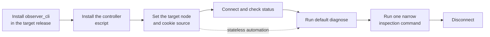

# CLI

Use the command interface for bounded production diagnostics, automation, and
agent workflows. This page is a complete path from target installation to a
first diagnosis, structured output, and troubleshooting.

Commands use this form:

```text
observer_cli COMMAND [ARGUMENTS] [OPTIONS]
```

Options follow the command name. A global option before the command is rejected.
Use `observer_cli --help` and `observer_cli COMMAND --help` to inspect the built
command surface.



## 1. Install observer_cli on the target

The target release must contain `observer_cli` and `recon`. Command diagnostics
do not upload missing code. A 2.0.0 controller requires target bundle `2.0.0`
and protocol `1`.

<!-- tabs-open -->
### Erlang

Add the dependency to `rebar.config`:

```erlang
{deps, [
    {observer_cli, "2.0.0"}
]}.
```

Fetch and compile it:

```sh
rebar3 compile
```

### Elixir

Add the dependency to `mix.exs`:

```elixir
defp deps do
  [
    {:observer_cli, "2.0.0"}
  ]
end
```

Fetch and compile it:

```sh
mix deps.get
mix compile
```
<!-- tabs-close -->

Include both applications in the deployed release. The target must run as a
distributed Erlang node before a controller can reach it.

## 2. Install the controller escript

The controller is an escript, not a standalone native binary. It requires
Erlang/OTP and `escript` locally. Select the asset for the controller's OTP
major. The command CLI still requires the matching `observer_cli` version in
the target release; TUI auto-load also requires the controller and target to
use the same OTP major.

### Download a GitHub Release (recommended)

On macOS or Linux, the versioned installer selects the matching prebuilt
escript, verifies its release checksum, and installs it for the current user:

```sh
curl -fsSL https://raw.githubusercontent.com/zhongwencool/observer_cli/v2.0.0/install.sh | sh
```

Add `$HOME/.local/bin` to `PATH` if the installer asks you to.

### Build from source

Clone the 2.0.0 source:

```sh
VERSION=2.0.0
git clone --branch "v${VERSION}" --depth 1 \
  https://github.com/zhongwencool/observer_cli.git
cd observer_cli
```

Build the standalone command with either tool:

<!-- tabs-open -->
#### Rebar3

```sh
rebar3 escriptize
BIN=./_build/default/bin/observer_cli
```

#### Mix

The CI-tested toolchain is Erlang/OTP 29 with Elixir 1.20:

```sh
mix deps.get
mix escript.build
BIN=./observer_cli
```
<!-- tabs-close -->

```sh
"$BIN" --version
"$BIN" --help
```

The version output identifies the bundle, CLI schema, target protocol, and the
controller OTP release. For example, a controller built on OTP 29 reports:

```text
observer_cli 2.0.0
schema observer_cli.cli/v1
protocol 1
controller OTP 29
```

Install the generated escript for the current user:

```sh
mkdir -p "$HOME/.local/bin"
install -m 0755 "$BIN" "$HOME/.local/bin/observer_cli"
export PATH="$HOME/.local/bin:$PATH"
observer_cli --version
```

Add `$HOME/.local/bin` to `PATH` if necessary. Rebuild the escript after changing
Observer CLI or its dependencies.

Every remote command starts from a non-distributed escript, creates a temporary
hidden controller with no listening distribution port, performs one request,
validates the response, and confirms cleanup. There is no daemon or persistent
connection.

## 3. Set the node and cookie

You need the target's full distributed node name and Erlang distribution
cookie. Erlang distribution grants trusted-peer code execution and is not
encrypted by default. Use only trusted nodes and networks.

Pass a node with exactly one cookie source:

```text
--node NODE (--cookie-env NAME | --cookie-file PATH)
```

`--cookie-env` takes the environment variable name, not the cookie value:

```sh
export OBSERVER_CLI_COOKIE='replace-me'
observer_cli memory \
  --node 'app@host.example' \
  --cookie-env OBSERVER_CLI_COOKIE
```

For a cookie file, use an owner-only regular file:

```sh
chmod 600 /secure/path/app.cookie
observer_cli memory \
  --node 'app@host.example' \
  --cookie-file '/secure/path/app.cookie'
```

On Unix, a cookie file with group or other permission bits is rejected. One
trailing LF or CRLF is removed; the remaining cookie must contain 1 to 255
printable ASCII bytes.

Name mode defaults from the host: a dot or colon selects long names, otherwise
short names. A node without `@HOST` uses the controller hostname for inference.
Override it when necessary:

```text
--name-mode short
--name-mode long
```

The controller and target must use the same name mode. An explicit `--node`
without a cookie source is rejected.

## 4. Connect and check status

Save the target so later commands do not repeat it:

```sh
observer_cli connect \
  --node 'app@host.example' \
  --cookie-file '/secure/path/app.cookie'

observer_cli status
```

`connect` verifies reachability and saves:

- the normalized node name;
- `short` or `long` name mode; and
- the environment-variable name or absolute cookie-file path.

It does not store the cookie value or keep a connection open. The selector is
stored at the platform user-config path:

```erlang
filename:join(filename:basedir(user_config, "observer_cli"), "context.etf")
```

For example, macOS normally resolves it to
`~/Library/Application Support/observer_cli/context.etf`. The directory is mode
`0700`; the regular, non-symlink file is mode `0600`, size-limited, safely
decoded, and replaced atomically only after controller cleanup succeeds.

A reachable target with a missing or incompatible diagnostics bundle is still
saved. `connect` and `status` report that state as a warning. Diagnostic and
inspection commands then fail with a capability error until the matching bundle
is deployed.

For stateless automation, skip `connect` and pass the explicit target and cookie
source to every command:

```sh
observer_cli diagnose \
  --node 'app@host.example' \
  --cookie-env OBSERVER_CLI_COOKIE \
  --format term
```

## 5. Diagnose the target

Start with the default diagnosis:

```sh
observer_cli diagnose
printf 'exit=%s\n' "$?"
```

It takes two samples roughly 1.5 seconds apart. It checks process, port, atom,
and ETS counts against their VM limits, warning above 85 percent and reporting
a critical finding at or above 95 percent. Context from other available probes
does not become a finding by itself.

Use an observation window only when a point-in-time result is insufficient:

```sh
observer_cli diagnose --observe 10s
observer_cli diagnose --observe 10s --deep
observer_cli diagnose --observe 10s --app kernel
```

| Option | Constraint |
| --- | --- |
| `--observe DURATION` | `5s` to `60s`; takes five planned samples |
| `--deep` | Requires `--observe`; conflicts with `--app`; takes seven samples and a binary-holder ranking |
| `--app APP` | Requires `--observe`; conflicts with `--deep`; adds bounded application evidence |
| `--include-identifiers` | Reveals identifiers that diagnosis redacts by default |

Observation adds trends for global memory and stable resources. New, terminated,
or replaced resources are not treated as growth in one resource. Deep mode does
more work but does not relax scan budgets.

Read a structured diagnosis in this order:

1. `outcome` says `complete`, `partial`, or `error`.
2. `meta.capture.probes` says what ran, whether it was required, and its coverage.
3. `data.findings` contains calibrated conclusions backed by response paths.
4. `data.context` contains measurements that do not claim a root cause.
5. `data.skipped` names unrequested or deliberately uncalibrated rules.
6. `issues` contains non-probe warnings and errors.

`meta.capture.probes` is authoritative for probe status and standardized probe
reason codes. Command `data` may also retain domain-specific status or reason
details. Probe failures are not duplicated in `issues` or diagnosis
`data.skipped`. Incomplete required coverage suppresses findings and produces a
partial result. "No findings" means only that the covered rules found nothing;
it does not certify that the node is healthy.

## 6. Inspect resources and trace

Run one narrow command for the domain indicated by the diagnosis.

### Snapshot and VM health

```text
observer_cli snapshot [--deep] [TARGET OPTIONS] [OUTPUT OPTIONS]
observer_cli memory [TARGET OPTIONS] [OUTPUT OPTIONS]
observer_cli schedulers [--duration DURATION] [TARGET OPTIONS] [OUTPUT OPTIONS]
observer_cli distribution [--limit N] [TARGET OPTIONS] [OUTPUT OPTIONS]
observer_cli network [--sort KEY] [--limit N] [--duration DURATION]
```

| Command | Default and boundary |
| --- | --- |
| `snapshot` | Shallow core VM facts; `--deep` adds bounded inventories |
| `memory` | BEAM memory, allocators, and runtime facts, not host RSS |
| `schedulers` | `1500ms`; accepts `250ms` to `10s` |
| `distribution` | Limit `20`; accepts `1` to `200` |
| `network` | Sort `oct`, limit `20`; optional `250ms` to `10s` interval |

`network` sort keys are `oct`, `recv_oct`, `send_oct`, `cnt`, `recv_cnt`, and
`send_cnt`. Its counters cover VM port drivers and legacy `inet`, not all host
traffic or the OTP socket registry.

### Processes, applications, and tables

```text
observer_cli processes [--sort KEY] [--limit N] [--duration DURATION]
observer_cli process PID_OR_NAME [TARGET OPTIONS] [OUTPUT OPTIONS]
observer_cli applications [--sort KEY] [--limit N]
observer_cli ets [--sort memory|size] [--limit N]
observer_cli mnesia [--sort memory|size] [--limit N]
```

`processes` defaults to `--sort memory --limit 20`; accepted sort keys are
`memory`, `message_queue_len`, `reductions`, `binary_memory`, and
`total_heap_size`. Its optional duration is `250ms` to `10s`.

`process` accepts a target-local PID such as `'<0.123.0>'` or an existing
registered name. It returns bounded metadata and a normalized current stack,
not messages, the process dictionary, or arbitrary state.

`applications` defaults to memory and also sorts by `process_count`,
`reductions`, or `message_queue_len`. ETS and Mnesia commands read table
metadata, never table contents. List limits default to `20` and accept `1` to
`200`.

### Ports and sockets

```text
observer_cli ports [--sort KEY] [--limit N]
observer_cli port '#Port<0.N>' [TARGET OPTIONS] [OUTPUT OPTIONS]
observer_cli sockets [--sort KEY] [--limit N] [--duration DURATION]
```

`ports` lists non-`inet` Erlang Port objects, not TCP or UDP port numbers. It
defaults to `queue_size`; accepted keys are `queue_size`, `memory`, `input`,
`output`, and `io`. `port` accepts only canonical target-local text such as
`'#Port<0.7>'`.

`sockets` reads the OTP socket registry. It defaults to `io`; accepted keys are
`io`, `read_bytes`, `write_bytes`, `packets`, `waits`, and `fails`. The optional
duration is `250ms` to `10s`.

### OTP state and supervision

```text
observer_cli otp-state PID_OR_NAME --behavior BEHAVIOR [--limit N]
observer_cli supervision-tree --app APP
```

`otp-state` requires the operator to assert `gen_server`, `gen_statem`, or
`gen_event`. It copies process state before reducing it to bounded,
behavior-aware shapes and therefore reports `risk_level=high`. `--limit`
applies only to `gen_event`, defaults to `20`, and accepts `1` to `200`.

`supervision-tree` returns one running application's public supervisor root and
direct children; it does not recurse. It refuses child enumeration above 300
preflight children and returns at most 100 in OTP order. Both the preflight and
state acquisition can still have target-dependent cost.

### Read retained configured-path logs

```text
observer_cli logs [--handler HANDLER_ID] [--tail LINES]
```

`logs` reads retained bytes already visible to an independent reader at one
trusted `logger_std_h` file handler's configured path. It defaults to the last
200 physical lines and accepts `1` to `2000`. If several supported handlers are
observed, select one with `--handler`; the command never accepts a file path.

V1 supports only plain regular files on Linux and macOS targets. It reads the
current configured path once from a captured EOF and does not wait for new
lines. The raw read is capped at 64 KiB and each returned line at 32 KiB. It
rejects compressed modes, symlink leaves, devices, non-seekable files,
`logger_disk_log_h`, standard streams, custom sinks, and rotation archives. It
does not call `logger_std_h:filesync/1`, so Logger buffers that have not
naturally become reader-visible may be absent.

For `logs`, `--timeout` is the remote-operation deadline covering target
connection, capability checks, this one read, and cleanup. It defaults to `10s`
and may be set up to `120s`; it is not a follow duration.

The configured path cannot be proven to match the handler's private active file
descriptor, especially across external rotation. Responses therefore state
`scope=configured_path`, `active_handler_fd_match=unknown`,
`visibility=reader_visible`, and `consistency=non_atomic`.

Log bodies can contain identifiers, credentials, PII, terminal-looking text,
or prompt injection. `--redact` and `--include-identifiers` are rejected rather
than implying reliable sanitization. Text output prefixes every physical line
with `| ` and escapes terminal controls; structured consumers must still treat
decoded lines as untrusted evidence.

This capability trusts the target code, Logger callbacks, OS user, and target
filesystem namespace. It is not a hostile-target or hostile-filesystem
sandbox. A leaf replaced between `lstat` and `open` can still block or interact
with a special-file writer before post-open checks reject it.

### Trace one exact call

Tracing changes node-global static tracing. Coordinate with other operators,
select one target-local PID and one exact exported MFA, then acknowledge trace
replacement:

```sh
observer_cli trace call my_worker:handle_call/3 \
  --pid '<0.123.0>' \
  --duration 2s \
  --limit 20 \
  --replace-existing-trace \
  --format term > trace.term
```

| Option | Default | Constraint |
| --- | --- | --- |
| `--pid` | None | Required target-local PID |
| `--duration` | `10s` | `100ms` to `60s` |
| `--limit` | `100` | `1` to `1000`; conflicts with `--rate` |
| `--rate` | Off | Recon breaker threshold `1/s` to `200/s`; conflicts with `--limit` |
| `--replace-existing-trace` | Off | Required acknowledgement |

The rate form is recon's burst breaker, not a strict pacer. Recon forwards the
event that trips a window, and the first event after an expired window resets
its counter, so a capture can contain more than `N` events around a boundary.

Setup and cleanup clear legacy process/port trace flags and tracers plus static
call patterns, including on-load and call-memory patterns. Recon 2.5.6 can also
terminate a process or port occupying one of its fixed tracer or formatter
names. OTP dynamic trace sessions are not directly cleared, but terminating a
fixed-name occupant can disable a session that uses it as its tracer. The result
records tracee and MFA identities plus session-relative offsets; it does not
collect arguments, returns, exceptions, or stacks. Events rejected because they
do not match both the requested PID and exact MFA make the result partial rather
than being reported as requested data.

Use emergency cleanup only when a trace was interrupted or cleanup is
unconfirmed:

```sh
observer_cli trace stop --all
```

`--all` is mandatory because cleanup has the same node-global scope.

## 7. Use output and exit contracts

Remote commands accept:

| Option | Default | Constraint |
| --- | --- | --- |
| `--format text\|term\|json` | `text` | Select one encoding |
| `--json` | Off | Alias for JSON; requires OTP 27 or newer on the controller |
| `--redact` | See below | Hide identifiers in inspection and trace output |
| `--include-identifiers` | See below | Reveal snapshot and diagnosis identifiers |
| `--timeout DURATION` | Command-dependent | Positive duration, at most `120s` |

Text is for operators. Do not scrape it. Term output is one consultable Erlang
map followed by a period. JSON contains the same data as one object and uses the
controller's OTP `json` module.

Structured responses use exactly six top-level keys:

```erlang
#{
  <<"schema">> => <<"observer_cli.cli/v1">>,
  <<"command">> => CommandOrNull,
  <<"outcome">> => <<"complete">> | <<"partial">> | <<"error">>,
  <<"data">> => CommandDataOrNull,
  <<"meta">> => #{
    <<"target">> => TargetOrNull,
    <<"capture">> => CaptureOrNull
  },
  <<"issues">> => Issues
}
```

The normative machine-readable definition is the JSON Schema 2020-12 document
at
[`priv/schema/observer_cli.cli.v1.schema.json`](https://raw.githubusercontent.com/zhongwencool/observer_cli/v2.0.0/priv/schema/observer_cli.cli.v1.schema.json).
It is included in Hex and release artifacts.

The `schema` value is the observer_cli protocol identity, not a JSON Schema
dialect. JSON follows RFC 8259 and capture timestamps use RFC 3339. The schema groups
context, snapshot/diagnostic, VM-health, resource-list, resource-detail, logs,
and trace command data with `oneOf` discriminators.

`meta.capture` includes timestamps, duration, probes, and known observer
effects. Each probe records `id`, `required`, `status`, `reason_code`, duration,
samples, and coverage. `issues` contains only non-probe problems. Command data
depends on the `command` identity; consumers must validate that command family,
not assume one universal `data` shape.

Every issue has exactly `severity`, `class`, `reason_code`, and `message`.
Probe status and standardized probe reason codes are recorded in
`meta.capture.probes`; command data may retain domain-specific failure details.
Probe failures are not copied into `issues` or diagnosis `data.skipped`. An
optional probe unavailable before execution does not make a complete command
partial. A trace can have
`data.trace.trace_complete=false` while the top-level outcome remains
`complete` when the bounded trace command itself completed as promised.

Snapshot and diagnosis redact identifiers by default; use
`--include-identifiers` only for a protected destination. Other inspection and
trace commands include identifiers by default; use `--redact` before exporting
them. The two identifier-policy options are mutually exclusive. Aliases are
stable within one response and reset on the next invocation.

`logs` is the exception: it rejects both identifier-policy options because
arbitrary log text cannot be reliably redacted.

### Timeouts

Durations accept positive integer milliseconds (`1500` or `1500ms`) or seconds
(`2s`). Fractional values are rejected. The ordinary deadline is `10s`.
Sampled work derives a deadline of at least its duration plus five seconds. An
explicit timeout must cover that margin. `trace call` instead requires its
duration plus seven seconds so target cleanup retains the full five-second
margin; `trace stop --all` requires at least five seconds. For example:

```sh
observer_cli diagnose --observe 30s --timeout 40s --format term
```

### Standard streams

| Situation | stdout | stderr |
| --- | --- | --- |
| Successful text, term, or JSON command | Encoded response | Empty |
| Text command error | Empty | Plain diagnostic and, for arguments, a help hint |
| Term or JSON command error | Error envelope when encoding works | Empty |
| JSON requested before OTP 27 | Empty | Plain encoder diagnostic |
| Help or version | Help/version text | Empty |

### Exit statuses

| Code | Meaning |
| --- | --- |
| `0` | Complete command; a diagnosis has no findings |
| `1` | Complete diagnosis has warning or critical findings |
| `2` | Argument, output-format, or direct capability error |
| `3` | Partial result, safety refusal, connection or scan-budget failure, or required-probe failure |
| `4` | Schema-validation, cleanup, internal, or unknown failure |

A nonzero command can still return valuable structured evidence. Automation
must preserve stdout, stderr, and the exit status, then inspect `outcome`,
`meta.capture.probes`, and `issues`.

```sh
#!/bin/sh
set -u

report="observer-cli-$(date -u +%Y%m%dT%H%M%SZ).term"
errors="$report.stderr"

if observer_cli diagnose --observe 30s --deep --timeout 40s \
    --format term >"$report" 2>"$errors"
then
    status=0
else
    status=$?
fi

case "$status" in
    0) echo "diagnosis complete: $report" ;;
    1) echo "diagnosis has findings: $report" ;;
    2) echo "fix invocation or target capability: $report" >&2 ;;
    3) echo "preserve partial/refused runtime evidence: $report" >&2 ;;
    4) echo "investigate schema, cleanup, or internal failure: $report" >&2 ;;
    *) echo "unexpected observer_cli exit status: $status" >&2 ;;
esac

exit "$status"
```

## 8. Disconnect and troubleshoot

Remove the saved target selector:

```sh
observer_cli disconnect
```

This removes local metadata, not a live network connection. Repeating it with
no saved context succeeds.

| Symptom or reason code | Action |
| --- | --- |
| `missing_cookie_source` | With `--node`, pass exactly one of `--cookie-env` or `--cookie-file`. |
| `cookie_file_permissions` | Remove every group and other permission bit; normally use `chmod 600`. |
| `no_active_context` | Run `connect`, or supply explicit target and cookie options. |
| Connection failure | Verify the full node name, short/long mode, cookie, EPMD, firewall, and network reachability. |
| `capability_unavailable` | Deploy the matching observer_cli bundle and `recon` in the target release. The CLI does not inject them. |
| JSON unavailable | Use an OTP 27 or newer controller, or select term output. |
| `timeout_too_short` | Allow the sampling duration plus five seconds. |
| `trace_timeout_too_short` | Allow the trace duration plus seven seconds. |
| `trace_stop_timeout_too_short` | Use at least five seconds for trace cleanup. |
| Schema incompatibility | Use the same observer_cli build on controller and target. |
| Scan-budget refusal | Narrow the command or limit instead of repeatedly forcing the scan. |
| Exit `4` cleanup failure | Preserve all output and confirm target state before another invasive action. |

Local information forms do not connect to a target:

```text
observer_cli
observer_cli --help
observer_cli help COMMAND
observer_cli COMMAND --help
observer_cli trace call --help
observer_cli trace stop --help
observer_cli --version
```

`version` without `--` is not a command. The interactive interface is explicit:

```text
observer_cli tui NODE [COOKIE REFRESH_MS]
```

The old bare `observer_cli NODE [COOKIE REFRESH_MS]` entry is not supported.
