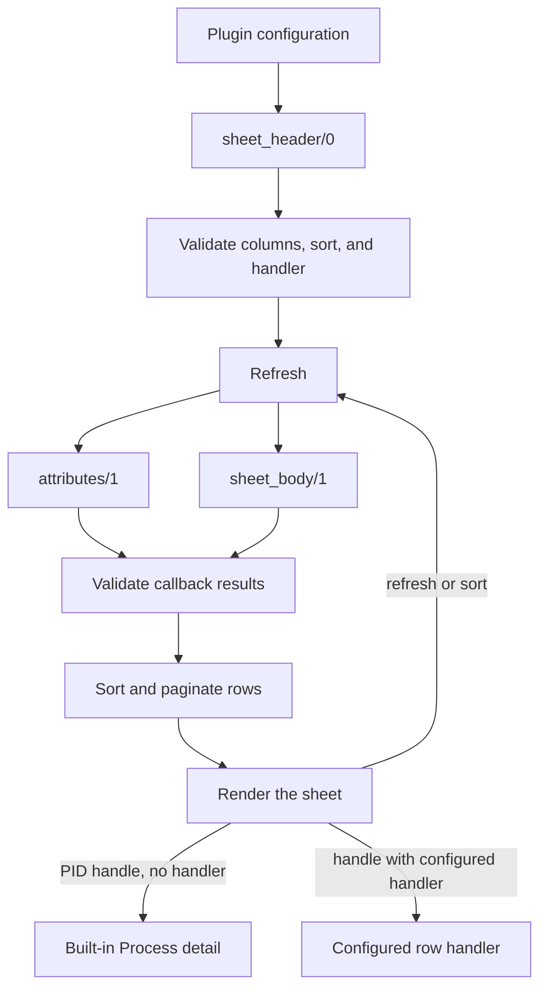

# TUI plugins

Use a plugin sheet for a target-specific live table. Use a formatter for
domain-specific process messages, dictionaries, or state. Both run on the node
that hosts the TUI runtime, so include their modules in that node's release or
code path.

## Implement a plugin

A plugin module implements the `observer_cli_plugin` callbacks:

```erlang
-module(my_runtime_plugin).

-behaviour(observer_cli_plugin).

-export([attributes/1, sheet_header/0, sheet_body/1]).

attributes(State) ->
    Total = erlang:memory(total),
    #{
        rows => [[
            #{content => "BEAM memory", width => 16},
            #{content => {byte, Total}, width => 16}
        ]],
        state => State
    }.

sheet_header() ->
    #{
        columns => [
            #{id => metric, title => "Metric", width => 24},
            #{id => value, title => "Value", width => 16, shortcut => "V"}
        ],
        default_sort => value
    }.

sheet_body(State) ->
    #{
        rows => [
            #{cells => #{metric => "Processes", value => erlang:system_info(process_count)}},
            #{cells => #{metric => "Ports", value => erlang:system_info(port_count)}}
        ],
        state => State
    }.
```

`attributes/1` and `sheet_body/1` keep independent state streams. Each receives
`undefined` on its first call and the state returned by its own preceding call
afterward.

### `attributes/1`

```erlang
attributes(PreviousState) -> #{
    rows => AttributeRows,
    state => NextState
}.
```

Each attribute row is a list of cells. A cell requires `content` and a positive
`width`; `color` is optional:

```erlang
#{
    content => Content,
    width => PositiveInteger,
    color => AnsiBinary
}
```

`content` may be a string, integer, `{byte, Bytes}`, or
`{percent, Fraction}`. A module that does not export `attributes/1` renders no
attributes; returning `undefined` is invalid.

### `sheet_header/0`

```erlang
sheet_header() -> #{
    columns => [
        #{
            id => ColumnId,
            title => "Title",
            width => PositiveInteger,
            shortcut => "T"
        }
    ],
    default_sort => ColumnId
}.
```

Column IDs must be unique atoms. `default_sort` and the configured `sort` must
name one declared column. A column shortcut changes the active sort key.

### `sheet_body/1`

```erlang
sheet_body(PreviousState) -> #{
    rows => [
        #{
            cells => #{ColumnId => Value},
            handle => Selection
        }
    ],
    state => NextState
}.
```

Each row needs a `cells` map keyed by declared column IDs. Missing cells render
empty and undeclared cells are ignored. `handle` is optional.

Invalid callback shapes raise `{plugin_api_error, Details}`. Details identify
the source as `attributes`, `sheet_header`, `sheet_body`, `config`, or
`row_handler`, together with a reason atom.

## Register the plugin

Configure an ordered plugin list in the `observer_cli` application environment.
`module`, `title`, and `shortcut` are required. `interval` defaults to `1500`
milliseconds; keep it at or above `1000`. `sort` defaults to the callback's
`default_sort`.

<!-- tabs-open -->
### Erlang

Add the configuration to the target release's `sys.config`:

```erlang
{observer_cli, [
    {plugins, [
        #{
            module => my_runtime_plugin,
            title => "Runtime",
            shortcut => "R",
            interval => 1500,
            sort => value
        }
    ]}
]}.
```

### Elixir

Add the configuration to `config/runtime.exs` or another runtime config file:

```elixir
config :observer_cli,
  plugins: [
    %{
      module: :my_runtime_plugin,
      title: ~c"Runtime",
      shortcut: ~c"R",
      interval: 1500,
      sort: :value
    }
  ]
```
<!-- tabs-close -->

For a remote TUI, package the plugin module in the target release. Automatic
core-module loading does not discover plugin applications.

Press `P` in the TUI, then the configured plugin shortcut. From an Erlang shell,
`observer_cli:start_plugin().` opens plugin mode on the current node.




## Tables, sorting, and pagination

Rows are ordered by the active column using descending Erlang term ordering
before pagination. Observer CLI maintains the selected row, page, and computed
sheet width.

| Input | Action |
| --- | --- |
| Configured plugin shortcut | Select a plugin |
| Configured column shortcut | Change the sort column |
| Positive row number below `1000` | Select that visible row |
| Enter | Select the remembered row |
| `F`, `B` | Next or previous page |
| Integer at least `1000` | Change the plugin refresh interval |
| `H` | Return Home |
| `q` | Quit |

Do not use `H`, `B`, `F`, `q`, Enter, or a positive integer as a plugin or
column shortcut; the built-in parser consumes them first. A plugin menu shortcut
wins when it duplicates a column shortcut.

## Add process drill-down

Put a PID in an explicit row handle to open the built-in Process detail view:

```erlang
#{
    cells => #{metric => "Worker", value => 1},
    handle => WorkerPid
}
```

Omit `handle` from non-selectable rows. A PID handle uses the built-in detail
view when no custom handler is configured.

For a resource the built-in process view cannot represent, add a handler module
to the plugin configuration:

```erlang
#{
    module => my_runtime_plugin,
    title => "Runtime",
    shortcut => "R",
    handler => my_runtime_detail
}
```

Observer CLI calls:

```erlang
my_runtime_detail:start(plugin, Selection, ViewOpts).
```

Custom handlers use the internal TUI page lifecycle, not a public behavior.
Use one only when PID drill-down is insufficient.

## Add a process formatter

The formatter renders values in the Process Messages, Dictionary, and State
views. Implement `observer_cli_formatter` and handle every Erlang term:

```erlang
-module(my_observer_formatter).

-behaviour(observer_cli_formatter).

-export([format/2]).

format(Pid, Term) ->
    unicode:characters_to_list(
        io_lib:format(
            "Process: ~p~n~n~tp~n",
            [Pid, Term],
            [{chars_limit, 64 * 1024 + 1}]
        )
    ).
```

The extra character in the soft `chars_limit` is a tripwire: the enclosing hard
cap rejects truncated formatter output instead of displaying it.

`format/2` must return a Unicode character list. If it raises, exits, or throws,
Observer CLI falls back to `observer_cli_formatter_default` for that value.
Collection and both formatter implementations run in the same bounded worker.
A timeout, heap-limit exit, invalid return, or final rendered detail above the
65,536-character or 64 KiB UTF-8 caps displays `too_large` without another
formatting attempt. The caps include view prefixes, not only formatter output.

Configure both the formatter application and module. The application identifies
only its own modules for TUI auto-load; dependency and included applications are
not uploaded.

<!-- tabs-open -->
### Erlang

```erlang
{observer_cli, [
    {formatter, #{
        application => my_formatter_app,
        mod => my_observer_formatter
    }}
]}.
```

### Elixir

```elixir
config :observer_cli,
  formatter: %{
    application: :my_formatter_app,
    mod: :my_observer_formatter
  }
```
<!-- tabs-close -->

Install the formatter application's dependencies and included applications on
the target. Auto-load can upload the formatter application's own modules when
the controller and target use the same OTP major release. Verify normal terms,
Unicode, and large nested terms in the Process Messages, Dictionary, and State
views.

## Related TUI settings

| Key | Accepted value | Default | Purpose |
| --- | --- | --- | --- |
| `scheduler_usage` | `enable` or `disable` | `disable` | Initial Home scheduler-wall-time display |
| `default_row_size` | Positive integer | `30` | Row count when terminal height is unavailable |
| `formatter` | Formatter map | Built-in formatter | Process Messages, Dictionary, and State rendering |
| `plugins` | List of plugin maps | `[]` | Plugin sheets |

The TUI escript copies the local `observer_cli` application environment when it
loads its bundle remotely.

## Migrate a 1.x plugin to 2.0

Update callback return values and column identities:

| 1.x | 2.0 |
| --- | --- |
| `attributes/1 -> {Rows, State}` | `#{rows => Rows, state => State}` |
| Header list with positional columns | `#{columns => [#{id => Id, ...}], default_sort => Id}` |
| `sheet_body/1 -> {RowLists, State}` | `#{rows => [#{cells => #{Id => Value}}], state => State}` |
| Implicit PID selection | Explicit `handle => Pid` |
| `sort_column => N` | `sort => ColumnId` |
| `handler => {Filter, Module}` | `handler => Module` plus explicit row handles |

Observer CLI translates `sort_column` and the old handler tuple at startup, but
rejects legacy callback shapes with `plugin_api_error`. Migrate the callbacks;
do not add an adapter.
