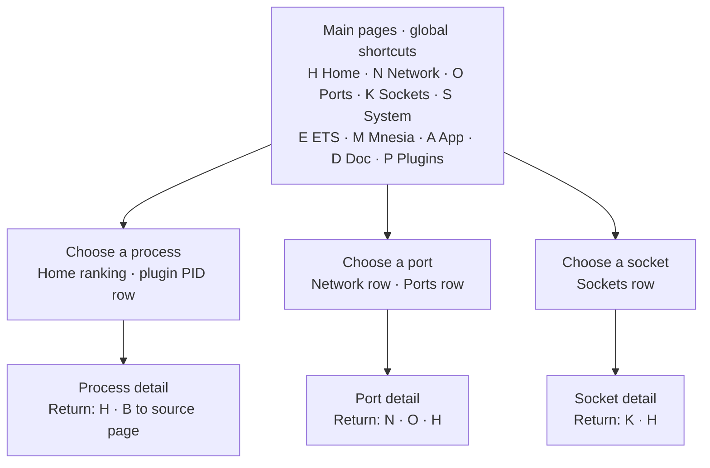

# TUI reference

The terminal UI shows a live, line-oriented view of one BEAM node. Type a
shortcut and press Enter; an empty line means Enter by itself.

## Quick start

Build the escript, then use the explicit `tui` command. This example uses the
cookie already available to the controller:

```sh
rebar3 escriptize
./_build/default/bin/observer_cli tui app@host
```

Press `D` for the built-in shortcut page and `q` to quit. The old bare
`observer_cli NODE [COOKIE REFRESH_MS]` form is not supported.


## Start forms

From the generated escript:

```text
observer_cli tui NODE [COOKIE REFRESH_MS]
```

`REFRESH_MS` defaults to `1500` and must be at least `1000`. Supplying a cookie
also requires the refresh value. The escript starts a hidden controller, loads
a compatible TUI bundle into the target when needed, and starts the UI there.
Auto-load requires the controller and target to use the same OTP major release;
a compatible bundle already installed on the target is used without auto-load.

From an Erlang shell:

```erlang
observer_cli:start().
observer_cli:start(2000).
observer_cli:start(RemoteNode).
observer_cli:start(RemoteNode, Cookie).
observer_cli:start(RemoteNode, [{cookie, Cookie}, {interval, 2000}]).
```

The integer form sets the refresh interval for most local pages; App keeps its
default. The options form is for a remote node.

## Main pages

| Page | Key | Contents |
| --- | --- | --- |
| Home | `H` | VM summary, memory and GC deltas, optional scheduler utilization, and ranked processes |
| Network | `N` | VM I/O totals and legacy `inet` Port counters |
| Ports | `O` | Non-`inet` Erlang Port metadata and counters |
| Sockets | `K` | OTP `socket` registry summary, counters, and socket details |
| System | `S` | System/architecture facts, allocators, cache rates, and distribution state |
| ETS | `E` | ETS table metadata |
| Mnesia | `M` | Local Mnesia table metadata; the menu entry appears only while the schema table exists |
| App | `A` | Process resources grouped by application |
| Doc | `D` | Built-in shortcut summary |
| Plugin | `P` | Configured plugin sheets |



The diagram separates two navigation mechanisms: global shortcuts among peer
main pages, then context-specific row drill-down. Pages without a row-detail
transition appear only in the global shortcut set. The tables below are
authoritative for all shortcuts and behavior.

The Home, Network, Ports, Sockets, ETS, Mnesia, App, and Plugin lists use
terminal height to choose the visible row count. If terminal geometry is
unavailable, `default_row_size` defaults to 30 rows.

## How to read values

The field tables below describe the labels rendered by the current TUI. The
**Source** column identifies the source API and key where the value is fixed.
Relevant API references are the Erlang/OTP [`erlang`](https://www.erlang.org/doc/apps/erts/erlang.html),
[`persistent_term`](https://www.erlang.org/doc/apps/erts/persistent_term.html),
[`inet`](https://www.erlang.org/doc/apps/kernel/inet.html),
[`socket`](https://www.erlang.org/doc/apps/kernel/socket.html),
[`ets`](https://www.erlang.org/doc/apps/stdlib/ets.html), and
[`mnesia`](https://www.erlang.org/doc/apps/mnesia/mnesia.html) modules, plus
[`recon`](https://ferd.github.io/recon/recon.html) and
[`recon_alloc`](https://ferd.github.io/recon/recon_alloc.html).

- Values passed through the byte formatter use `B`, `KiB`, `MiB`, or `GiB`.
  Byte-valued exceptions rendered as raw integers, plus raw counts and words,
  are identified below.
- A **total** is cumulative for the VM or resource. An **increment** or **delta**
  is the current sample minus the preceding sample; it is not a per-second rate.
- A Recon **count** is a point-in-time ranking. A Recon **window** is the
  difference between two samples separated by the configured interval.
- `dead` means that a resource disappeared. `unavailable` means a required
  capability is missing. `undefined` marks an unsupported or absent property.
  `-` can represent an empty state or an endpoint that is not connected. Socket
  counters and options can vary with the OTP release, operating system, domain,
  type, and protocol.

## Shared input

Most built-in main and list pages use the shared input parser below. A page
ignores actions it does not implement; detail and plugin views document their
own inputs later in this reference.

| Input | Action |
| --- | --- |
| `H`, `N`, `O`, `K`, `S`, `E`, `M`, `A`, `D`, `P` | Switch main page |
| `q` or `Q` | Quit the TUI |
| `F`, `pd`, or `PD` | Next page |
| `B`, `pu`, or `PU` | Previous page; page 1 is the lower bound |
| Integer at least `1000` | Set the active page's refresh interval in milliseconds |
| Positive integer below `1000` | Select that row on pages with row drill-down; otherwise ignored |
| Enter | Open the remembered row on Home and Network; otherwise page-specific |

Pages that accept interval changes retain their own value while you navigate.

## Home

The Home ranking has two collection modes:

- count mode calls `recon:proc_count/2` once per refresh;
- window mode calls `recon:proc_window/3` for the configured interval.

The first redraw after entering a window mode still uses `proc_count`; later
redraws use `proc_window`.

| Input | Ranking |
| --- | --- |
| `r` / `rr` | Reductions, count/window |
| `m` / `mm` | Memory, count/window |
| `b` / `bb` | Referenced binary memory, count/window |
| `t` / `tt` | Total heap size, count/window |
| `mq` / `mmq` | Message queue length, count/window |
| `p` | Pause or resume Home redraw |
| `` ` `` | Enable or disable scheduler wall-time utilization rows |
| Row number | Open that ranked process |
| Enter | Open the remembered ranked process |
| Full PID, for example `<0.43.0>` | Open a local process even if it is not ranked |
| `<431` or `>431` | Open `<0.431.0>` |

Enabling scheduler utilization changes the node-wide `scheduler_wall_time` system flag while the view is active. observer_cli restores the preceding setting when it cleans up the Home view.

### VM and OS fields

| Field | Meaning and unit | Sampling | Source |
| --- | --- | --- | --- |
| Header | ERTS system version, node name, and VM uptime | Version/name are stable; uptime is current | `system_info(system_version)`, `node()`, `statistics(wall_clock)` |
| `Proc Count` | Existing processes / process limit; red above 85% | Current | `system_info(process_count)`, `system_info(process_limit)` |
| `Port Count` | Existing Ports / Port limit; red above 85% | Current | `system_info(port_count)`, `system_info(port_limit)` |
| `Atom Count` | Existing atoms / atom limit; red above 85% | Current | `system_info(atom_count)`, `system_info(atom_limit)` |
| `Ets Limit` | ETS table limit, shown instead of `Atom Count` when `atom_limit` is unsupported | Stable | `system_info(ets_limit)` |
| `Version` | OTP release | Stable | `system_info(otp_release)` |
| `ps -o pcpu` | CPU percentage reported by the host `ps` command for the BEAM OS process | Current | `ps -o pcpu PID` |
| `ps -o pmem` | Memory percentage reported by the host `ps` command for the BEAM OS process | Current | `ps -o pmem PID` |
| `Active Task` | Active processes and Ports ready or running on normal and dirty-CPU schedulers; dirty IO is excluded | Current | `statistics(total_active_tasks)` |
| `Context Switch` | VM context-switch count | Total | `statistics(context_switches)` |
| `Reds(Total/SinceLastCall)` | Total reductions / reductions since this API was last called | Total / API-call increment | `statistics(reductions)` |

`ps` fields display `--` when observer_cli cannot parse the command output.

### Memory, IO, and GC fields

| Field | Meaning and unit | Sampling | Source |
| --- | --- | --- | --- |
| `Total` | Total memory allocated by the VM, bytes; always 100% | Current | `memory()` key `total` |
| `Process` | Memory currently used by processes, bytes and percent of `Total` | Current | `memory()` key `processes_used` |
| `Atom` | Memory currently used by atoms, bytes and percent of `Total` | Current | `memory()` key `atom_used` |
| `Binary` | Memory for binaries, bytes and percent of `Total` | Current | `memory()` key `binary` |
| `Code` | Memory for loaded code, bytes and percent of `Total` | Current | `memory()` key `code` |
| `Ets/N` | ETS memory, bytes and percent of `Total`; `N` is the current table count | Current | `memory()` key `ets`, `length(ets:all())` |
| `Persistent Terms/N` | Persistent-term memory in bytes; `N` is the term count | Current | `persistent_term:info()` keys `memory`, `count` |
| `RunQueue` | Runnable normal and dirty-CPU work | Current | `statistics(run_queue)` |
| `RunQueue/ErrorLoggerQueue` | Run queue / `error_logger` mailbox length, when that registered process exists | Current | `statistics(run_queue)`, `process_info(Pid, message_queue_len)` |
| `IO/GC:(Nms)`, `Total/Increments` | `N` is the configured refresh interval; following values show totals and prior-sample differences, not exact-period rates | Configured interval / sampled values | Page state |
| `IO Input`, `IO Output` | Total bytes through VM Ports / bytes added since the preceding Home sample | Total / refresh increment | `statistics(io)` |
| `Gc Count` | Garbage collections / collections added since the preceding Home sample | Total / refresh increment | `statistics(garbage_collection)` |
| `Gc Words Reclaimed` | Reclaimed heap words / words added since the preceding Home sample | Total / refresh increment | `statistics(garbage_collection)` |

### Scheduler utilization

Each scheduler row shows its scheduler ID and active-time percentage between two
`statistics(scheduler_wall_time)` samples. The rows cover the normal and dirty
CPU scheduler IDs returned by OTP, not dirty IO schedulers. observer_cli uses
`recon_lib:scheduler_usage_diff/2`; values at or above 80% are red.

### Top-N process fields

| Field | Meaning and unit | Sampling | Source |
| --- | --- | --- | --- |
| `No`, `Pid` | Display row and local process identifier | Current | Ranked result |
| `Name\|>Label\|>Initial Call` | Registered name, otherwise OTP 27+ process label, otherwise translated initial call | Current | `registered_name`, `proc_lib:get_label/1`, `proc_lib:translate_initial_call/1` |
| `Current Function` | Currently executing MFA | Current | `process_info(Pid, current_function)` |
| `Memory` | Process memory, bytes | Count: current; window: change | `recon:proc_count/2` or `recon:proc_window/3` with `memory` |
| `BinMemory` | Referenced binary memory, bytes | Count: current; window: change | Recon `binary_memory` attribute |
| `Reductions` | Process reductions | Count: total; window: increment | Recon `reductions` attribute |
| `TotalHeapSize` | Process total heap words multiplied by VM word size, bytes | Count: current; window: change | Recon `total_heap_size` attribute |
| `MsgQueue` | Pending message count | Count: current; window: change | Recon `message_queue_len` attribute |

Only the selected ranking field uses the count or window value. The companion
`Memory`, `Reductions`, and `MsgQueue` columns are current point-in-time reads.
Window changes are second sample minus first and can be negative. A process
present in only one sample retains that sample's absolute value.
A reduction is a VM scheduling work unit, not elapsed CPU time.

## Network

| Input | Action |
| --- | --- |
| `ic` | Use `recon:inet_count/2` |
| `iw` | Use a Recon-backed window sample with the page interval |
| `rc` | Sort by received packet count |
| `ro` | Sort by received octets |
| `sc` | Sort by sent packet count |
| `so` | Sort by sent octets |
| `cnt` | Sort by total packet count |
| `oct` | Sort by total octets |
| Row number or Enter | Open the corresponding Port detail |

The page also displays VM input/output deltas from `erlang:statistics(io)`.
Ranked rows cover legacy `inet` Ports, not every host connection or the OTP
`socket` registry.

### Displayed fields

| Field | Meaning and unit | Sampling | Source |
| --- | --- | --- | --- |
| `Byte Input`, `Byte Output` | Bytes added since the preceding Network redraw | Refresh delta | `statistics(io)` |
| `Total Input`, `Total Output` | Cumulative bytes through VM Ports | Total | `statistics(io)` |
| `NO`, `Port` | Display row and legacy `inet` Port identifier | Current | Recon count or window sampling |
| `recv_cnt`, `send_cnt`, `cnt` | Received, sent, and combined packet counts | Count: total; window: delta | `inet:getstat/2` through Recon |
| `recv_oct`, `send_oct`, `oct` | Received, sent, and combined bytes | Count: total; window: delta | `inet:getstat/2` through Recon |
| `output`, `input` | Cumulative bytes written to and read from the Port driver | Total | `recon:port_info(Port, io)` |
| `queuesize` | Bytes currently queued by the Port driver, rendered as a raw integer | Current | `recon:port_info(Port, memory_used)` key `queue_size` |
| `memory` | Runtime memory allocated for the Port, bytes | Current | `recon:port_info(Port, memory_used)` key `memory` |
| `Peername(ip:port)` | Remote endpoint or formatted socket error | Current | `inet:peername/1` |

The first `iw` redraw uses count mode; later redraws use the configured window.
For Ports present in both samples, all ranked metric columns use deltas from the
same window. A Port present in only one sample retains that sample's absolute
values. One-direction modes remain sorted by the selected direction. Port
`input` and `output` totals appear under their matching headings.

## Ports

The Ports page excludes `inet` Ports already represented on Network.

| Input | Action |
| --- | --- |
| `qs` | Sort by queue size |
| `m` | Sort by memory |
| Row number | Open Port detail |

In Port detail, `H` opens Home, `N` opens Network, `O` returns to Ports, `P`
keeps the current detail, and an integer at least `1000` changes the refresh
interval.

### Ports list fields

| Field | Meaning and unit | Source |
| --- | --- | --- |
| `NO` | Display row | Current page |
| `Id` | Runtime Port index | `port_info(Port, id)` |
| `Connected` | Process connected to and controlling the Port | `port_info(Port, connected)` |
| `Name` | Port driver name | `port_info(Port, name)` |
| `Controls` | Driver control name, falling back to `Name` | `port_info(Port, controls)` |
| `Slot` | Runtime Port-table slot; `undefined` when unsupported | `port_info(Port, slot)` |
| `Queue` | Current queued bytes, rendered as a raw integer | `port_info(Port, queue_size)` |
| `Memory` | Current runtime memory for the Port, bytes | `port_info(Port, memory)` |
| `Parallel` | Whether the Port uses parallelism | `port_info(Port, parallelism)` |
| `Locking` | Locking mode, such as `port_level` or `driver_level` | `port_info(Port, locking)` |
| `Mon/By` | Count of outbound monitors held by the Port / count of entities monitoring the Port | `port_info(Port, monitors)`, `port_info(Port, monitored_by)` |

The list is a current snapshot of `erlang:ports/0` and excludes Ports whose
name or control name is `tcp_inet`, `udp_inet`, or `sctp_inet`.

### Port detail fields

| Field | Meaning and unit | Source |
| --- | --- | --- |
| `port`, `id`, `name` | Port term, runtime index, and driver name | `recon:port_info/1` |
| `queue_size` | Current queued bytes, rendered as a raw integer; red when nonzero | `recon:port_info/1` category `memory_used` |
| `input`, `output` | Cumulative bytes read from and written to the Port | `recon:port_info/1` category `io` |
| `connected` | Controlling process | `recon:port_info/1` category `signals` |
| `memory` | Runtime memory allocated for the Port, bytes | `recon:port_info/1` category `memory_used` |
| `os_pid` | Associated external OS process ID, when one exists | `recon:port_info/1` category `meta` |
| `controls` | Runtime control name, falling back to the Port name | `port_info(Port, controls)` |
| `slot`, `parallelism`, `locking` | Runtime-specific Port properties; unsupported properties are `undefined` | `port_info/2` |
| `Links(N)`, `Monitors(N)`, `Monitored by(N)` | Full link, outbound-monitor, and inbound-monitor counts; at most the first 30 values | Recon signals plus `port_info(Port, monitored_by)` |
| `sockname`, `peername` | Local and remote legacy-`inet` endpoints | `recon:port_info/1` category `type` |

Legacy-`inet` detail adds current statistics from `inet:getstat/1` through
Recon. Transfer counters and packet-size aggregates are cumulative;
`send_pend` is a current gauge.

| Field | Meaning and unit |
| --- | --- |
| `recv_cnt`, `send_cnt` | Packets received and sent |
| `recv_oct`, `send_oct` | Bytes received and sent |
| `recv_max`, `send_max` | Largest received and sent packet, bytes |
| `recv_avg`, `send_avg` | Average received and sent packet size, bytes |
| `recv_dvi` | Average received-packet-size deviation, bytes |
| `send_pend` | Bytes currently pending send; rendered as a raw integer |

The `Options` block attempts a fixed `inet:getopts/2` allowlist: `active`,
`broadcast`, `buffer`, `bind_to_device`, `delay_send`, `deliver`, `dontroute`,
`exit_on_close`, `header`, `high_msgq_watermark`, `high_watermark`,
`low_msgq_watermark`, `low_watermark`,
`ipv6_v6only`, `keepalive`, `linger`, `mode`, `netns`, `nodelay`, `packet`,
`packet_size`, `priority`, `read_packets`, `recbuf`, `reuseaddr`, send-timeout
options `send_timeout` and `send_timeout_close`, `show_econnreset`, `sndbuf`,
`tos`, and `tclass`. Unsupported options are shown explicitly.

## Sockets

The Sockets page reads the OTP socket registry. A missing socket API produces
an unavailable state.

| Input | Sort key |
| --- | --- |
| `io` | Read plus write bytes |
| `rb` | Read bytes |
| `wb` | Write bytes |
| `pk` | Packets |
| `wt` | Waits |
| `fl` | Failures |
| `mx` | Maximum packet value |
| `ac` | Accept activity |
| `id` | Socket ID |
| `fd` | File descriptor |
| `ow` | Owner |
| `dm` | Domain |
| `tp` | Type |
| `pt` | Protocol |

A row number opens socket detail; `K` returns to the Sockets list. Counter
sorting uses deltas after the first refresh. Identity sorting uses current
metadata.


### General socket fields

The `General` block comes from `socket:info/0`, with `num_sockets` and
`num_monitors` taken from `socket:number_of/0` and
`socket:number_of_monitors()`.

| Field | Meaning |
| --- | --- |
| `iov_max` | Maximum number of IO vectors supported by the runtime |
| `num_cnt_bits` | Width of the socket counter representation |
| `num_sockets`, `num_monitors` | Registry-known socket and socket-monitor counts |
| `num_dinet`, `num_dinet6`, `num_dlocal` | Socket counts by domain |
| `num_tstreams`, `num_tdgrams`, `num_tseqpkgs` | Socket counts by type |
| `num_pip`, `num_psctp`, `num_ptcp`, `num_pudp` | Socket counts by protocol |

The page enumerates `socket:which_sockets/0`; sockets created with registry use
disabled are not included.

### Socket list fields

| Field | Meaning and unit | Sampling | Source |
| --- | --- | --- | --- |
| `NO`, `Socket` | Display row and `socket:to_list(Socket)` identifier | Current | Socket registry |
| `Owner(ow)` | Controlling process | Current | `socket:info(Socket)` key `owner` |
| `Endpoint` | Local endpoint `->` remote endpoint | Current | `socket:sockname/1`, `socket:peername/1` |
| `Kind` | `domain/protocol/type` | Current | `socket:info(Socket)` |
| `State` | Read and write state lists | Current | `socket:info(Socket)` keys `rstates`, `wstates` |
| `Read rb` | `read_byte`, bytes | First redraw: total; later: delta | Socket counters |
| `Write wb` | `write_byte + sendfile_byte`, bytes | First redraw: total; later: delta | Socket counters |
| `Pkt/Acc` | Read + write + sendfile packet count / successful accept count | First redraw: total; later: delta | Socket counters |
| `Wait` | Accept + read + write + sendfile wait count | First redraw: total; later: delta | Socket counters |
| `Fail` | Accept + read + write + sendfile failure count | First redraw: total; later: delta | Socket counters |
| `MaxPkt` | Largest current read, write, or sendfile packet maximum, bytes | Current | Socket counters |

Counter decreases are clamped to zero. Sorting by `ac` uses
`acc_success + acc_tries`, while the visible acceptance value in `Pkt/Acc` is
`acc_success` only. Changing the sort, interval, or page restarts the list
worker, so the next redraw again shows cumulative counters before later
redraws become deltas.

### Socket detail fields

| Section | Fields | Source and behavior |
| --- | --- | --- |
| `Overview` | `id`, `owner`, `fd`, `domain`, `type`, `protocol`, `read_state`, `write_state`, `monitored_by` | Current `socket:info/1`, `socket:getopt(Socket, otp, fd)`, and `socket:monitored_by(Socket)` |
| `Net` | `local_address`, `remote_address` | Current `socket:sockname/1` and `socket:peername/1` |
| `Counters` | `acc_tries`, `acc_waits`, `acc_fails`, `acc_success`, `read_tries`, `read_waits`, `read_fails`, `read_byte`, `read_pkg`, `read_pkg_max`, `write_tries`, `write_waits`, `write_fails`, `write_byte`, `write_pkg`, `write_pkg_max`, plus runtime additions | Current cumulative `socket:info/1` counters, not list deltas |
| `Options` | Supported `socket`, `ip`/`ipv6`, and matching `tcp`/`udp`/`sctp` options | Dynamic `socket:supports/2` set read through `socket:getopt/2` |

`read_byte`, `write_byte`, `read_pkg_max`, and `write_pkg_max` are byte-formatted;
the other preferred counters are counts. Additional runtime counters follow
alphabetically. Unsupported, disconnected, and unimplemented options are
identified rather than omitted.

## System

The System page is a current snapshot. Its refresh interval controls redraw;
the page does not calculate interval deltas.

### Runtime, OS, and memory fields

| Group | Field | Meaning and unit | Source |
| --- | --- | --- | --- |
| System | `System Version`, `Erts Version` | OTP release and ERTS version | `system_info(otp_release)`, `system_info(version)` |
| System | `Emulator Wordsize`, `Process Wordsize` | External and internal VM word sizes, bytes | `system_info({wordsize, external/internal})` |
| System | `Thread Support`, `Async thread pool size` | Thread support flag and async-thread count | `system_info(threads)`, `system_info(thread_pool_size)` |
| System | `compiled for` | Target system architecture | `system_info(system_architecture)` |
| CPU | `Logical CPU's`, `Online Logical CPU's`, `Available Logical CPU's` | Logical processor counts | Corresponding `system_info/1` keys |
| CPU | `Schedulers`, `Online schedulers` | Configured and online normal scheduler counts | `system_info(schedulers)`, `system_info(schedulers_online)` |
| CPU | `Available schedulers` | Online schedulers when multi-scheduling is enabled; otherwise `1` | `system_info(multi_scheduling)`, `system_info(schedulers_online)` |
| Memory | `Total`, `Processes`, `Atoms`, `Binaries`, `Code`, `Ets` | Bytes and percent of total | Corresponding `memory()` keys |
| Statistics | `ps -o pcpu`, `ps -o pmem` | Host `ps` CPU and memory percentages for the BEAM OS process | `ps` |
| Statistics | `ps -o rss`, `ps -o vsz` | Resident and virtual memory reported by `ps`, converted for byte display | `ps` |
| Statistics | `Total IOIn`, `Total IOOut` | Cumulative bytes through VM Ports | `statistics(io)` |

System `Processes` and `Atoms` use the allocated-memory keys `processes` and
`atom`; Home deliberately uses the used-memory keys `processes_used` and
`atom_used`.

### Runtime statistics and limits

| Field | Meaning and unit | Source |
| --- | --- | --- |
| `Processes`, `Ports`, `Atoms`, `ETS` | Current count / limit and percent used | Corresponding `system_info/1` count and limit keys |
| `Dirty CPU schedulers`, `Online dirty CPU schedulers` | Configured and online dirty-CPU scheduler counts | `system_info/1` |
| `Distribution buffer busy limit` | Configured distribution busy limit in bytes, rendered as a raw integer | `system_info(dist_buf_busy_limit)` |
| `Modules` | Loaded module count | `length(code:all_loaded())` |
| `Run Queue` | Runnable normal and dirty-CPU work | `statistics(run_queue)` |

### Allocator fields

Rows cover `binary_alloc`, `driver_alloc`, `eheap_alloc`, `ets_alloc`,
`fix_alloc`, `ll_alloc`, `sl_alloc`, `std_alloc`, and `temp_alloc`.

| Field | Meaning and unit | Source |
| --- | --- | --- |
| `Allocator Type` | Allocator family | Fixed list above |
| `Current Mbcs`, `Current Sbcs` | Current average block size in multi- and single-block carriers, bytes | `recon_alloc:average_block_sizes(current)` |
| `Max Mbcs`, `Max Sbcs` | Average block sizes derived from Recon's `max` block-count and block-size values, bytes | `recon_alloc:average_block_sizes(max)` |
| `Current SbcsToMbcs`, `Max SbcsToMbcs` | Dimensionless sums of numeric per-instance SBCS-to-MBCS ratios grouped by allocator family | `recon_alloc:sbcs_to_mbcs/1` |

### Distribution fields

| Field | Meaning and unit | Source |
| --- | --- | --- |
| `Health` | `down` when state is not `up`; `unknown` without a queue value; `warn` at a computed ratio of at least 85%; otherwise `ok` | Derived |
| `Node` | Connected distributed node | `net_kernel:nodes_info()` |
| `Dist Queue` | Pending-output value / `dist_buf_busy_limit` | `dist_get_stat/1`, `system_info(dist_buf_busy_limit)` |
| `Percent` | The TUI's computed pending-output / busy-limit ratio | Derived |
| `Address` | Distribution address and port | `net_kernel:nodes_info()` |
| `In`, `Out` | Cumulative distribution connection bytes | `net_kernel:nodes_info()` |
| `Type`, `State` | Distribution connection type and state | `net_kernel:nodes_info()` |

On supported OTP 26–29 releases, the fourth `dist_get_stat/1` value is pending
output packets. It is not an output-queue byte count, even though the TUI
compares it with `dist_buf_busy_limit`. Disabled distribution and no connected
nodes produce explicit sentinel rows.

### Allocator cache fields

| Field | Meaning | Source |
| --- | --- | --- |
| `Instance` / `IN` | `mseg_alloc` cache instance | `recon_alloc:cache_hit_rates/0` |
| `Hits` | Memory-segment cache hits | Current cumulative counter |
| `Calls` | Memory-segment cache lookups | Current cumulative counter |
| `Hit Rate` | Hits divided by calls | `recon_alloc:cache_hit_rates/0` |

## ETS and Mnesia

Both table pages accept:

| Input | Action |
| --- | --- |
| `m` | Sort by memory |
| `s` | Sort by object count |
| `F` / `B` or `pd` / `pu` | Change page |

Mnesia also accepts `hide` to toggle system tables. These views report metadata only; they do not read table contents.

### ETS fields

All values are current `ets:all/0` and `ets:info/1` metadata.

| Field | Meaning and unit | Source |
| --- | --- | --- |
| `Table Name` | Table name recorded by ETS | `ets:info(Table, name)` |
| `Size` | Stored object count | `ets:info(Table, size)` |
| `Memory` | Table memory words multiplied by VM word size, displayed as bytes | `ets:info(Table, memory)`, `system_info(wordsize)` |
| `Type` | `set`, `ordered_set`, `bag`, or `duplicate_bag` | `ets:info(Table, type)` |
| `Protection` | `public`, `protected`, or `private` access mode | `ets:info(Table, protection)` |
| `KeyPos` | Tuple element used as the key | `ets:info(Table, keypos)` |
| `Write/Read` | Write-concurrency / read-concurrency settings | `ets:info/1` |
| `Owner Pid` | Owner PID | `ets:info(Table, owner)` |

If a table disappears between enumeration and metadata collection, the current
renderer can fail that redraw. Sorting uses raw memory words or object count.

### Mnesia fields

| Field | Meaning and unit | Source |
| --- | --- | --- |
| `Name` | Table name | Table ID from `mnesia:system_info(tables)` |
| `Memory` | Table memory in bytes; word-valued storage types are multiplied by VM word size | `mnesia:table_info(Table, memory)`, `system_info(wordsize)` |
| `Size` | Stored record count | `mnesia:table_info(Table, size)` |
| `Type` | Mnesia table type | `mnesia:table_info(Table, type)` |
| `Storage` | Local storage type such as `ram_copies`, `disc_copies`, or `disc_only_copies` | `mnesia:table_info(Table, storage_type)` |
| `Owner` | Owner PID of the local `schema` ETS table | `ets:info(schema, owner)` |
| `Index` | Configured index positions | `mnesia:table_info(Table, index)` |
| `Reg_name` | Registered name of the local schema owner | `process_info(Owner, registered_name)` |

The `schema` table is always hidden; `hide` toggles an additional fixed list of
legacy system tables. OTP reports `memory` in words for `ram_copies` and
`disc_copies`, but in bytes for `disc_only_copies`; only the word-valued forms
are multiplied by VM word size.

## App

The App page aggregates process resources by application.

| Input | Sort key |
| --- | --- |
| `p` | Process count |
| `m` | Memory |
| `r` | Reductions |
| `mq` | Message queue length |
| `F` / `B` | Next or previous page |

### Displayed fields

| Field | Meaning and unit | Sampling and source |
| --- | --- | --- |
| `Id` | Display row | Current page |
| `App` | Application name; `no_group` contains unmatched processes | Application set and running supervisors from `application:info()`; process association from `process_info(Pid, group_leader)` |
| `ProcessCount(p)` | Processes associated with the application | Current sum |
| `Memory(m)` | Sum of process memory, bytes | Current `process_info(Pid, memory)` values |
| `Reductions(r)` | Sum of cumulative process reductions | Current `process_info(Pid, reductions)` values |
| `MsgQ(mq)` | Sum of pending messages | Current `process_info(Pid, message_queue_len)` values |
| `Status` | `Loading`, `Loaded`, `Starting`, `Started`, `StartPFalse`, or `Unknown` | `application:info()` |
| `version` | Loaded application version or `unknown` | `application:info()` |

Processes are associated through application group leaders. All values and
sorts are current snapshots; the page does not calculate interval deltas.

## Process detail

Home rows and plugin PID rows without a configured handler open Process detail.

| View | Key | Contents |
| --- | --- | --- |
| Process Info | `P` | Metadata, signals, memory, and reduction history |
| Messages | `M` | Message list when queue length is at most 10,000 |
| Dictionary | `D` | Process dictionary |
| Current Stack | `C` | Up to 30 current stack frames |
| State | `S` | `recon:get_state(Pid, 2500)` rendered through the configured formatter |

`H` returns Home. `B` returns to the source page: Home or the plugin sheet. An
integer at least `1000` changes the detail refresh interval. State is a static
capture in the built-in pager.


### Process Info fields

The primary view requests only the displayed `process_info/2` fields; it does
not fetch the process dictionary or current stacktrace in the background.

| Field | Meaning and unit | Source |
| --- | --- | --- |
| `registered_name` | PID, followed by `/name` when registered | Recon `meta` |
| `initial_call` | MFA that started the process | Recon `location` |
| `group_leader` | Process group leader PID | Recon `meta` |
| `status` | Current scheduler-visible process state | Recon `meta` |
| `priority` | Process priority | `process_info(Pid, priority)` |
| `catchlevel` | Number of active catches | `process_info(Pid, catchlevel)` |
| `suspending` | Total suspending entries and at most the first three values | `process_info(Pid, suspending)` |
| `error_handler` | Module used for unresolved function calls | `process_info(Pid, error_handler)` |
| `msg_queue_len` | Pending message count; red when nonzero | Recon `memory_used` |
| `heap_size` | Current heap words multiplied by VM word size, bytes | Recon `memory_used` |
| `total_heap_size` | Total allocated heap words multiplied by VM word size, bytes | Recon `memory_used` |
| `trap_exit` | Whether exit signals are converted to messages | Recon `signals` |
| `stack_size` | Current stack words multiplied by VM word size, bytes | `process_info(Pid, stack_size)` |
| `binary_refs` | Referenced-binary entry count / sum of referenced binary sizes | `process_info(Pid, binary)` |
| `min_bin_vheap_size` | Minimum virtual binary heap words multiplied by VM word size, bytes | Recon garbage-collection data |
| `min_heap_size` | Minimum heap words multiplied by VM word size, bytes | Recon garbage-collection data |
| `fullsweep_after` | Minor collections allowed before a full-sweep collection | Recon garbage-collection data |
| `minor_gcs` | Minor collections since the last full sweep | Recon garbage-collection data |

Process `status` is one of the states returned by OTP, including `exiting`,
`waiting`, `running`, `runnable`, `garbage_collecting`, or `suspended`.
`Links(N)`, `Monitors(N)`, and `MonitoredBy(N)` show the full relationship
counts and at most the first 30 values. Links are bidirectional process/Port
links; `Monitors` are monitors created by the process; `MonitoredBy` lists
entities monitoring it. The `Reductions` and `Memory` histories hold up to 20
point-in-time samples; reductions are cumulative and memory is current bytes.

### Other process views

| View | Data source and boundary |
| --- | --- |
| Messages | Reads `message_queue_len` first. An empty queue is not fetched; queues above 10,000 return `too_large`; otherwise messages come from `recon:info(Pid, messages)` and use the configured term formatter. |
| Dictionary | Reads the current process dictionary and entry count with `process_info(Pid, dictionary)` and uses the configured term formatter. |
| Current Stack | Reads `process_info(Pid, current_stacktrace)` and shows at most 30 MFA plus `file:line` frames. |
| State | Takes one static `recon:get_state(Pid, 2500)` capture and uses the configured term formatter. |

Messages, Dictionary, and State are collected and formatted in a monitored
worker on the observed node. The worker has a five-second deadline and a
`512 * 1024`-word heap cap that includes shared binaries. Terms are refused
above 64 KiB of external representation or structural depth 32. Formatter
output is refused when the final rendered detail, including view prefixes,
exceeds 65,536 characters or 64 KiB of UTF-8; every refusal displays
`too_large`. These limits bound the helper and retained output, but the VM can
still do transient work while copying a requested term, and a delivered
`system_get_state` request can outlive its caller timeout.

Pager input is:

| Input | Action |
| --- | --- |
| `F` or `j` | Next page |
| `B` or `k` | Previous page |
| `q` or `Q` | Quit the TUI from the process-state pager |

When `B` is reserved for returning to a plugin, use `k` for the previous pager page.

## Plugin page

Application configuration supplies the Plugin menu and column shortcuts.
Built-in input is:

| Input | Action |
| --- | --- |
| Plugin shortcut | Select a plugin |
| Column shortcut | Sort by that column |
| Row number | Select that row |
| Enter | Open the remembered row |
| `F` / `B` | Next or previous page |
| Integer at least `1000` | Change plugin refresh interval |
| `H` | Return Home |
| `q` | Quit |

See [TUI plugins](tui-plugins.md) for callback, configuration, sorting,
pagination, row-handler, and formatter contracts.

## Redraw behavior

Main views clear the screen once, then redraw from the cursor origin without
accumulating output. A view schedules its next refresh after collection.
Window modes first sample for the configured interval, so collection and
rendering add to the wall-clock cycle.

Home pause stops collection until resumed. Process state does not auto-refresh.
Port and socket detail views render a dead or unavailable state when the
selected resource disappears. Process detail renders a dead notice, but a
shorter redraw can leave older rows visible.
